# つるまきたが歯車

[[fusion360-study-gears チュートリアルへ戻る]](https://github.com/osamutake/fusion360-study-gears/blob/main/README-ja.md#チュートリアル)

https://karakurist.jp/?p=2149 こちらで紹介されていた機構です。

英語では Archimedean Spiral Gear と呼ばれるのでしょうか。

これはらせん状の歯筋を持った歯車で、通常はゆるいかみ合わせで平歯車と組み合わせて用いられるのだと思います。ウォーム＆ウォームホイールと同等の大きなギア比と、ピニオン側からはつる巻きたが歯車を駆動できないという一方向性を備えています。

ここでは study-gears の機能を組み合わせて、
単なる平歯車を用いるよりも良いかみ合わせを持つつるまきたが歯車＆専用ピニオンのペアを成形し、
組み合わせて動かすことを試みます。

## より良いかみ合わせを得るには

つる巻きたが歯車の歯筋がかみ合いの範囲で直線とみなせるほどらせん半径が大きい場合には、
その部分をラック歯形と同じにしておくことで
局所的にラック＆ピニオンと同様の噛み合いが得られます。

通常はそのような近似の下、ラックの歯形をらせんに沿ってスイープしたつるまきたが歯車を、
薄い平歯車と組み合わせて使うことが多いのだと思います。

しかし有限な半径のらせんは半径と直交しませんので、
その分を正しく取り込むには、ピニオン側をその分だけはすばにする必要があります。

加えて、単なるはすばのピニオンを使った場合には、つるまきたが歯車のらせんに沿って湾曲した歯筋と
はすばピニオンの直線的な歯筋とが正しくかみ合うわけがはなく、
特につるまきたが歯車の内側の歯面に対しては、はすばピニオンの歯の角が有限の角度でぶつかるため、良好な噛み合いは得られません。

ここではピニオン側の歯筋もつるまきたが歯車と同じらせんに沿って切り出すことで、
実用的なつるまきたが歯車＆専用ピニオンのペアを成形することを試みます。

この方法で得られる形状も厳密な歯形ではありませんが、
Fusion 360 上で回転させて歯当たりを確認する限り
まずまず実用的な形状となっているように思われます。

この点も最後に確認することにします。

## 方針

- つるまきたが歯車の歯筋を表すらせんを Spiral タブで作成
- ラックの歯形をらせんに沿ってスイープしてつる巻きたが歯車の歯筋を得る
- ピニオンの歯溝をらせんに沿ってスイープして、つるまきたが歯車と同じ曲率の歯筋を持つピニオンを作成
- 両者を組み合わせて動作させる

## らせんの生成

ここでは正面モジュールを $4\,\mathrm{mm}$ として、らせんの平均半径を $60\,\mathrm{mm}$ とします。

つるまきたが歯車の歯筋は１回転で１ピッチ、すなわち $\pi\times 4\,\mathrm{mm}$ だけ進むらせんに沿ったものになります。

つるまきたが歯車の歯筋を 1.5 回転分作ることにして、study-gears スクリプトの Spiral Tab に以下を入力します。半径は平均が $60\,\mathrm{mm}$ で、1.5 回転で $\pi\times 4\,\mathrm{mm}\times 1.5$ だけ半径が変化するようにしています。

- Total Angle = 360 deg * 1.5
- Radii = 60 mm - PI * 4 mm * 3/4, 60 mm + PI * 4 mm * 3/4

<a href="assets/archimedean1.jpg">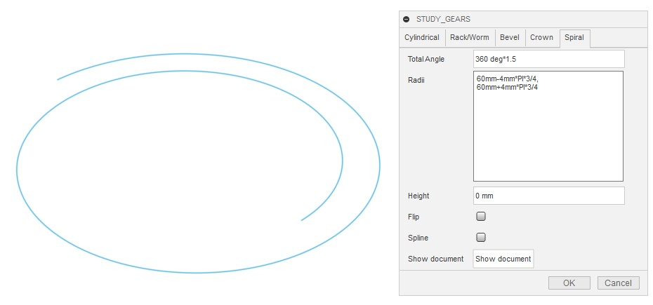</a>

### 直交モジュールを 4 にするには

正面モジュールではなく歯直交モジュールを 4 としたい場合には少しちゃんと計算する必要が出てきます。

正面モジュールを $m_t$、半径 $r_0$ とすると一周で $\pi m_t$ だけ半径が増減するので、
回転角 $\theta$ に対する半径の増加は
$$
r(\theta)=r_0+m_t\theta/2
$$
と表せます。円周と歯筋のなす角（はすば角）は
$$
\tan\beta\sim\sin\beta\sim\frac{dr}{rd\theta}=\frac{m_t}{2r}
$$
と近似できますが、このはすば角は $r$ に依存するので、歯車が回転して歯筋が内側や外側にずれてくるとはすば角は変化してしまうことになります。

さしあたりそこには目をつぶるとすると、直角モジュールは
$$
m_n=m_t\cos\beta
$$
の関係にあるため
$$
m_n=m_t\sqrt{1-(m_t/2r)^2}
$$
$$
m_n^2=m_t^2-m_t^4/4r^2
$$
$$
m_t^4-4r^2m_t^2+4r^2m_n^2=0
$$
$$
m_t^2=2r^2-
\sqrt{4r^4-4r^2m_n^2}
$$
$$
m_t^2=2r\Big(r-
\sqrt{r^2-m_n^2}\Big)
$$
と計算を進めると、正面モジュールとはすば角が以下のように求まります。
$$
m_t=\sqrt{2r\Big(r-
\sqrt{r^2-m_n^2}\Big)}
$$
$$
\beta=\sin^{-1}\sqrt{\frac{1-\sqrt{1-m_n^2/r^2}}{2}\\}
$$

結局のところ、今回の場合 $m_n=4$ に対して $m_t=4.0022$ ですので、両者を厳密に区別する必要性はあまりなさそうです。

（以下の手順を考えても、正面モジュールが切りのいい値になっていた方がずっと楽です）

## ラックの生成

モジュールを４として生成します。

<a href="assets/archimedean2.jpg">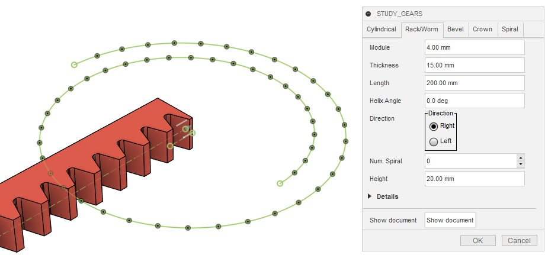</a>

プロジェクトの１つ目のコンポーネントは自動的にルートコンポーネントに固定されてしまうため、
「親に固定」を解除して、錨マーク⚓が外れていることを確認します。

<a href="assets/archimedean3.jpg">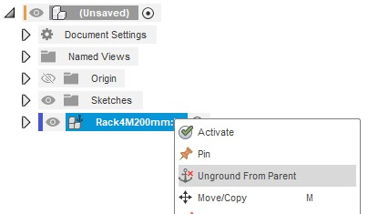</a>

$y$ 軸周りにラックを90度回転して $z$ 軸正方向へ向けます。

## 平歯車ピニオンの生成

モジュール４、歯数１２、厚さ 5 mm で生成しました。

噛み合い位置へ移動します。
- $y$ 軸周りに 90 度回転
- $x$ 方向に 60 mm 移動
- $z$ 方向に $4\,\mathrm{mm}\times 12/2=24\,\mathrm{mm}$ 移動

<a href="assets/archimedean8.jpg">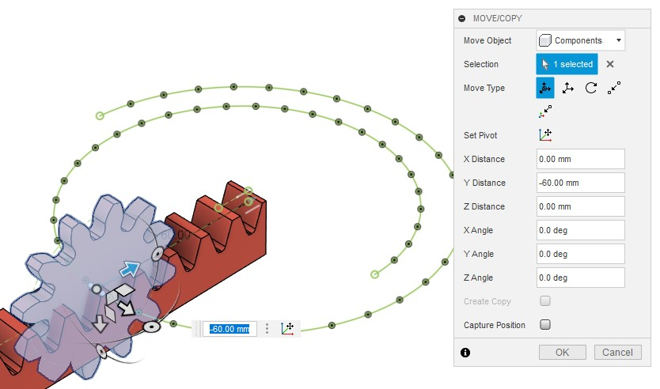</a>

## ラック歯形をらせんに沿ってスイープする

ラック歯形を取り出すため $yz$ 平面状にスケッチを作成します。

<a href="assets/archimedean10.jpg">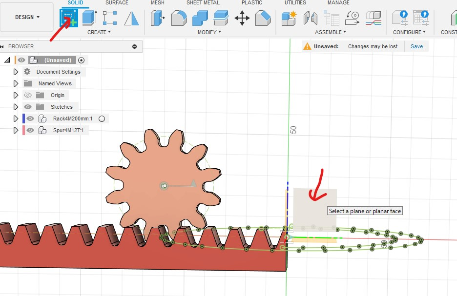</a>

その際、先ほど移動したラックや歯車を元の位置に戻すかと聞かれるので、
「位置をキャプチャ」を選びます。

ラック形状を利用するため、射影（プロジェクト）を選択し、
原点に最も近い歯筋の直線とフィレット部分を選択してＯＫを押します。

<a href="assets/archimedean12.jpg">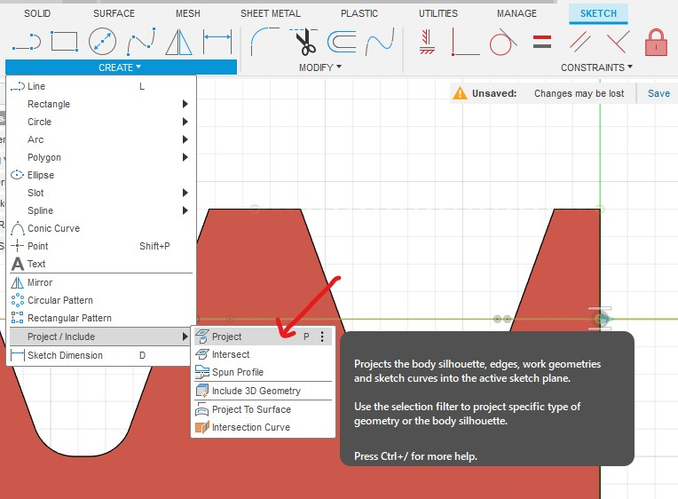</a>
<a href="assets/archimedean13.jpg">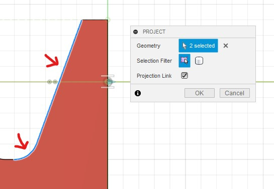</a>

歯筋形状を $z$ 軸に対して鏡面対称操作で複製し、上下を直線で繋ぐことで歯形を得ます。

<a href="assets/archimedean14.jpg">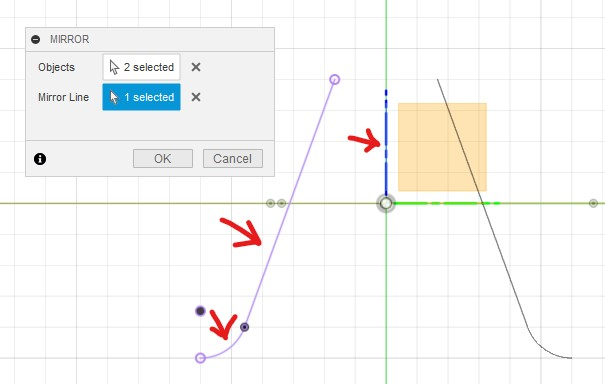</a>

スケッチの編集を終了したら、作成した歯形プロファイルを選択して、
サーフェスメニューからパッチを生成。
生成したパッチを $x$ 方向に 60 mm 移動して噛み合い位置に置きます。

<a href="assets/archimedean16.jpg">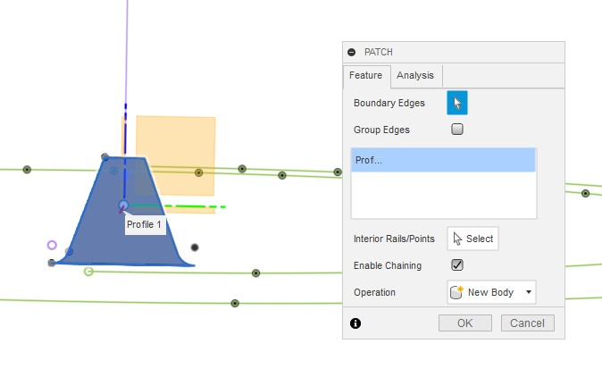</a>
<a href="assets/archimedean17.jpg">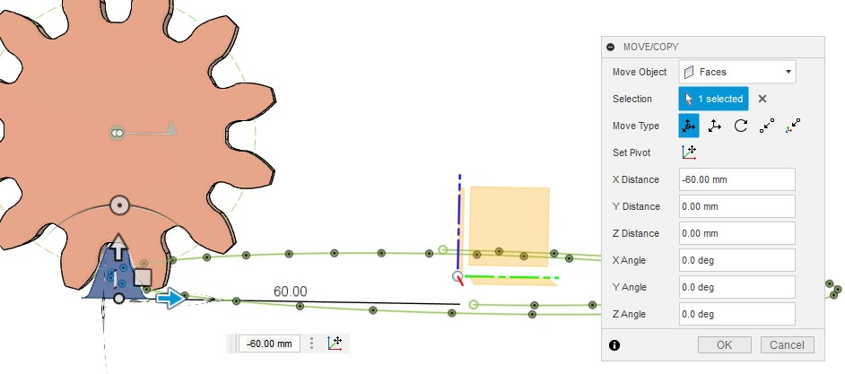</a>

ソリッドメニューのスイープで、歯形パッチをらせんに沿ってスイープし、
つるまきたが歯車の歯筋を形成します。

## つるまきたが歯車に回転ジョイントを付ける

生成したつるまきたが歯車のボディに対して「ボディからコンポーネントを生成」を二回適用して、
二重になったコンポーネントを作成、その外側のコンポーネントと内側のコンポーネントとの間に
回転ジョイントを生成します。

まず「ボディからコンポーネントを生成」を二回適用。

内側のコンポーネントが「親に固定」されてしまったので「親に固定」を解除しました。

<a href="assets/archimedean21.jpg">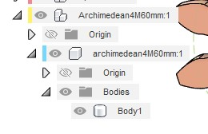</a>

錨マーク⚓が外れていることを確認してください。

その後、
- 内側のコンポーネントを選択
- Shift+J で 構築ジョイント（as-built joint）の生成
- 外側のコンポーネントを選択
- スナップに原点を選択（上手に選択して $z$ 軸周りのジョイントになるようにします）

これで回転ジョイントを作成できました。

## ピニオンの歯筋を修正する

作業を進めるにあたり、まず以下を行います。

- つるまきたが歯車コンポーネントを非表示
- ピニオンの内側コンポーネントの１つ目のスケッチを表示
- ルートコンポーネントの spiral スケッチを表示

次に、操作履歴上でピニオン制作のグループを見つけて展開。

<a href="assets/archimedean24.jpg">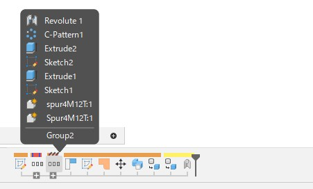</a>

<a href="assets/archimedean25.jpg">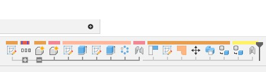</a>

２つ目の押し出しと円形配列のフィーチャを選択し、右クリックから抑制。

<a href="assets/archimedean26.jpg">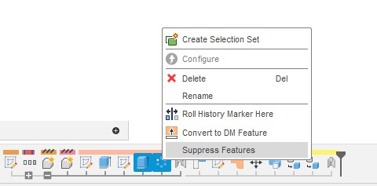</a>

これでピニオンの歯溝切削操作がキャンセルされて、元の円盤に戻りました。

ここにらせんに沿った歯筋となるよう再度歯切りを施します。

スケッチ上の歯溝形状を選択、らせんに沿ってスイープして歯溝を切り取ります。

これでうまくいくかと思いきや、

帯状の「切り残し」が発生してしまいました。

これはスイープ時に選んだプロファイルが足りなかったためなので、
スイープフィーチャをもう一度編集して、
歯先円の外側の部分も選択してやります。

<a href="assets/archimedean31.jpg">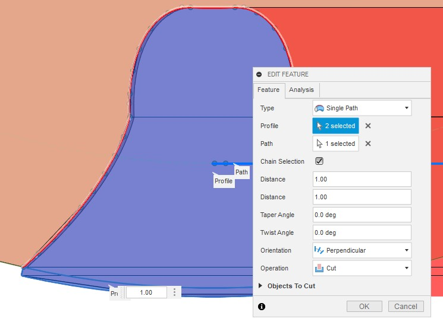</a>

これできれいに歯溝が切れました。

今歯溝を切ったスイープフィーチャを選択して円形複製を行います。

ここでは歯溝形状を無駄に長い距離スイープしているため、
プレビュー画面がとんでもないことになりますが、、、

中心軸を選び、数量に１２を指定してＯＫすれば
きれいに歯切りを行えます。

## モーションリンクを設定する

つるまきたが歯車のジョイントと歯筋修正済みのピニオンのジョイントの間にモーションリンクを設定します。

つるまきたが歯車が一回転したらピニオンが１ピッチだけ回転するようにします。

## 歯当たりの検証

以上の操作を、バックラッシュを -0.02 mm としたラック＆ピニオンに対してもう一度行い、
意図的に若干の干渉を起こすつるまきたが歯車＆ピニオンのペアを生成しました。

この２つを組み合わせて回転させながら、干渉する領域を見ることで歯当たりを確認しました。

通常のラック＆ピニオンの噛み合いと同様に、安定した接触が得られていることを確認できます。
比較のために、ピニオンギアを通常のはすば歯車とした場合の接触の様子がこちらです。つるまきたが歯車の内側では、つるまきたが歯車の歯面に対してピニオンの両端の角が角度を持ってぶつかってしまっています。外側はそこまでひどくはありませんが、ピニオンの歯の中央でしか接触が得られていません。

上で行ったピニオンの歯筋修正もあくまで近似的なものですが、
通常の平歯車やはすば歯車をピニオンとして用いるのに比べると
大幅に噛み合いが改善していることが期待されます。

## 端の処理

つるまきたが歯車の歯がピニオンの歯溝へ入る際に衝突することを避けるため、
歯の端の部分には薄くフィレットを付けておくのが良いのだと思います。

----
[[fusion360-study-gears チュートリアルへ戻る]](https://github.com/osamutake/fusion360-study-gears/blob/main/README-ja.md#チュートリアル)
