# Archimedean Spiral Gear

[[Go back to fusion360-study-gears Tutorials]](https://github.com/osamutake/fusion360-study-gears/#tutorials)

<a href="assets/archimedean36.gif">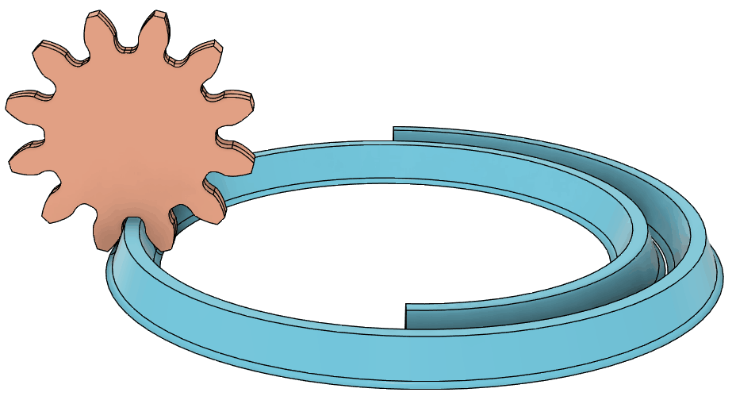</a>

This is a gear with spiral-shaped tooth traces, which is usually used in combination with a spur gear with loose meshing. It has a large gear ratio equivalent to a worm and worm wheel, and it is also a one-way mechanism that cannot be driven from the pinion side to the Archimedean spiral gear.

Here, we will combine the features of the study-gears script to form a practical pair of Archimedean spiral gear and dedicated pinion, which has better meshing than a simple spur gear pinion.

## Realization of Better Meshing

When the spiral radius of the Archimedean spiral gear is large enough to consider the tooth trace as a straight line within the meshing range, the meshing can be locally approximated to that of a rack and pinion.

Under such approximations, it is common to use an Archimedean spiral gear, created by sweeping the rack tooth profile along the spiral, in combination with a thin spur gear as a pinion.

However, since a finite-radius spiral is not perpendicular to the radius, the pinion must be helical to account for this.

Additionally, if a simple helical pinion is used, the straight tooth traces of the helical pinion will not mesh correctly with the curved tooth traces of the Archimedean spiral gear along the spiral. Particularly on the inner tooth surface of the Archimedean spiral gear, the corners of the helical pinion teeth will collide at a finite angle, resulting in poor meshing.

Here, we attempt to form a practical pair of Archimedean spiral gear and dedicated pinion by cutting the pinion tooth traces along the same spiral as the Archimedean spiral gear.

Although the resulting shapes are not theoretically accurate, they appear to be reasonably practical based on tooth contact analysis in Fusion 360.

We will confirm this point at the end.

## Approach

- Create the spiral representing the tooth trace of the Archimedean spiral gear using the Spiral tab of study-gear script.
- Sweep the rack tooth profile along the spiral to obtain the tooth trace of the Archimedean spiral gear.
- Sweep the pinion tooth groove profile along the spiral to create a pinion with tooth traces of the same curvature as the Archimedean spiral gear.
- Combine the two and test their contact.

## Generating the Spiral

Here, we set the transverse module to $4\,\mathrm{mm}$ and the average radius of the spiral to $60\,\mathrm{mm}$.

The tooth trace of the Archimedean spiral gear follows a spiral that advances by one pitch, i.e., $\pi\times 4\,\mathrm{mm}$, per rotation.

We create 1.5 rotations of the Archimedean spiral gear tooth trace by setting the following parameters into the Spiral tab of the study-gears script. The radius is set to vary by $\pi\times 4\,\mathrm{mm}\times 1.5$ over 1.5 rotations, with an average of $60\,\mathrm{mm}$.

- Total Angle = 360 deg * 1.5
- Radii = 60 mm - PI * 4 mm * 3/4, 60 mm + PI * 4 mm * 3/4

<a href="assets/archimedean1.jpg">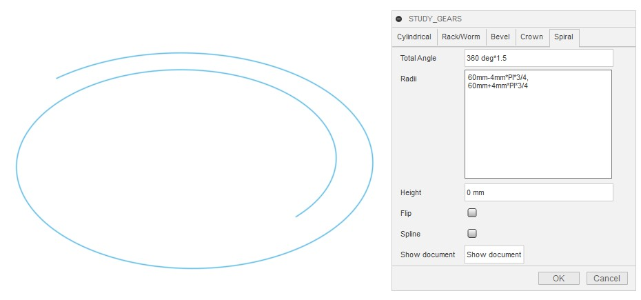</a>

### Normal Module to be 4 ?

If you want to set the normal module to 4 instead of the transverse module, some calculations are required.

Let the transverse module be $m_t$ and the radius $r_0$. The radius increases by $\pi m_t$ per rotation, so the radius as a function of a rotation angle $\theta$ is expressed as:
$$
r(\theta)=r_0+m_t\theta/2
$$
The angle $\beta$ between the circumference and the tooth trace (helix angle) is approximately:
$$
\tan\beta\sim\sin\beta\sim\frac{dr}{rd\theta}=\frac{m_t}{2r}
$$
This helix angle $\beta$ depends on $r$, so it changes as the gear rotates and the tooth trace shifts inward or outward.

Ignoring this for now, the normal module is related to the transverse module by:
$$
m_n=m_t\cos\beta
$$
Thus:
$$
m_n=m_t\sqrt{1-(m_t/2r)^2}
$$
$$
m_n^2=m_t^2-m_t^4/4r^2
$$
$$
m_t^4-4r^2m_t^2+4r^2m_n^2=0
$$
$$
m_t^2=2r^2-
\sqrt{4r^4-4r^2m_n^2}
$$
$$
m_t^2=2r\Big(r-
\sqrt{r^2-m_n^2}\Big)
$$
From this, the transverse module and helix angle are calculated from the normal module $m_n$ and averaged radius $r_0$:
$$
m_t=\sqrt{2r_0\Big(r_0-
\sqrt{r_0^2-m_n^2}\Big)}
$$
$$
\beta=\sin^{-1}\sqrt{\frac{1-\sqrt{1-m_n^2/r_0^2}}{2}\\}
$$

In this case, for $m_n=4$ and $r_0=60\,\mathrm{mm}$, we obtain $m_t=4.0022$. So, distinguishing between the two is not very meaningful.

Considering the following steps, it is much easier if the transverse module is a clean value.

## Generating the Rack

Generate the rack with a module of 4.

<a href="assets/archimedean2.jpg">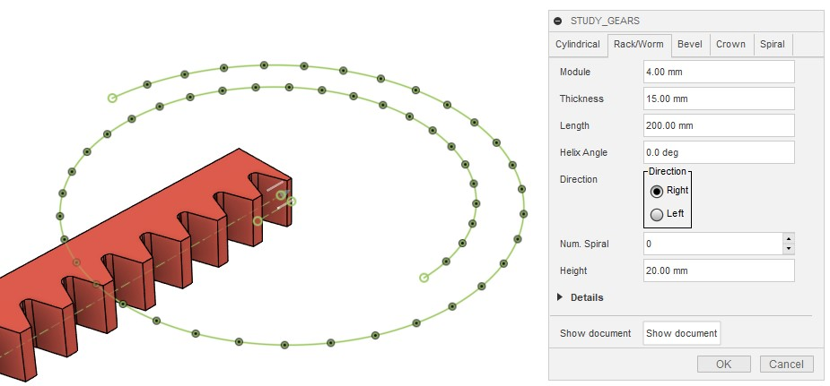</a>

The first component in the project is automatically fixed to the root component. We unfix it and ensure the anchor mark ⚓ is removed.

<a href="assets/archimedean3.jpg">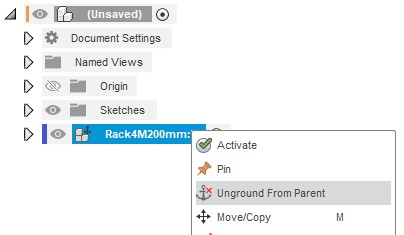</a>

<a href="assets/archimedean4.jpg">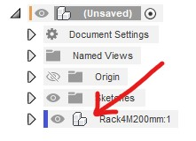</a>

Rotate the rack 90 degrees around the $y$-axis to align it with the positive $z$-axis.

<a href="assets/archimedean5.jpg">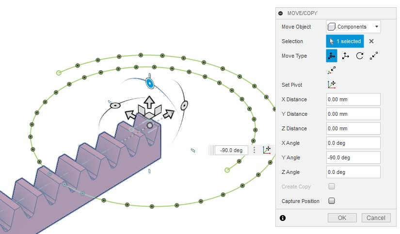</a>

## Generating the Spur Gear Pinion

Generate a spur gear pinion with a module of 4, 12 teeth, and a thickness of 5 mm.

<a href="assets/archimedean6.jpg">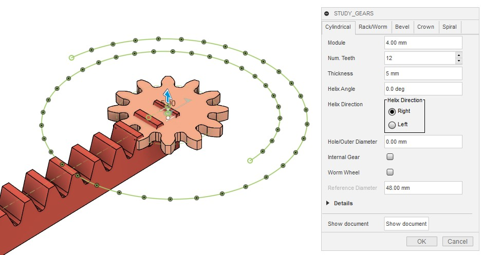</a>

Move it to the meshing position:
- Rotate 90 degrees around the $y$-axis.
- Move $60\,\mathrm{mm}$ in the $x$ direction.
- Move $4\,\mathrm{mm}\times 12/2=24\,\mathrm{mm}$ in the $z$ direction.

<a href="assets/archimedean7.jpg">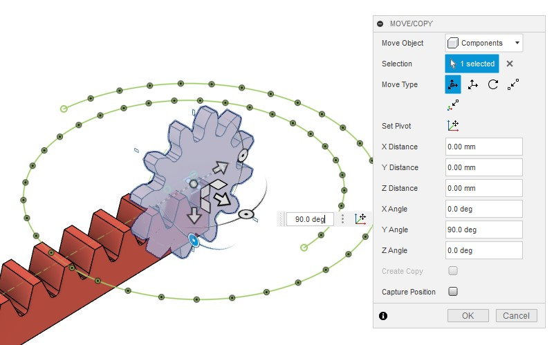</a>
<a href="assets/archimedean8.jpg">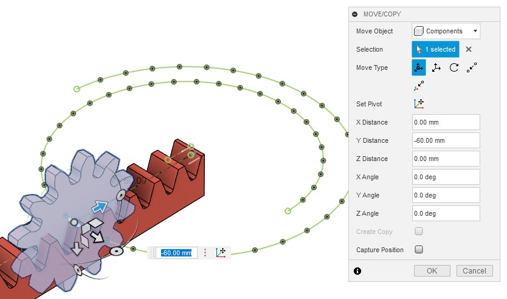</a>
<a href="assets/archimedean9.jpg">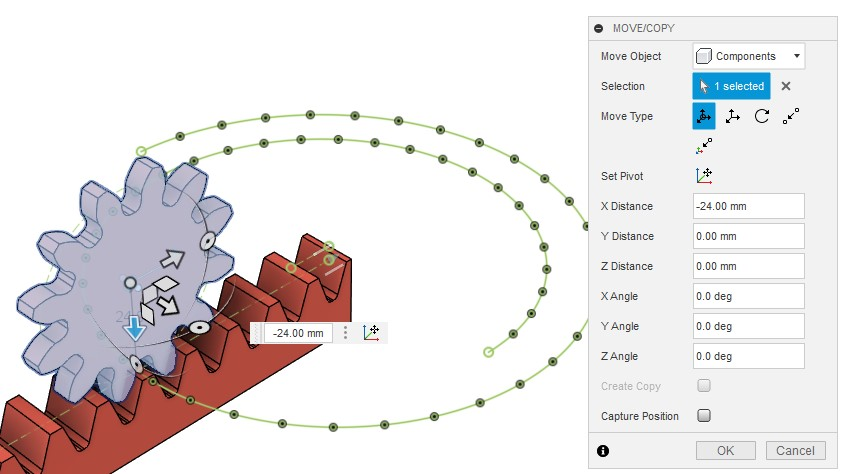</a>

## Sweeping the Rack Tooth Profile Along the Spiral

Create a sketch on the $yz$ plane to extract the rack tooth profile.

<a href="assets/archimedean10.jpg">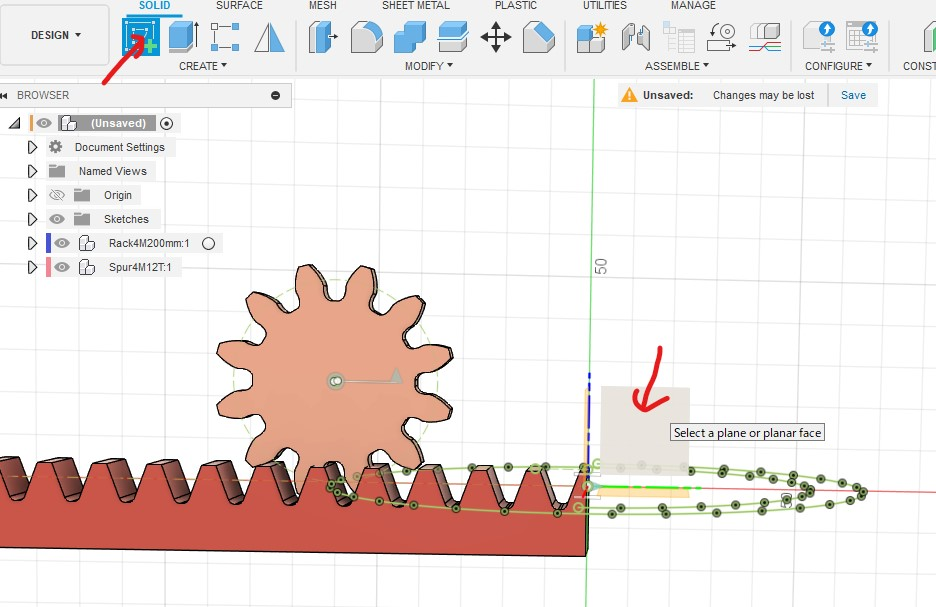</a>

When asked whether to return the moved rack and gear back to their original positions, select "Capture Position."

<a href="assets/archimedean11.jpg">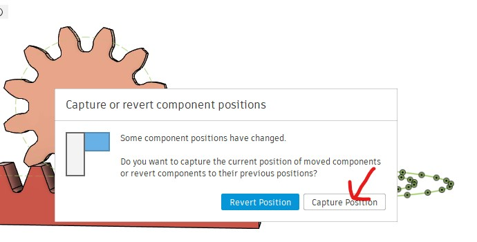</a>

Select "Project" from the menu to project the rack shape into the sketch. Choose the straight line and fillet part of the tooth trace closest to the origin, and press OK.

<a href="assets/archimedean12.jpg">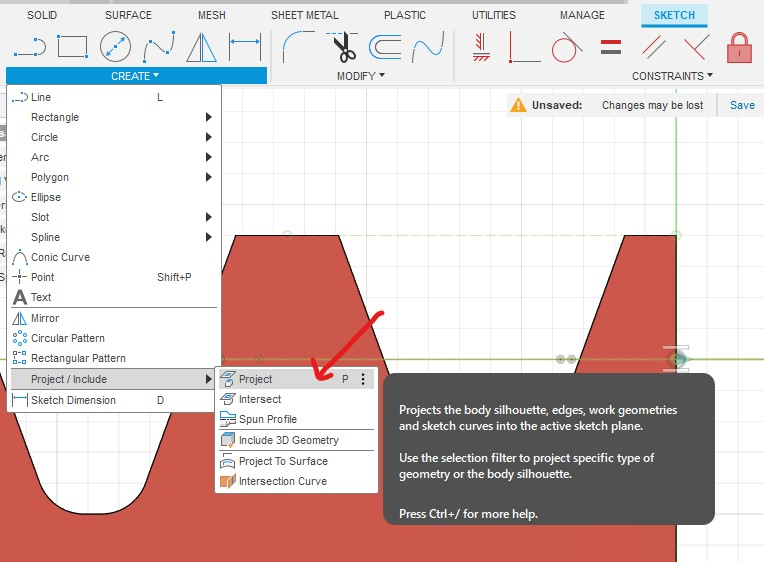</a>
<a href="assets/archimedean13.jpg">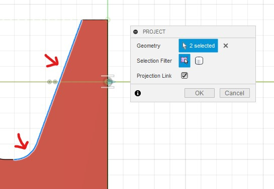</a>

Mirror the tooth trace shape about the $z$-axis and connect the top and bottom with straight lines to complete the tooth profile.

<a href="assets/archimedean14.jpg">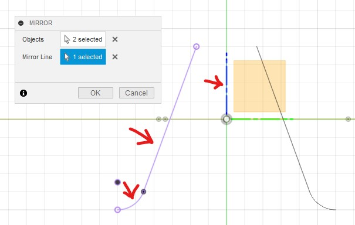</a>
<a href="assets/archimedean15.jpg">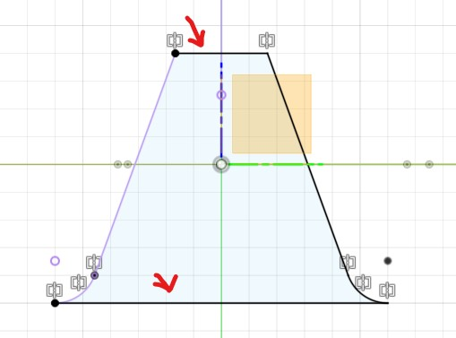</a>

After finishing the sketch, select the created tooth profile and generate a patch from the Surface menu. Move the generated patch $60\,\mathrm{mm}$ in the $x$ direction to place it in the meshing position.

<a href="assets/archimedean16.jpg">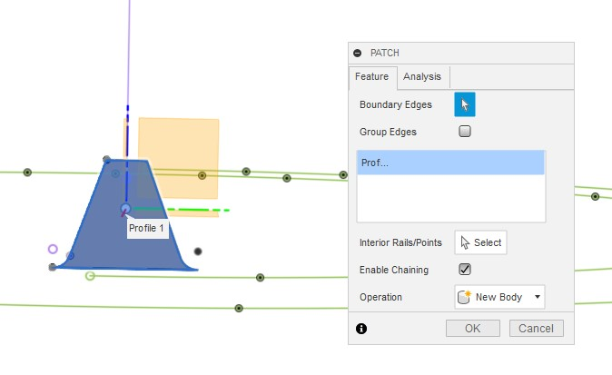</a>
<a href="assets/archimedean17.jpg">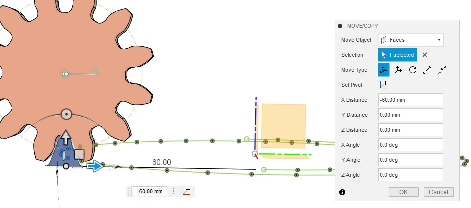</a>

Use the Sweep tool from the Solid menu to sweep the tooth profile patch along the spiral, forming the tooth of the Archimedean spiral gear.

<a href="assets/archimedean18.jpg">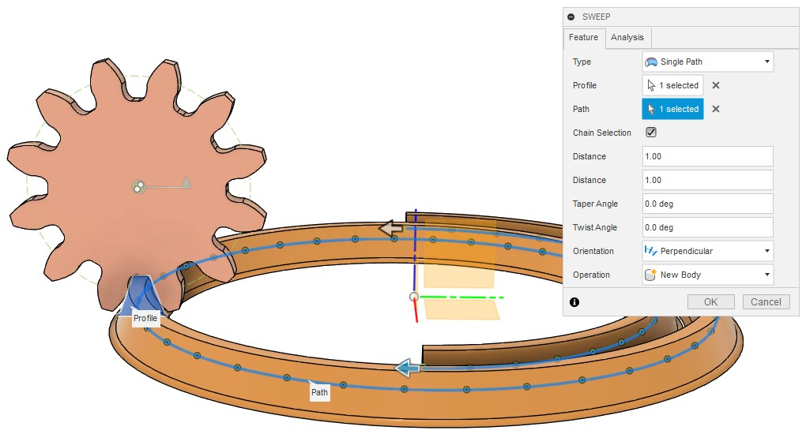</a>

## Adding a Revolute Joint to the Archimedean Spiral Gear

Apply "Create Component from Bodies" twice to the generated Archimedean spiral gear body to create a double-layered component. Then, create a revolute joint between the outer and inner components.

First, apply "Create Component from Bodies" twice.

<a href="assets/archimedean19.jpg">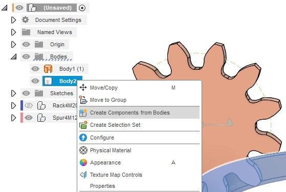</a>
<a href="assets/archimedean20.jpg">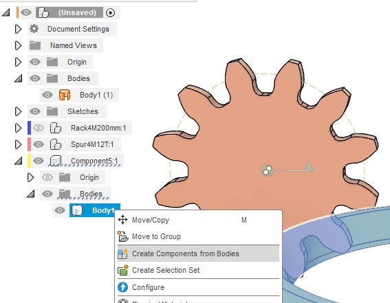</a>

The inner component was automatically fixed to the parent, so unfix it.

<a href="assets/archimedean21.jpg">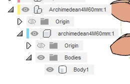</a>

Ensure the anchor mark ⚓ is removed.

Then:
- Select the inner component.
- Press Shift+J to create an As-Built Joint.
- Select the outer component.
- Snap to the origin (ensure it becomes a $z$-axis revolute joint).

<a href="assets/archimedean22.jpg">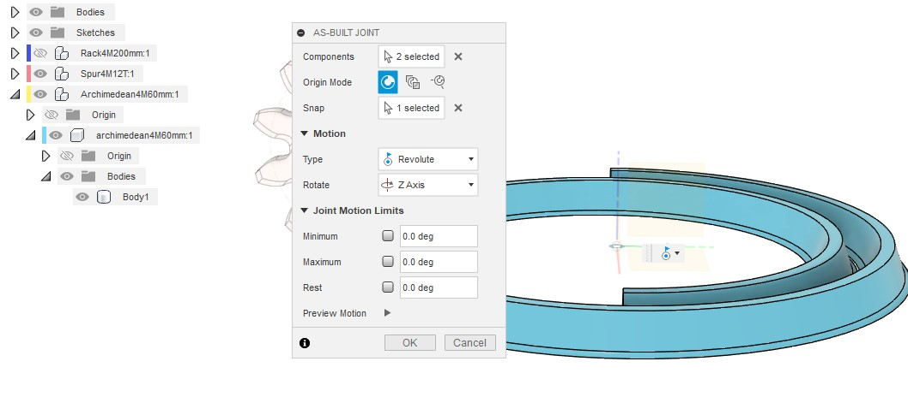</a>

This creates the revolute joint for the Archimedean spiral gear.

## Modifying the Pinion Tooth Trace

To proceed, first:
- Hide the Archimedean spiral gear component.
- Show the first sketch of the inner pinion component.
- Show the spiral sketch of the root component.

<a href="assets/archimedean23.jpg">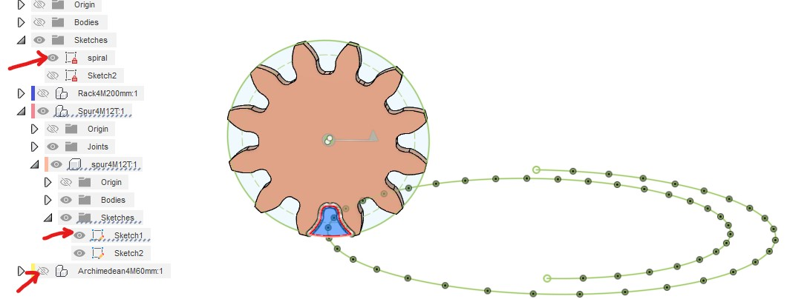</a>

Next, locate and expand the pinion creation group in the timeline.

<a href="assets/archimedean24.jpg">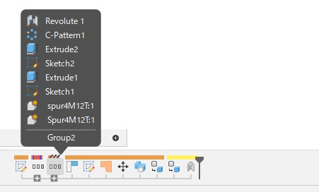</a>

Suppress the second extrusion and circular pattern features from right-click menu.

<a href="assets/archimedean26.jpg">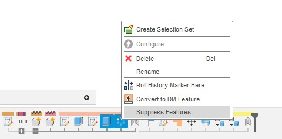</a>

This cancels the pinion tooth groove cutting operation, returning it to the original disk.

<a href="assets/archimedean27.jpg">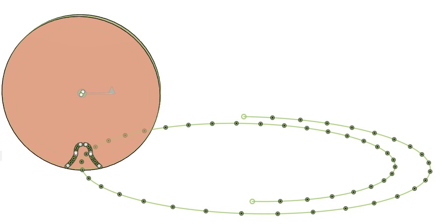</a>

Now, re-cut the teeth along the spiral.

Select the tooth groove shape in the sketch and sweep it along the spiral to cut the grooves.

<a href="assets/archimedean28.jpg">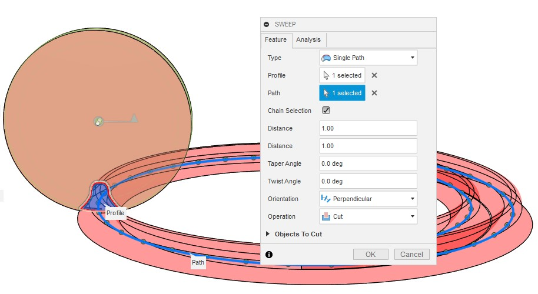</a>

However, this resulted in:

<a href="assets/archimedean29.jpg">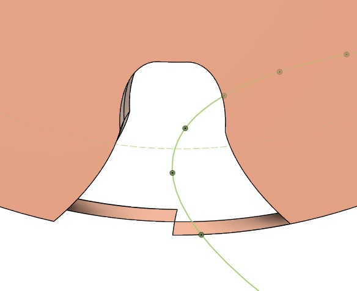</a>

Two "strips" of uncut material remained.

This occurs because the selected profile for the sweep was insufficient. Edit the sweep feature and select the outer part of the tip circle.

<a href="assets/archimedean30.jpg">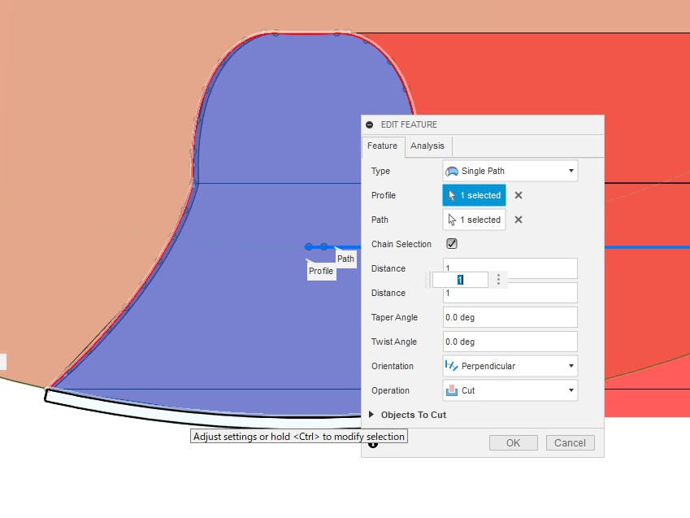</a>
<a href="assets/archimedean31.jpg">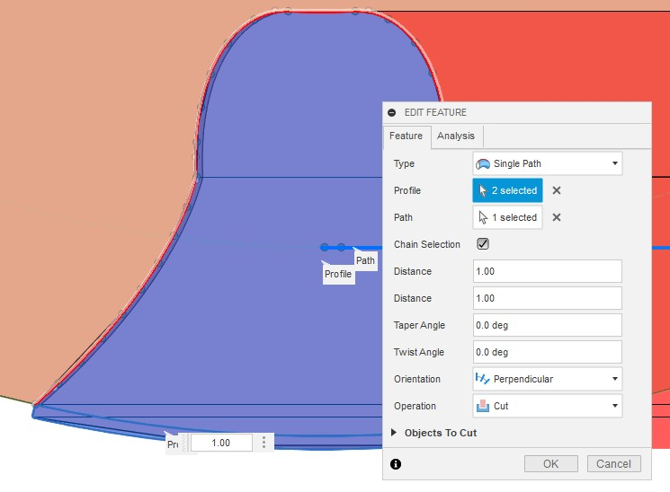</a>

Now the groove is cleanly cut.

<a href="assets/archimedean32.jpg">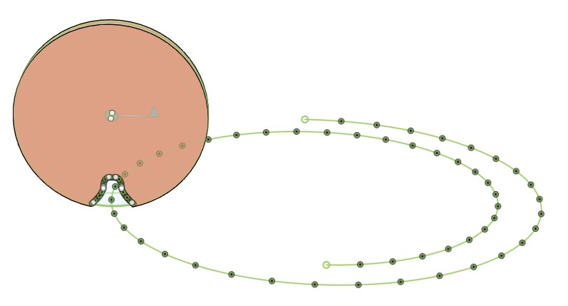</a>

Select the sweep feature used to cut the grooves and perform a circular pattern.

<a href="assets/archimedean33.jpg">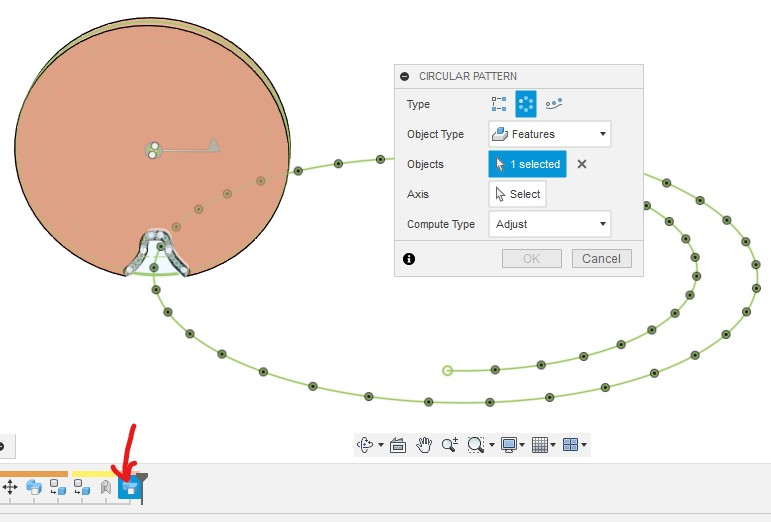</a>

Since the groove shape is swept over an unnecessarily long distance, the preview looks chaotic.

<a href="assets/archimedean34.jpg">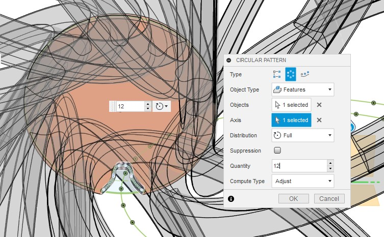</a>

Anyway, select the center axis, set the quantity to 12, and press OK to cut the grooves successfully.

## Setting a Motion Link

Set a motion link between the joint of the Archimedean spiral gear and the joint of the pinion with the modified tooth trace.

Set it so that the pinion rotates by one pitch when the Archimedean spiral gear completes one rotation.

<a href="assets/archimedean35.jpg">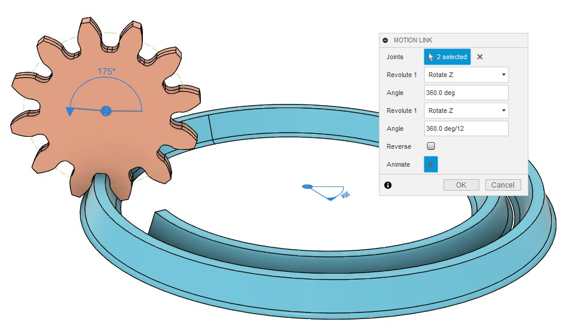</a>

## Verifying Tooth Contact

I repeated the above steps with a rack and pinion having a negative backlash of -0.02 mm to generate a pair of Archimedean spiral gear and pinion with intentional slight interference with each other.

I combined and rotated them to observe the interference regions, verifying the tooth contact.

<a href="assets/archimedean37.gif">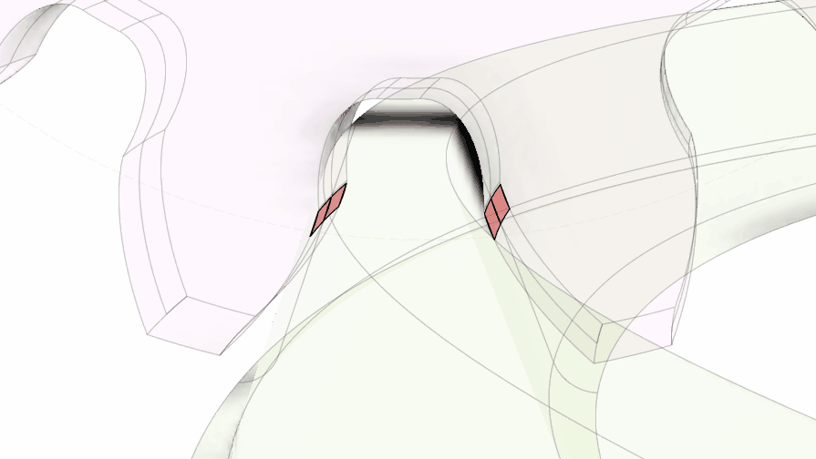</a>

It was confirmed that stable contact similar to that of a normal rack and pinion is achieved.

For comparison, the next figure shows the contact regions when the pinion gear is a normal helical gear. On the inner side of the Archimedean spiral gear, the corners of the pinion teeth collide at an angle with the tooth surface of the Archimedean spiral gear. On the outer side, contact is only achieved at the center of the pinion teeth.

<a href="assets/archimedean38.jpg">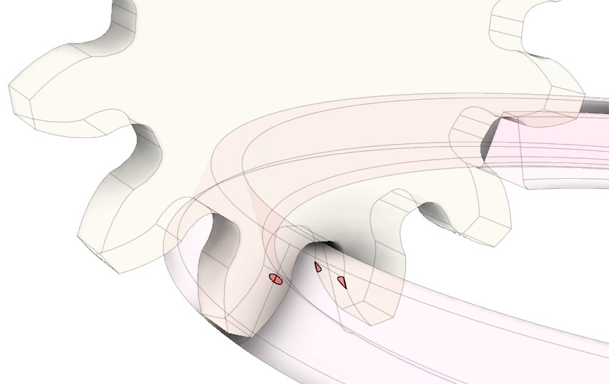</a>

Although the pinion tooth trace obtained with above procedure is still an approximated one, it has significantly improved meshing compared to using a normal spur or helical gear as the pinion.

## Chamfering Edge of the spiral tooth

To avoid collisions when the teeth of the Archimedean spiral gear enter the pinion grooves, it is recommended to add a slight chamfer to the edges of the teeth.

<a href="assets/archimedean39.jpg">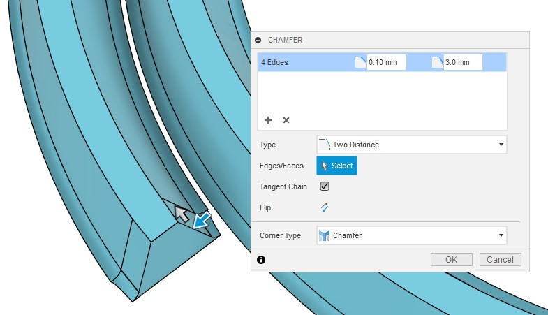</a>

----
[[Go back to fusion360-study-gears Tutorials]](https://github.com/osamutake/fusion360-study-gears/#tutorials)
