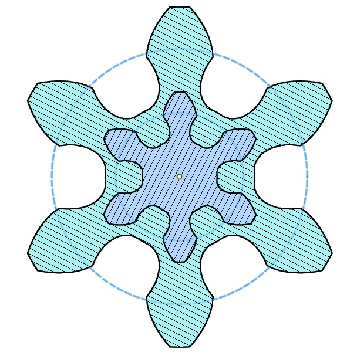
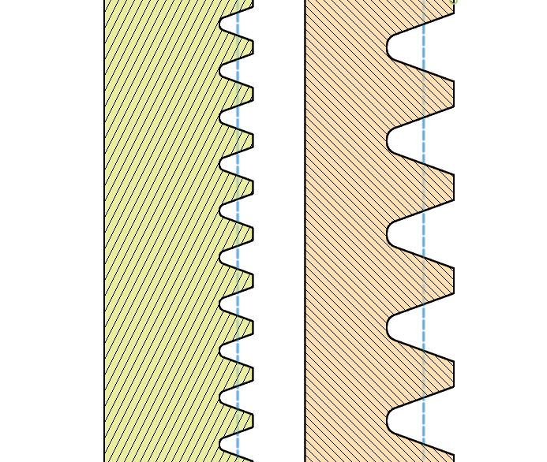
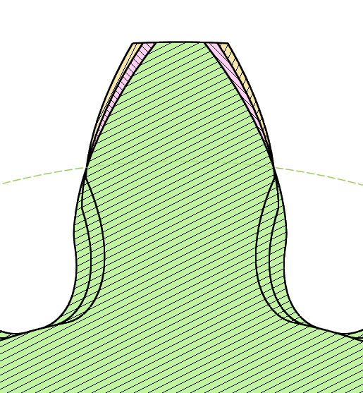
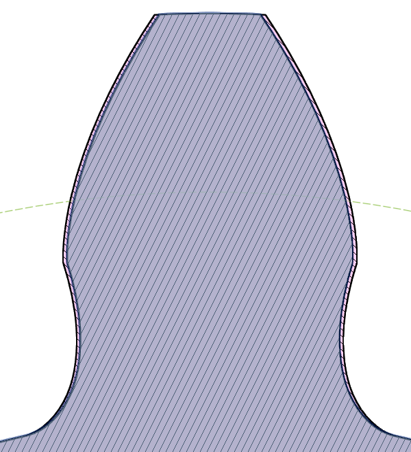
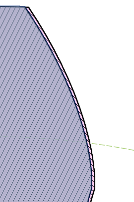
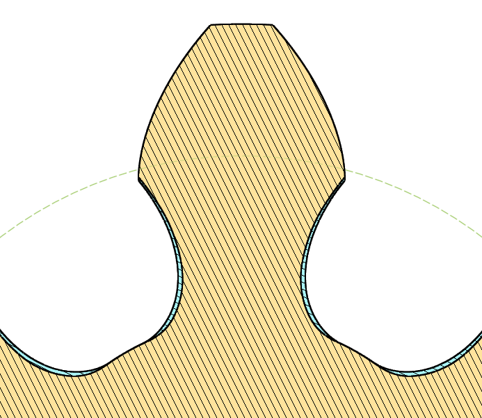
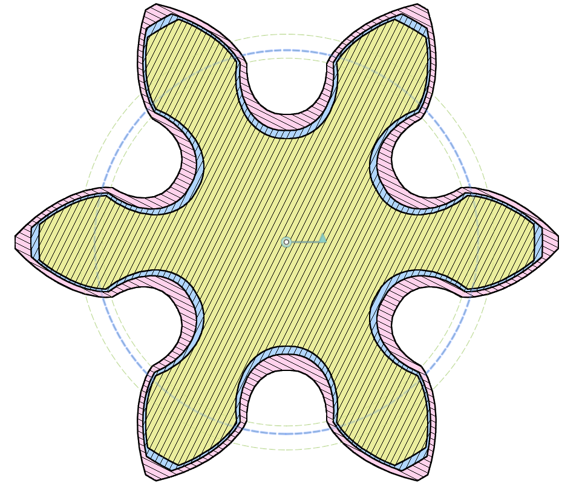

# 歯車形状を決める各種パラメータについて簡単に紹介します

[[fusion360-study-gears チュートリアルへ戻る]](https://github.com/osamutake/fusion360-study-gears/blob/main/README-ja.md#チュートリアル)

## モジュール $m$

歯の大きさを決めるパラメータで、長さの次元を持ちます。

歯の大きさとモジュール数との関係は単純な比例関係で、モジュール数を $m$ とすると歯のピッチ（歯の並ぶ周期）は $\pi m$ で表されます。

なぜここで $\pi$ が出てくるかというと、このおかげでモジュール $m$、歯数 $z$ の歯車の直径 $d$ を $d=mz$ のように簡単に表せるようにするためです。
直径 $d$ の円の円周が $\pi d$ となるため、$\pi d=\pi m \times z$ から $d=mz$ の関係が導かれます。

下図は、モジュール 4 mm と 2 mm の歯車・ラックのサイズを比較したものです。モジュールが２倍になると、歯のサイズも２倍になっていることが分かります。

## インボリュート歯車

そもそもの基本として、このスクリプトが生成する歯車は「インボリュート歯車」と呼ばれるものです。

インボリュート歯車の最も大きな特徴は、同じモジュール（と後述の圧力角）で設計された歯車同士を任意の歯数の歯車（歯数無限大がラックに相当します）と組み合わせて動作させられることにあります。

## 基準円

上で述べた「歯車の直径 $d$」は正確には「基準円」の直径です。

この直径は、歯車の歯の厚さがピッチの半分になる直径になります。歯車の歯は先端に行くにしたがって細くなるため、直径を大きく取ればピッチに対して歯は薄くなり、直径を小さく取れば厚くなります。ちょうど半分になるところが基準円です（ラックの場合は基準ピッチ線）。

２つの歯車を基準円あるいは基準ピッチ線が触れるように配置することで正しいかみ合わせが得られます。

## 圧力角

歯形が基準円と交わる点において、歯形と半径とがなす角を圧力角と呼びます。

図は圧力角 14度、20度、26度 の歯形を重ねて表示したものです。すべての歯形は基準円上で重なっていることを確認できます。

モジュールだけでなく圧力角も同じでないと歯車は正しくかみ合いません。通常は20度のものが使われますが、用途によっては 14 度のものが使われる場合もあるそうです。

## バックラッシュ

理論上ぴったり噛み合うよう作られた歯車同士では間に油膜を張ることができず、また組付け誤差を吸収することもできないため、現実的にはスムーズに回転することができません。

そこで実用的な歯車では理論値に比べて少しだけ歯を薄く作ることで歯と歯の間に「遊び」を作りスムーズな回転を可能にします。この遊びをバックラッシュと呼びます。

図はモジュール 4 の歯車で、バックラッシュゼロの歯形（ピンク）と、歯の進む方向（回転方向）に 0.2 mm のバックラッシュを持たせた歯形とを比べたものです。歯の両側が 0.1 mm ずつ薄くなることで、合計で 0.2 mm の遊びを生じます。

0.2 mm のバックラッシュを持つ歯車を２つ組み合わせれば、合計で 0.4 mm の遊びが生じることになります。

右図はバックラッシュがあると、ある方向に回していた歯車を逆方向に回し始める際に歯と歯の噛み合いが外れて回転が伝わらなくなる瞬間が生じることを Fusion 360 でシミュレーションした動画です。

## 歯先、歯底、歯末、歯元、頂隙

歯車の歯の先端を歯先、歯溝の底を歯底と呼びます。

また、歯車の歯の基準円より外側を歯末、内側を歯元と呼びます。

歯末の丈 (addendum)、歯元の丈（dedendum）はそれぞれ、基準円から歯先、あるいは歯底までの半径方向の距離のことで、このスクリプトではモジュールの倍数として値を指定します。

標準値は、歯末の丈が 1.0 つまりモジュールと等しく、歯元の丈が 1.25 です。

歯末の丈よりも歯元の丈がモジュールの 0.25 倍長いことにより、歯車同士を組み合わせた際に、歯先と歯底との間にモジュールの 0.25 倍の間隙（頂隙）が生じ、これが歯車のスムーズな回転を助けます。

## ラック型切削具による歯車の切削

通常の平歯車の形状は円盤状の部材をラック型に切削可能な切削具により切削して作成されます。下の図は、回転する歯車部材に対して切削具の歯先（黄色の曲線）が近づき、抜けていくところまでをシミュレーションしたものです。

このとき歯車の歯先に近い部分は切削具の直線部分によって削られ、インボリュート曲線と呼ばれる曲線が現れます。歯車のうちこのインボリュート領域が相手の歯車と接して動力を伝える部分になります。

一方、歯車の歯元に近い部分にはトロコイド曲線と呼ばれる曲線が現れるのですが、これは切削具の歯先が歯車の歯元を削り取ることによって生まれる形状になります。

歯車の歯元に適切な頂隙を形成するため、切削具の歯末の丈は、歯車の歯元の丈と等しくなるよう延長されています。そしてその延長部分の角はフィレットが付けられ丸められます。図の黄色の形状がこのフィレット付きで延長された歯先形状を表しています。

この丸まった切削具の歯先が歯車の歯元を削り取ることにより、歯車の歯元は自然な丸みを持って歯底と接続されます。

## フィレット半径

このスクリプトで指定するフィレットの大きさは切削具の歯先に付けるフィレットの半径を指定するものなので、これをゼロにしても歯車の歯元には切削具の移動経路に沿った丸みが残ります。

下図は青が通常のフィレット付き（最大のフィレット径）切削具による歯形、黄色がフィレットゼロの切削具による歯形ですが、フィレットをゼロにしても歯車の歯形にカドが生じることはありません。

ウォームホイールの歯形計算ではこの図と同様に切削具をステップバイステップで移動させながら切削される領域を求めているため、フィレット径が小さいとステップ間で削り残された部分が生じて歯形がおかしくなります。十分なフィレットを持たせて生成するようにしてください。

## 転位歯車

転位歯車とは、ラック型切削具による歯車切削時に、切削具を通常よりも遠ざけたり（正転位）、近づけたり（負転位）して切削した歯車のことです。

「転位」した歯車を使うと、モジュールと歯数を変えないまま、噛み合い距離を調整することができます。正転位では噛み合い距離が大きくなり、負転位では噛み合い距離が小さくなります。

下図は、転位ゼロの青の歯車に、モジュールの 1/4 だけ正転位したピンク色の歯車と、モジュールの 1/8 だけ負転位した黄色の歯車を重ねたものです。

青の破線で示したのが本来の基準円であり、緑の破線はそれぞれ基準円からシフト量だけ半径を増減して描いた円になります。

正転位により歯車が大きくなり、歯元のえぐれが小さくなり、インボリュート領域が広がるが、歯先が細くなり弱くなること。

負転位により歯車が小さくなり、歯元のえぐれが大きくなり、インボリュート領域が狭まるが、歯先は太くなり強くなること。

が分かります。

これらの特徴を生かして、転位歯車は以下のような用途で便利に用いられます。

- 小径歯車の歯元の切り下げを小さくして噛み合いを良くするために正転位させる
- はすば歯車では軸間距離が無理数になってしまうため、転位を使って切りのいい値に調整する
- 遊星歯車のように複数の歯車の軸間距離がある特定の条件を満たさなければならない場合に、転位を使って条件式を満たすようにする

ただし、転位歯車は転位なしの場合に比べて利用上注意すべき点も多いです。

転位なしの歯車では任意の歯数の歯車との組み合わせで「基準円」同士を接触させることで軸間距離を決定できましたが、転位歯車では軸間距離をそのような簡単な計算では求められません。相手がラックであれば、軸間距離をちょうど転位量だけ調整すれば噛み合いますが、有限の歯数の歯車が相手の場合には、軸間距離を決定するために自身の歯数と転位量、相手の歯数と転位量を含む複雑な計算を行わなければなりません。

この計算にはインボリュート関数の逆計算が含まれるため、三角関数の逆関数などを用いても計算ができず、これに特化した漸化式の極限計算が必要となります。

また、歯数と転位量との組み合わせによっては相手の歯車と干渉してしまい、回転させられない場合もあります。

----
[[fusion360-study-gears チュートリアルへ戻る]](https://github.com/osamutake/fusion360-study-gears/blob/main/README-ja.md#チュートリアル)