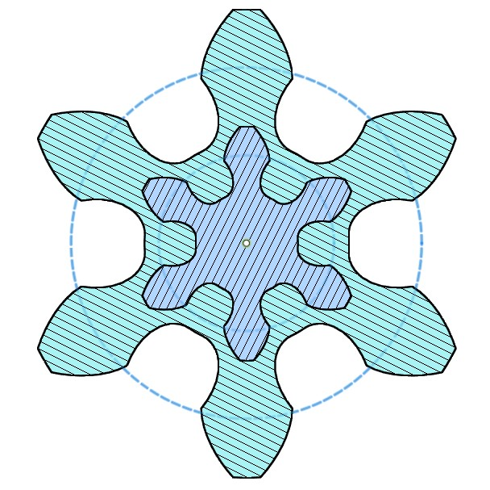
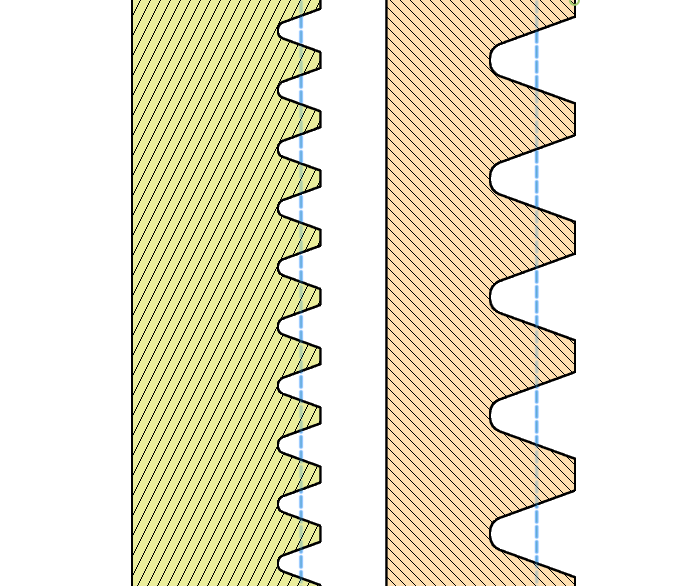
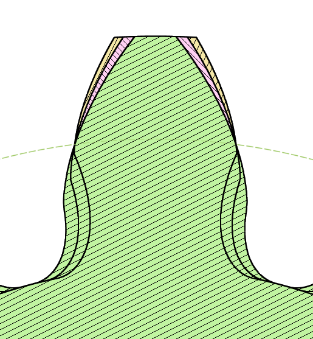
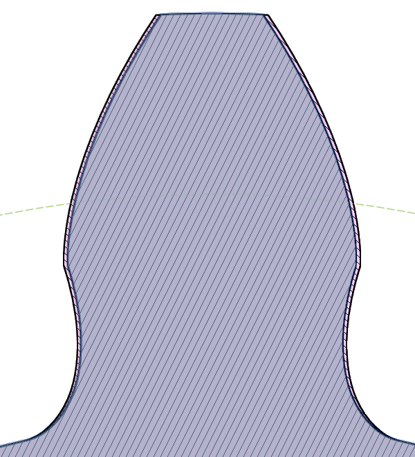
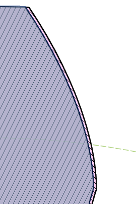
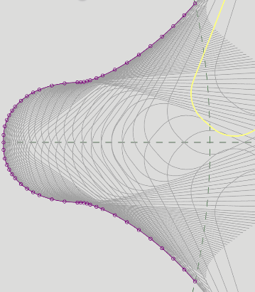
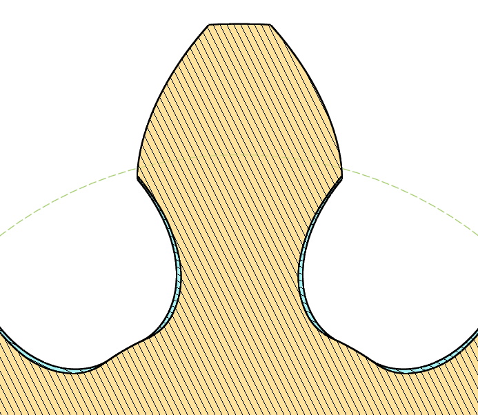
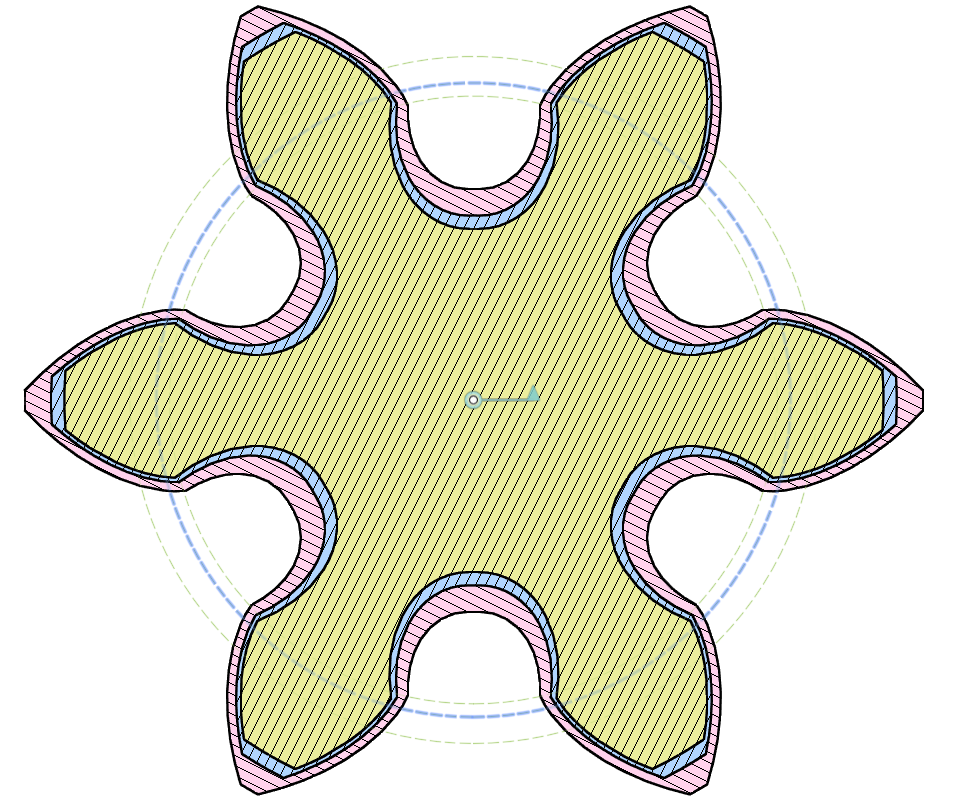

# Various Parameters of a Gear

[[Go back to fusion360-study-gears Tutorials]](https://github.com/osamutake/fusion360-study-gears/#tutorials)

## Module $m$

The module of a gear is a parameter that determines the size of the gear teeth and has the dimension of length.

The relationship between the size of the teeth and the module number is a simple proportional relationship. If the module number is $m$, the pitch of the teeth (the period at which the teeth are arranged) is expressed as $\pi m$.

The reason why $\pi$ appears here is to make it easy to express the diameter $d$ of a gear with module $m$ and number of teeth $z$ as $d=mz$. Since the circumference of a circle with diameter $d$ is $\pi d$, the relationship $d=mz$ is derived from $\pi d=\pi m \times z$.

The figure below compares the sizes of gears and racks with modules of 4 mm and 2 mm. You can see that when the module is doubled, the size of the teeth is also doubled.

## Involute Gear

As a basic premise, the gears generated by this script are called "involute gears."

The most important feature of involute gears is that gears designed with the same module (and pressure angle, which is described later) can be combined and operated regardless of the numbers of tooth (a rack corresponds to an infinite number of teeth).

## Pitch Circle

The "gear diameter $d$" mentioned above is precisely the diameter of the "pitch circle."

This diameter is where the thickness of the gear teeth is half the pitch. Since the teeth of the gear become thinner towards the tip, if the diameter is taken larger, the teeth become thinner relative to the pitch. The pitch circle is where the thickness of the teeth is exactly half of the pitch. It is called as the pitch line in the case of a rack.

By arranging two gears so that their pitch circles or pitch lines touch to each other, proper meshing is achieved.

## Pressure Angle

The angle formed by the tooth profile and the radius at the point where the tooth profile intersects the pitch circle is called the pressure angle.

The figure shows tooth profiles with pressure angles of 14 degrees, 20 degrees, and 26 degrees overlaid. You can confirm that all tooth profiles overlap on the pitch circle.

Gears will not mesh correctly unless their pressure angles are the same, as well as the modules. Usually, a pressure angle of 20 degrees is used, but in some cases, a pressure angle of 14 degrees may be used depending on the application.

## Backlash

Gears that are theoretically made to mesh perfectly cannot form an oil film between them and cannot absorb assembly errors, so they cannot rotate smoothly in practice.

Therefore, in practical gears, the teeth are made slightly thinner than the theoretical value to create "play" between the teeth, allowing for smooth rotation. This play is called backlash.

The figure shows a gear with a module of 4 mm, comparing a tooth profile with zero backlash (pink) and a tooth profile with 0.2 mm backlash in the direction of tooth movement (rotation direction). By making both sides of the tooth 0.1 mm thinner, a total play of 0.2 mm is created.

If two gears with 0.2 mm backlash are combined, a total play of 0.4 mm will be created.

The right figure is a simulation in Fusion 360 showing that when a gear with backlash is rotated in one direction and then starts to rotate in the opposite direction, there is a moment when the meshing of the teeth is disengaged and rotation is not transmitted.

## Addendum, Dedendum, Radial Clearance

The addendum and dedendum are the radial distances from the pitch circle to the tip of the teeth or the bottom of the teeth, respectively, and in this script, the values are specified as multiples of the module.

The standard values are an addendum of 1.0, which is equal to the module, and a dedendum of 1.25.

By making the dedendum 0.25 times longer than the addendum, a radial clearance of 0.25 times the module is created between the tip of the teeth and the bottom of the teeth of the other gear when two gears are meshed, which helps the gears rotate smoothly.

## Gear Cutting with Rack-shaped Cutters

The shape of a typical spur gear is created by cutting a disk-shaped material with a rack-shaped cutter. The figure below simulates the process of the cutter's teeth (yellow curve) approaching and passing through the rotating gear material.

The part near the tip of the teeth of the gear is cut by the straight part of the cutter, and a curve called as **involute curve** appears.  This involute region of the gear is the part that contacts the mating gear and transmits power.

On the other hand, a trochoid curve appears near the bottom of the teeth of the gear, which is the shape created by the cutter's tip part cutting into the bottom part of the gear.

To form an appropriate clearance at the bottom of the gear, the addendum of the cutter is extended to be equal to the dedendum of the gear. The extended part of the cutter is rounded with a fillet. The yellow shape in the figure represents this extended and filleted cutter tip shape.

By cutting the bottom of the gear with the rounded cutter tip, the root of the gear connects to the bottom with a naturally rounded curve.

## Fillet Radius

The fillet size specified in this script refers to the radius of the fillet attached to the cutter's tip, so even if this is set to zero, the gear's root will still have a rounded shape along the cutter's path.

The figure below shows a tooth profile with a normal filleted (with maximum fillet radius) cutter in blue and a tooth profile with a zero fillet cutter in yellow. Even with a zero fillet, the gear tooth profile does not have sharp corners.

In the calculation of worm wheel tooth profiles, the gear shape is determined by moving the cutter position step by step as shown in this figure. So, if the fillet radius is small, there will be uncut areas between steps, resulting in an incorrect tooth profile. Make sure to generate worm wheels with a sufficient fillet.

## Shifted Gears

Shifted gears are gears cut with a rack-shaped cutter positioned either further away (positive shift) or closer (negative shift) than usual.

With using shifted gears, we can make fine adjustment of the meshing distance without changing the module and number of teeth. Positive shift increases the meshing distance, while negative shift decreases it.

The figure below shows a blue gear with zero shift, overlaid with a pink gear shifted positively by 1/4 of the module and a yellow gear shifted negatively by 1/8 of the module.

The blue dashed line represents the original reference circle, and the green dashed lines represent circles drawn by increasing or decreasing the radius by the shift amount from the reference circle.

Positive shift makes the gear larger, reduces undercut at the root, and expands the involute region, but makes the tooth tip thinner and weaker.

Negative shift makes the gear smaller, increases undercut at the root, and narrows the involute region, but makes the tooth tip thicker and stronger.

These characteristics make shifted gears useful in the following applications:

- Positive shift is used to reduce undercut at the root of small gears and improve meshing.
- In helical gears, shift is used to adjust the meshing distance to a convenient value, as the meshing distance would otherwise be an irrational number.
- In planetary gears, shift is used to meet specific conditions for the meshing distances of multiple gears.

However, there are several points to be aware of when using shifted gears compared to non-shifted gears.

For non-shifted gears, the center distance can be determined by contacting the "reference circles" for any combination of gears. For shifted gears, however, the center distance cannot be determined by such simple calculations. If the mating gear is a rack, adjusting the center distance by the shift amount will achieve proper meshing. In contrast, if the mating gear has a finite number of teeth, complex calculations involving the number of teeth and shift amounts of both gears are required to determine the center distance.

The calculation includes the inverse calculation of the involute function, which cannot be performed using inverse trigonometric functions and requires dedicated iterative calculations.

Additionally, depending on the combination of the number of teeth and shift amounts, the gears may interfere with each other and not rotate.

----

[[Go back to fusion360-study-gears Tutorials]](https://github.com/osamutake/fusion360-study-gears/#tutorials)
