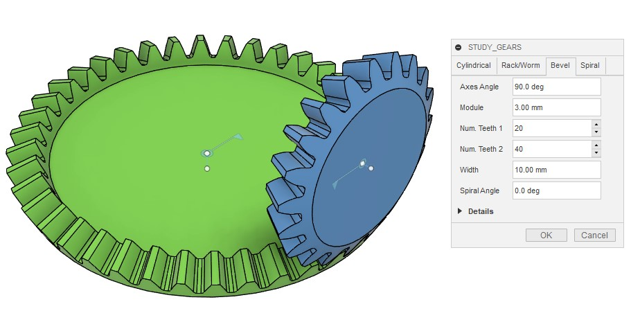

# かさば歯車を生成して回転させる

[[fusion360-study-gears チュートリアルへ戻る]](https://github.com/osamutake/fusion360-study-gears/blob/main/README-ja.md#チュートリアル)

かさば歯車は２つの回転軸を任意の角度でかみ合わせることのできる歯車です。

かさば歯車は切削による製作が難しいため、いろいろな特性の歯形が開発されているそうです。

その中で、３Ｄプリンタのように歯車の切削工程について考える必要がない場合には、平面的な歯車として歯形がインボリュート曲線となるインボリュート歯車が使われるのと同様に、かさば歯車として歯形が球面インボリュート曲線となる歯車を利用することができ、よい特性が得られるという内容がこちらのリンク先の記事で紹介されていました。

https://thermalprocessing.com/computerized-design-of-straight-bevel-gears-with-optimized-profiles-for-forging-molding-or-3d-printing/

ということで、このスクリプトでは球面インボリュート関数を歯形として持つかさば歯車を生成します。

- 歯元のフィレット
- 小径歯車の場合の切り下げ
- まがり歯

にも対応しています。一方で、

- フィレット半径の変更には対応していません
- 転位にも対応していません

内部では球面インボリュートと言うだけあって球面上で歯形を計算しています。

> このスクリプトを実装していて気づいたのですが、Fusion 360 は球面上に描いた歯形からサーフェスパッチを作り、それを複数並べてロフトにより繋げることではすば歯車の歯溝を切るようなことが可能なのですね。ロフトで繋げられるのはプロファイルとして認識される平面的な形状のみであると勘違いしていました。

## かさば歯車の生成

bevel タブを開いてそのまま OK を押せば、図のように２つのかさば歯車が組み合わさった状態で生成されます。

歯車自体の大きさはモジュールと歯数、軸の角度で決定されます。 Width で歯の生成される幅を指定します。

これらの歯車は回転ジョイントで固定されていますので、モーションリンクを設定すればすぐに連動して動かせます。

## 歯形の詳細

バックラッシュゼロで作成した歯車の接触部分を拡大しました。

繰り返しになりますが、このスクリプトが生成するかさば歯車の歯形は 通常の平歯車の歯形を流用したものではなく、 ちゃんとかさば歯車用に球面インボリュート曲線を使って形作られたものです。

そのおかげで２つの歯車が正しく精密に噛み合っていることを確認できます。

また、このケースでは上側の小径歯車には切り下げが生じています。

切り下げとは、下の歯車の歯先が上の歯車の歯元と干渉するのを避けるために 歯元にえぐれた形状が生じることです。ここには球面トロコイド曲線が現れます。

このスクリプトでは歯末の球面インボリュート領域だけでなく 歯元の球面トロコイド領域も正しく計算するため、 この組み合わせでも問題なく歯車は回転します。

この部分を正しく計算せず球面インボリュート曲線のみで歯形を生成しようとすると 歯元の形状を定められなかったり、２つの歯車に干渉が生じて回転しなかったりと いった問題が生じます。

下側の歯車には切り下げは生じていませんが、 歯末のインボリュート領域と歯底を滑らかにつなぐフィレットとして やはり球面トロコイド曲線が現れています。

## まがり歯への対応

Spiral Angle に値を入れるとまがり歯のかさば歯車を作れます。

はすば歯車と同様に、まがり歯では正面モジュールが歯垂直モジュールに比べて大きくなるため、歯車自体も一回り大きくなります。

本当は負のバックラッシュを設定したまがり歯のかさば歯車を作り、干渉測定で歯当たりを検証したかったのですが、歯形が複雑すぎるためなのか、ブール演算に失敗してしまうケースが頻発してうまく計算が行えませんでした。。。

## フェースギアの代わりに使える？

フェースギア（クラウンギア）の歯形の計算は難しいので、 かさ歯車で代用することも可能かもしれません。

とはいえ、かさ歯車では小歯車の軸方向へ移動すると歯当たりが変わってしまうため、 その点に注意が必要になります。

----
[[fusion360-study-gears チュートリアルへ戻る]](https://github.com/osamutake/fusion360-study-gears/blob/main/README-ja.md#チュートリアル)
