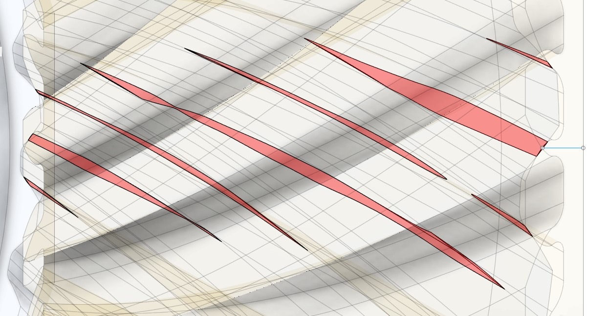
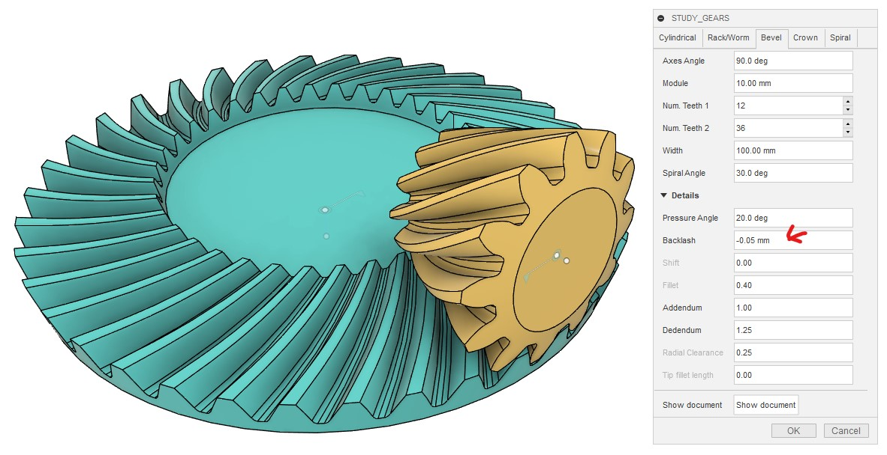
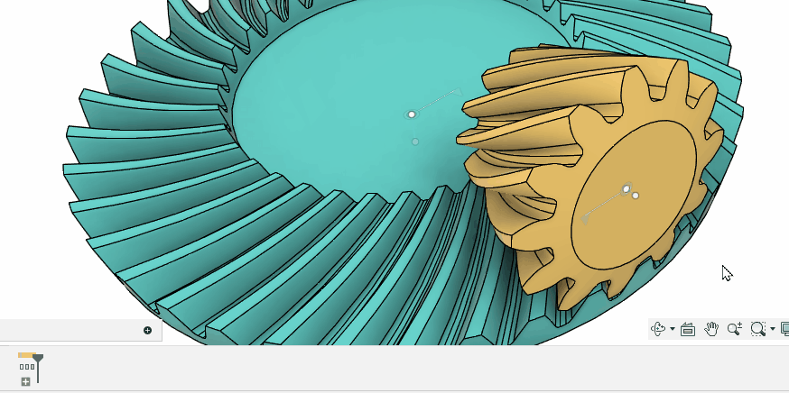
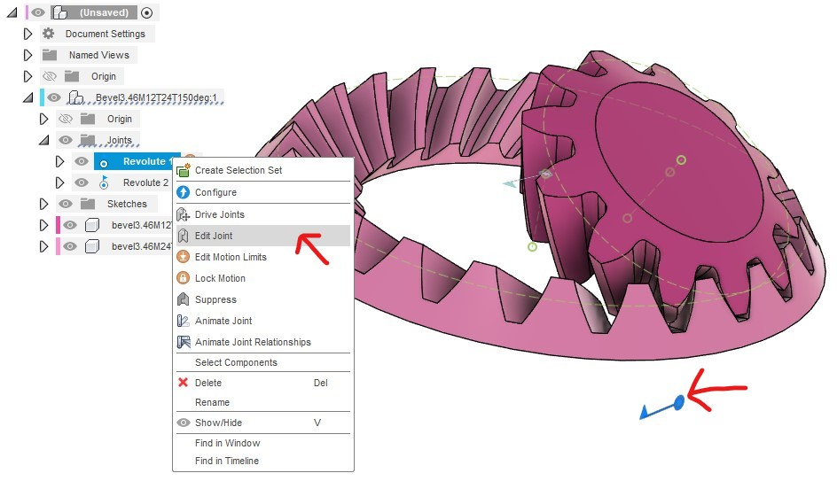

# かさ歯車を生成して回転させる

[[fusion360-study-gears チュートリアルへ戻る]](https://github.com/osamutake/fusion360-study-gears/blob/main/README-ja.md#チュートリアル)

かさ歯車は２つの回転軸を任意の角度でかみ合わせることのできる歯車です。

かさ歯車は切削による製作が難しいため、いろいろな特性の歯形が開発されているそうです。

その中で、３Ｄプリンタのように歯車の切削工程について考える必要がない場合には、平面的な歯車として歯形がインボリュート曲線となるインボリュート歯車が使われるのと同様に、かさ歯車として歯形が球面インボリュート曲線となる歯車を利用することができ、よい特性が得られるという内容がこちらのリンク先の記事で紹介されていました。

https://thermalprocessing.com/computerized-design-of-straight-bevel-gears-with-optimized-profiles-for-forging-molding-or-3d-printing/

ということで、このスクリプトでは球面インボリュート関数を歯形として持つかさ歯車を生成します。

- 歯元のフィレット
- 小径歯車の場合の切り下げ
- まがり歯
- 内歯

にも対応しています。一方で、

- フィレット半径の変更には対応していません
- 転位にも対応していません

内部では球面インボリュートと言うだけあって球面上で歯形を計算しています。

> このスクリプトを実装していて気づいたのですが、Fusion 360 は球面上に描いた歯形からサーフェスパッチを作り、それを複数並べてロフトにより繋げることではすば歯車の歯溝を切るようなことが可能なのですね。ロフトで繋げられるのはプロファイルとして認識される平面的な形状のみであると勘違いしていました。

## かさ歯車の生成

bevel タブを開いてそのまま OK を押せば、図のように２つのかさ歯車が組み合わさった状態で生成されます。

歯車自体の大きさはモジュールと歯数、軸の角度で決定されます。 Width で歯の生成される幅を指定します。

これらの歯車は回転ジョイントで固定されていますので、モーションリンクを設定すればすぐに連動して動かせます。

## 歯形の詳細

バックラッシュゼロで作成した歯車の接触部分を拡大しました。

繰り返しになりますが、このスクリプトが生成するかさ歯車の歯形は 通常の平歯車の歯形を流用したものではなく、 ちゃんとかさ歯車用に球面インボリュート曲線を使って形作られたものです。

そのおかげで２つの歯車が正しく精密に噛み合っていることを確認できます。

また、このケースでは上側の小径歯車には切り下げが生じています。

切り下げとは、下の歯車の歯先が上の歯車の歯元と干渉するのを避けるために 歯元にえぐれた形状が生じることです。ここには球面トロコイド曲線が現れます。

このスクリプトでは歯末の球面インボリュート領域だけでなく 歯元の球面トロコイド領域も正しく計算するため、 この組み合わせでも問題なく歯車は回転します。

この部分を正しく計算せず球面インボリュート曲線のみで歯形を生成しようとすると 歯元の形状を定められなかったり、２つの歯車に干渉が生じて回転しなかったりと いった問題が生じます。

下側の歯車には切り下げは生じていませんが、 歯末のインボリュート領域と歯底を滑らかにつなぐフィレットとして やはり球面トロコイド曲線が現れています。

モジュール6で歯数30と歯数15の歯車を９０度で組み合わせ、バックラッシュを -0.03 mm に設定しました。 これらを組み合わせて動かしながら干渉部分を見ることで、歯当たりを確認できます。

本当はもう少し小さいバックラッシュで試したかったのですがブーリアン演算の失敗が頻発したため、意図的に大きな干渉を生じさせています。

球面インボリュート曲線で生成した歯面同士が正しく接触していることを確かめられました。

## まがり歯への対応

Spiral Angle に値を入れるとまがり歯のかさ歯車を作れます。

はすば歯車と同様に、まがり歯では正面モジュールが歯垂直モジュールに比べて大きくなるため、歯車自体も一回り大きくなっています。

## まがり歯に対する歯当たりの検証（失敗）

まがり歯でも歯当たりを検証してみたのですが・・・

すぐ歯の時と同様に負のバックラッシュを設定して干渉を見る方法を試したところ、うまく行きませんでした。

本来なら歯筋に沿って端から端まで連続的に移動するはずの接触領域が途切れ途切れになってしまっています。

負のバックラッシュを大きく取ってみたのがこちらです。
これを見ると歯面間の距離が揺らいでしまっていることが原因のように見えます。

この結果を見た当初は歯車の形状が悪いのかと思って慌てたのですが、どうやらこれは干渉領域の計算精度に問題があるためのようです。

Fusion 360 では複雑な曲面を持つボディ同士の間のブーリアン演算結果はあまり信用を置けないようです？！

## 歯溝形状との重ね合わせを用いた歯当たりの検証

２つの歯車の干渉を見るのではなく、以下のように一方の歯車形状と、もう一方の歯溝形状との上下関係を見る方法を用いることで、計算は軽く、結果も見やすく、精度も高い解析を行えることが分かりました。

まず十分な計算精度を確保するために大きなモジュール、ここではモジュール10で、歯数12と歯数36の曲がり角30度の曲がり歯かさ歯車を生成しました。軸間の角度は９０度です。このときバックラッシュを -0.05 mm に設定することで２つの歯車が若干ですが干渉するようにしておきます。

ここで干渉解析を行うと、やはり干渉領域は途切れ途切れになってしまっており、正しい歯当たりが得られていないかのような結果が得られてしまいます。

正しい解析を行うために、小さい方の歯車の歯溝形状を生成し、それをモーションリンクで大きな歯車と一緒に回転させます。干渉部分では歯溝形状が歯面より上に来るため、とても分かりやすく歯当たり位置を確認できます。

手順は以下の通りです：

- ベベルギア生成の作業履歴グループを開く
- その中の小さい方の歯車に関する履歴のうち「除去」がたくさん並んでいるところをすべて選択
- 「フィーチャを抑制」する
- 小さい歯車の歯溝位置に一連のパッチが出現したのを確認
- それらをロフトで繋ぐことで歯溝形状を得る
- その際、外から２つ目については選択せずにおきます
   - これは外端ぴったりに生成されたオリジナルの歯溝形状です
   - これをコピー、スケール、回転して他のパッチが生成されています
   - このオリジナルを選んでしまうとパッチの間隔が不均一になるため精度に悪影響があるようです
- 生成された形状が歯溝形状と完全に一致することを確認するため小さい歯車との間で干渉解析を行います
  - 「一致する面を含める（Include Coincident Faces）」をチェックしなければ干渉なし
  - 「一致する面を含める（Include Coincident Faces）」をチェックすると歯溝全体が検出される
- 生成された形状を小さい歯車と同じコンポーネントに移動します
- 小さい歯車と大きい歯車との間にモーションリンクを生成します
- 小さい歯車を非表示にして、歯溝形状を大きい歯車の上で転がします
- 大きい歯車の歯面は負のバックラッシュ分だけ歯溝形状より上に来ることになります
- 歯溝構造の曲面の上に現れた大きい歯車の歯面により色の変わるところが歯と歯の接触する領域になります

このように確認すると歯の接触領域は大きく途切れることなく歯筋全体に渡って移動しており、 曲がり歯のはすば歯車の歯形が正確に出力されていることを確認できました。

## 内歯かさ歯車

２つの歯車の大きさが異なるとき、
軸間角度を大きくすると内歯かさ歯車が生成されます。

通常の内歯車のケースと同様に、内歯かさ歯車は歯数の組み合わせによって干渉を起こし、
実際には回転しない形状が生成されてしまうため、製作に移る前に Fusion 360 上で
干渉がないことを慎重にチェックする必要があります。

### ジョイント位置の修正方法

現状でこのスクリプトは内歯かさ歯車と噛み合う小歯車のジョイントを
正しい位置に生成することができません。

これにはスクリプト内での内歯車の生成手順が関係しています。

このスクリプトは内歯のかさ車歯を通常の外向きのかさ歯車の歯形を反転することで生成しています。
その際、小歯車も一旦外向きの歯車とかみ合うように生成したものを内歯車と噛み合う位置に移動して最終形を得ています。

もちろんジョイントはかみ合い位置に移動した後に生成しているのですが、
なぜかジョイント作成時にコンポーネントの移動がうまく反映されず、移動前の位置にジョイントが生成されてしまっているのが正しい位置に生成されない理由です。

ジョイント作成時にコンポーネントの移動が反映されないのは Fusion 360 
のバグによるものである可能性が高いと感じています。

というのも、おかしな位置に生成されたジョイントを「編集」しようとすると、
編集ダイアログが表示された瞬間、何の操作も必要なくジョイントは正しい位置に移動します。

ですので、ジョイントを正しい位置に生成する方法が分かるまではこの方法で
ジョイント位置を調整して利用するようにしてください。

## クラウンギアの代わりに使える？

クラウンギア（フェースギア）の歯形の計算は難しいので、 かさ歯車で代用することも可能かもしれません。

とはいえ、かさ歯車では小歯車の軸方向へ移動すると歯当たりが変わってしまうため、 その点に注意が必要になります。

→ その後、このスクリプトの Crown タブでクラウンギアも生成できるようになりました。

----
[[fusion360-study-gears チュートリアルへ戻る]](https://github.com/osamutake/fusion360-study-gears/blob/main/README-ja.md#チュートリアル)
