# Generate and Rotate Bevel Gears

[[Go back to fusion360-study-gears Tutorials]](https://github.com/osamutake/fusion360-study-gears/#tutorials)

Bevel gears are gears that can mesh at arbitrary angles between two rotational axes.

<a href="assets/bevel26.gif">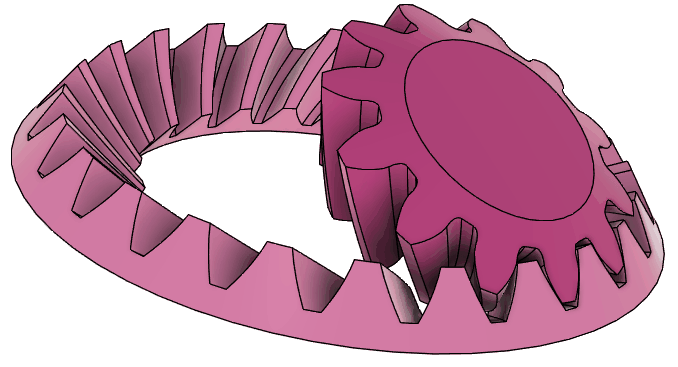</a>

Bevel gears are challenging to manufacture through cutting, so various tooth profiles have been developed. Among these, when manufacturing constraints like cutting are not a concern, such as with 3D printing, bevel gears with a spherical involute curve as the tooth profile can be used, similar to how involute gears are used for planar gears. This approach is introduced in the following article:

https://thermalprocessing.com/computerized-design-of-straight-bevel-gears-with-optimized-profiles-for-forging-molding-or-3d-printing/

This script generates bevel gears with spherical involute curves as their tooth profiles.

- Fillets at the tooth root
- Undercutting for small gears
- Spiral teeth
- Internal bevel gear

are supported. However:

- Changing the fillet radius is not supported.
- Profile shifting is not supported.

Internally, the tooth profile is calculated on a spherical surface, as the name "spherical involute" suggests.

> While implementing this script, I realized that Fusion 360 allows creating gear tooth grooves by generating surface patches from tooth profiles drawn on a spherical surface, arranging them, and connecting them using lofts. I had mistakenly thought that only planar shapes recognized as profiles could be connected using loft feature.

## Generating Bevel Gears

Open the bevel tab and press OK to generate two bevel gears meshed together, as shown in the figure.

<a href="assets/bevel8.jpg">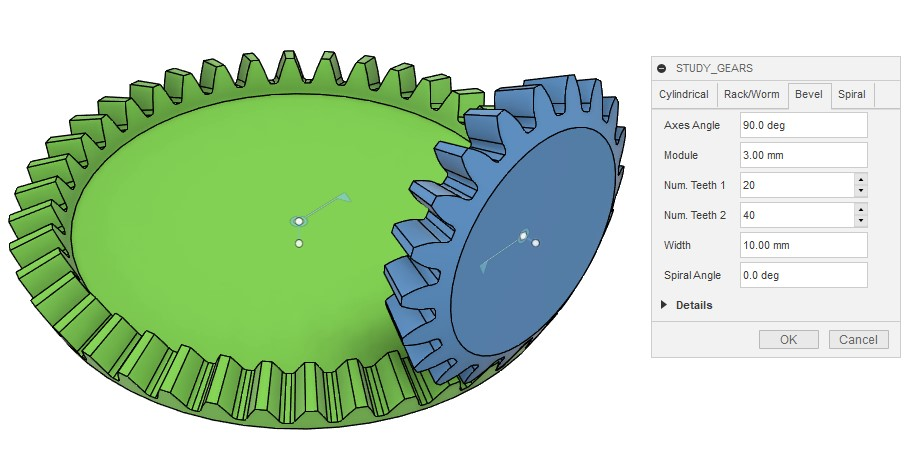</a>

The size of the gears is determined by the module, number of teeth, and shaft angle. The width specifies the generated tooth width.

These gears are fixed with rotational joints, so you can set motion links to make them move together immediately.

## Detail of Tooth Profile

Here is a close-up of the contact area of gears created with zero backlash.

As mentioned earlier, the tooth profile of the bevel gears generated by this script is not a reused profile from standard spur gears. Instead, it is properly formed using spherical involute curves specifically for bevel gears.

This ensures that the two gears mesh correctly and precisely.

In this case, undercutting occurs on the smaller gear at the top.

Undercutting refers to the removal of material at the tooth root to prevent interference between the tip of the other gear. This results in appearance of a spherical trochoidal curve at the tooth root.

This script calculates not only the spherical involute region at the tooth tip but also the spherical trochoidal region at the tooth root, ensuring that the gears rotate smoothly even in the cases like this combination.

If the tooth profile were generated using only spherical involute curves without correctly calculating the trochoidal region, it would result in undefined shapes at the tooth root or interference between the two gears, preventing rotation.

The larger gear at the bottom in the figure does not experience undercutting, but a spherical trochoidal curve also appears as a fillet that smoothly connects the involute region at the tooth tip to the tooth bottom.

<a href="assets/bevel10.gif">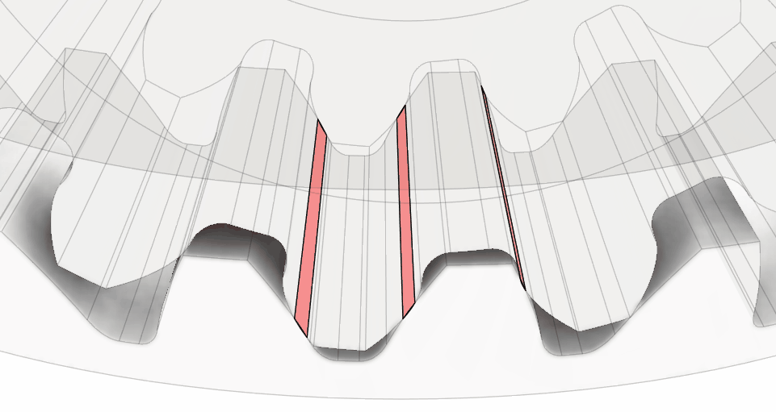</a>

Bevel gears were generated with module 6 and numbers of teeth 30 and 15 with 90 deg between axes with backlash set to -0.03 mm. We can check the contact between the two gears by visualizing the interfering part during their combined rotation.

I wanted to have smaller values for backlash but smaller backlash caused errors in boolean operation of gear shapes. So, I set unwanted large negative backlash to have clear overlap between the gears.

It can be confirmed that the tooth shapes generated from the spherical involute curve contact nicely with each other.

## Supporting Spiral Teeth

By entering a none-zero value for the Spiral Angle, you can create bevel gears with spiral teeth.

Similar to helical gears, spiral teeth result in a larger gear size because the transverse module is larger than the normal module.

I tried to create bevel gears with spiral teeth and negative backlash to verify tooth contact through interference checks. However, probably due to the complexity of the tooth profile, boolean operations frequently report failures, and the calculations could not be completed successfully.

## Verification of Tooth Contact for Spiral Bevel Gears (Failed)

I attempted to verify the tooth contact for spiral teeth.

Using the same method as for straight teeth, I set a negative backlash to observe interference, but it did not work as expected.

<a href="assets/bevel15.jpg">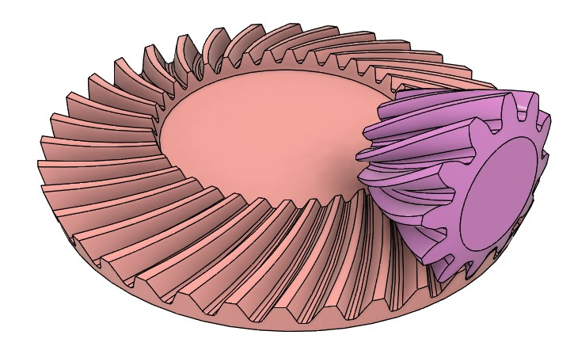</a>
<a href="assets/bevel14.jpg">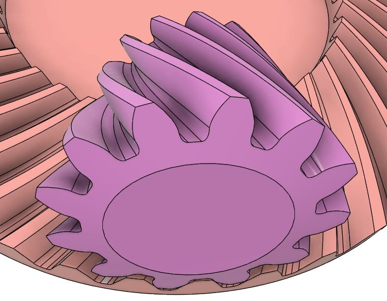</a>

The contact area should move continuously along the tooth line from one end to the other, but it ended up being fragmented.

Here is the result with a larger negative backlash. It seems that the fluctuating distance between the tooth surfaces is causing the issue.

<a href="assets/bevel16.jpg">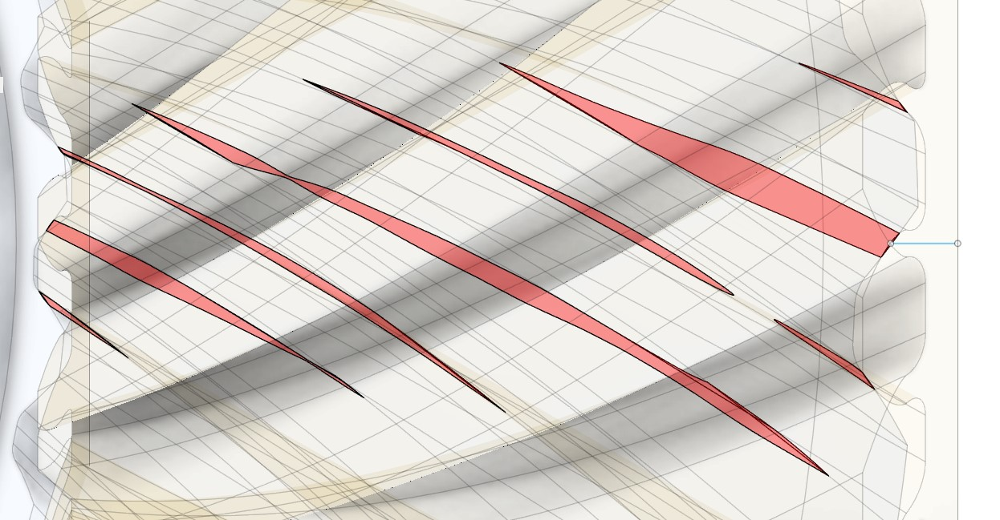</a>

Initially, I panicked, thinking the gear shape was incorrect, but it appears that the issue lies in the accuracy of the interference analysis.

It seems that the Boolean operation results between bodies with complex curved surfaces in Fusion 360 cannot always be trusted.

## Verification of Tooth Contact Using Tooth Groove Shape Overlay

Instead of observing the interference between two gears, I found that a more lightweight, visually clear, and accurate analysis can be performed by examining the relative position of one gear's tooth groove shape and the other gear's tooth surface, as shown below.

To ensure sufficient calculation accuracy, I generated spiral bevel gears with a large module of 10, 12 teeth for the smaller gear, and 36 teeth for the larger gear, with a spiral angle of 30 degrees. The angle between two shafts was set to 90 degrees. By setting the backlash to -0.05 mm, I ensured slight interference between the two gears.

<a href="assets/bevel19.jpg">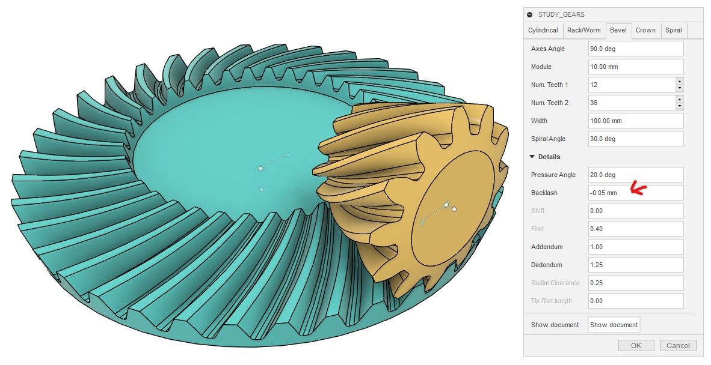</a>

When performing interference analysis, the interference regions again appeared fragmented, giving the impression that proper tooth contact was not achieved.

<a href="assets/bevel20.jpg">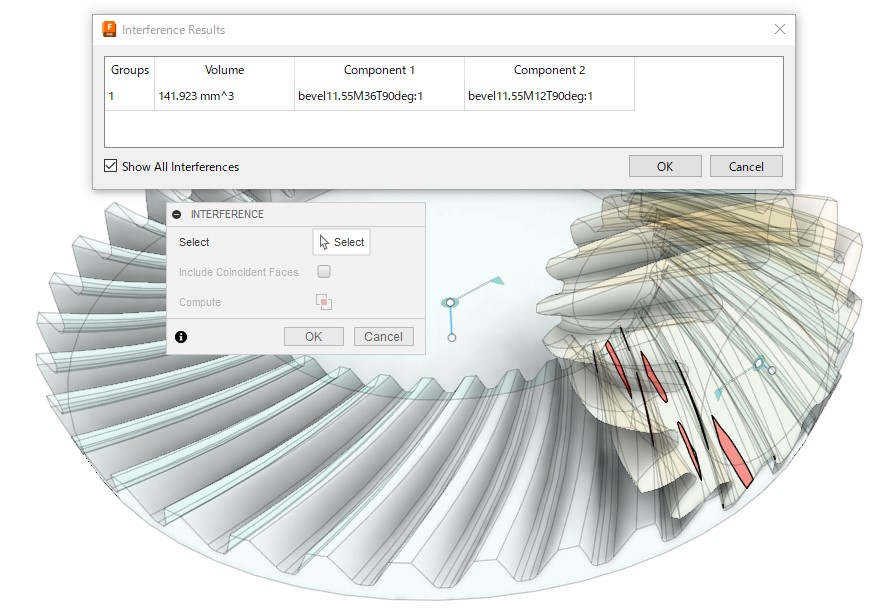</a>

To perform a correct analysis, I generated the tooth groove shape of the smaller gear and rotated it together with the larger gear using a motion link. In the interference regions, the tooth surface of the larger gear appears above the tooth groove shape of the smaller gear, making it easy to confirm the tooth contact region.

The procedure is as follows:

- Open the bevel gear generation timeline group.
- Select all the "Remove" features related to the smaller gear in the timeline.
- Suppress the selected features.
- Confirm that a series of patches appear in a tooth groove of the smaller gear.
- Connect these patches using the loft feature to obtain the tooth groove shape.
- Do not select the second outermost patch:
  - This is the original tooth groove cross section generated exactly at the outer edge of the smaller bevel gear.
  - It is copied, scaled, and rotated to generate other patches.
  - Selecting this original patch can result in uneven patch spacing, negatively affecting accuracy.
- Perform interference analysis between the generated shape and the smaller gear to confirm that:
  - Without "Include Coincident Faces" checked, there is no interference.
  - With "Include Coincident Faces" checked, the entire tooth groove is detected.
- Move the generated body of the groove shape into the same component as the smaller gear.
- Create a motion link between the smaller and larger gears.
- Hide the smaller gear and roll the tooth groove shape over the larger gear.
- The tooth surface of the larger gear will appear above the tooth groove shape by the amount of negative backlash.
- The regions where the larger gear's tooth surface is visible on the tooth groove structure's curved surface indicate the tooth contact areas.

<a href="assets/bevel21.gif">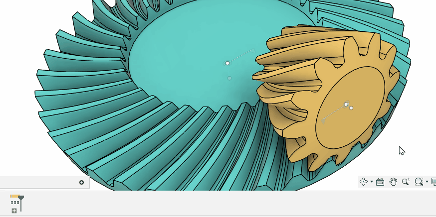</a>

Using this method, it can be confirmed that the tooth contact area moves continuously across the entire tooth line without fragmentation, verifying that the tooth profile of the spiral bevel gears is accurately generated by this script.

## Internal Bevel Gears

When the sizes of the two gears differ and the shaft angle is large, an internal bevel is generated.

As with standard internal gears, internal bevel gear may result in interference depending on the combination of teeth numbers. Therefore, it is crucial to carefully check for interference in Fusion 360 before proceeding with manufacturing.

### How to Adjust Joint Positions

Currently, this script does not generate the joint for the smaller gear meshing with the internal bevel gear at the correct position.

This issue is related to the internal gear generation process within the script.

The script generates the teeth of the internal bevel gear by inverting the tooth profile of a standard outward-facing bevel gear. During this process, the smaller gear is initially generated to mesh with the outward-facing gear and then moved to the position where it meshes with the internal gear to obtain the final result.

Although the joint is created after moving the component to the meshing position, for some reason, the movement of the component is not properly reflected when creating the joint, resulting in the joint being generated at the pre-move position.

This is likely due to a bug in Fusion 360. When attempting to "Edit" the incorrectly positioned joint, the joint immediately moves to the correct position as soon as the edit dialog is displayed, without requiring any further action.

<a href="assets/bevel24.jpg">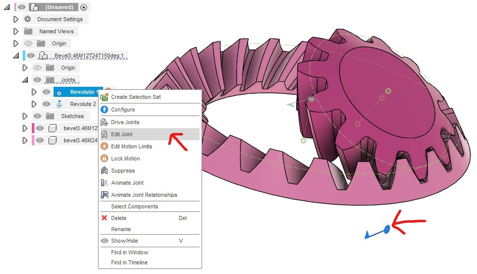</a>

<a href="assets/bevel25.jpg">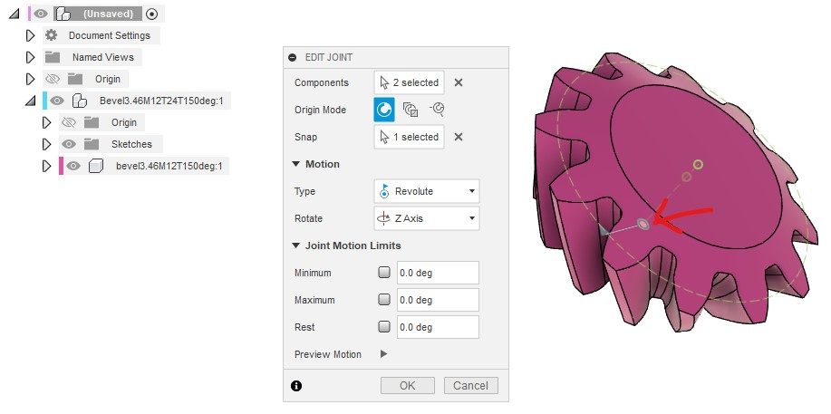</a>

Until a method to generate the joint at the correct position is found, please adjust the joint position using this method.

## Can It Replace Crown Gears?

Since calculating the exact tooth profile of crown gears, which is also known as face gears, is challenging, bevel gears might be used as a substitute.

Note that with bevel gears, the tooth contact changes when the smaller gear moves along the axis direction, so care must be taken in this regard.

→ Later, support for generating exact shape of crown gear was added to this script.

----
[[Go back to fusion360-study-gears Tutorials]](https://github.com/osamutake/fusion360-study-gears/#tutorials)