# カム機構

[[fusion360-study-gears チュートリアルへ戻る]](https://github.com/osamutake/fusion360-study-gears/blob/main/README-ja.md#チュートリアル)

Spiral タブを使いカム機構を作り動かしてみます。

<a href="assets/cam14.gif">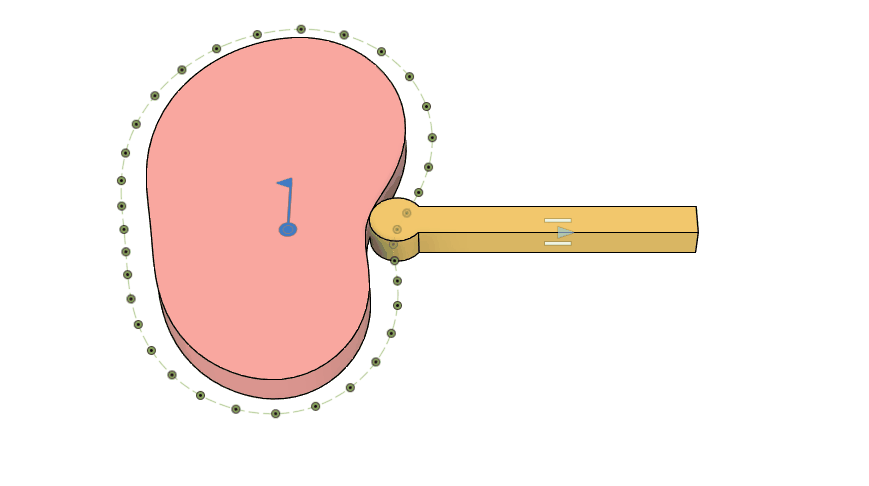</a>

ここで生成するカム機構は上図の通り半径が変化する円盤に先端が有限の半径で丸められた棒状のフォロワーが接触した構造で、カムの回転に伴いカムが直線運動を繰り返すものです。

## カム形状の生成

Spiral タブを使ってカム形状を生成します。

Total Angle を 360 deg とすると、Radii に入力した半径が全周に等間隔に配置されることになります。

最初と最後の値を等しくし、Spline をチェックすると滑らかな動作をするカム形状を生成できます。

<a href="assets/cam1.png">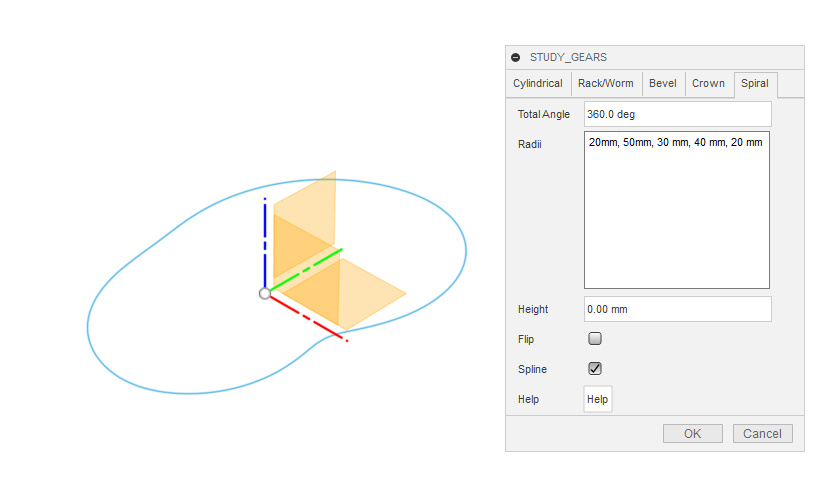</a>

ここで生成する形状は仮想的なものです。

以下ではフォロワーがこの仮想的なカム形状を追って動作するようにします。

フォロワーの先端は冒頭の図のように有限な半径で丸めておくか、あるいは実際に回転可能な車を付けることでカムとの接触を滑らかなものとするのが普通です。

そこで実際のカム形状はスクリプトで生成した仮想的なカム形状からフォロワー先端の半径分だけ内側へオフセットしたものとします。

生成されたカム形状の入ったスケッチを編集モードにします。

<a href="assets/cam2.png">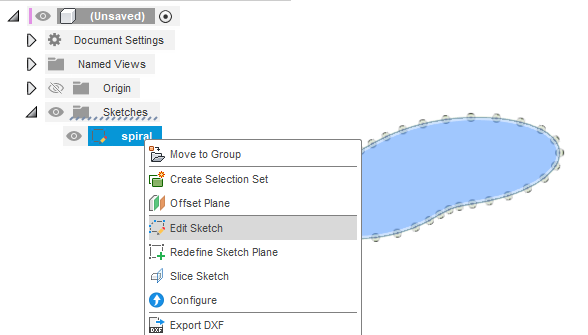</a>

オフセット機能を使い 5 mm だけ内側へオフセットした形状を生成します。

<a href="assets/cam3.png">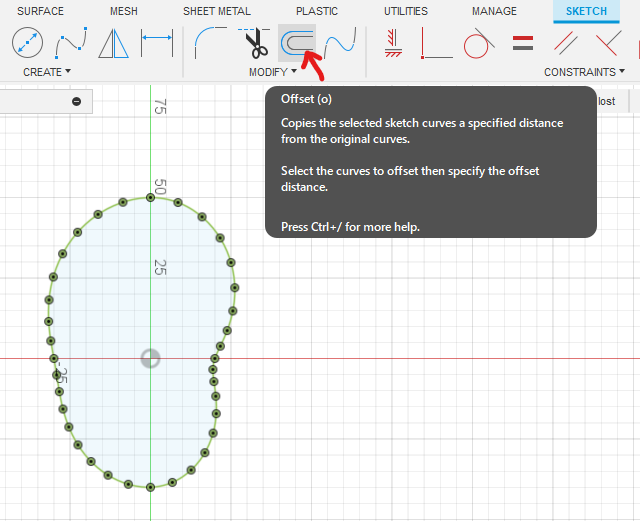</a>

<a href="assets/cam4.png">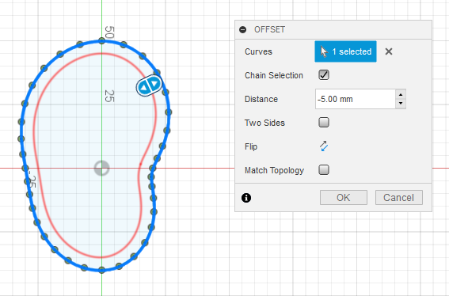</a>

元の仮想的なカム形状は Construction （破線）にしておきます。

<a href="assets/cam5.png">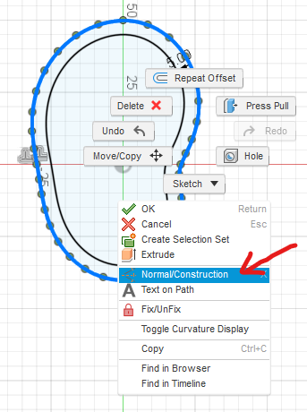</a>

## フォロワーの生成

上でオフセットに使ったのと合わせて半径 5 mm、直径 10 mm の円を描きます。

<a href="assets/cam6.png">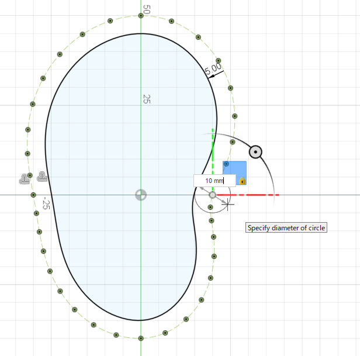</a>

今回はこれに x 軸に平行な長方形を組み合わせてフォロワー形状としました。

## 押出し

カム形状とフォロワー形状とを押し出して立体化します。

<a href="assets/cam7.png">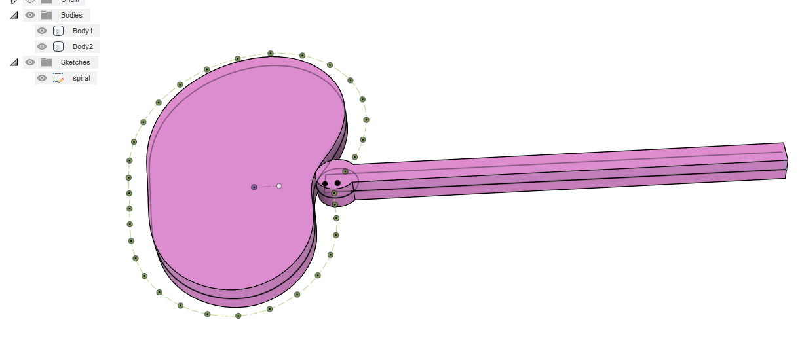</a>

## コンポーネント化

カムとフォロワーの２つのボディを別々にコンポーネント化します。

<a href="assets/cam8.png">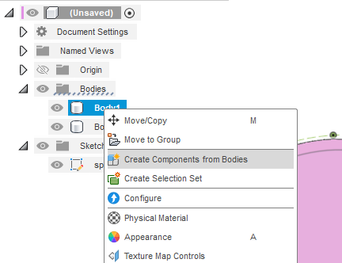</a>

１つ目のコンポーネントが「親に固定」されてしまうため、固定を解除します。

<a href="assets/cam9.png">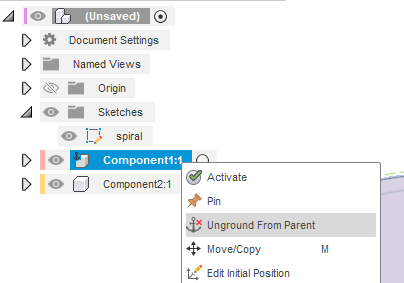</a>

## ジョイントを追加

カムコンポーネントとルートコンポーネントとを選択して、両者の間に構築済みジョイント（回転）を原点位置に作成します。

<a href="assets/cam10.png">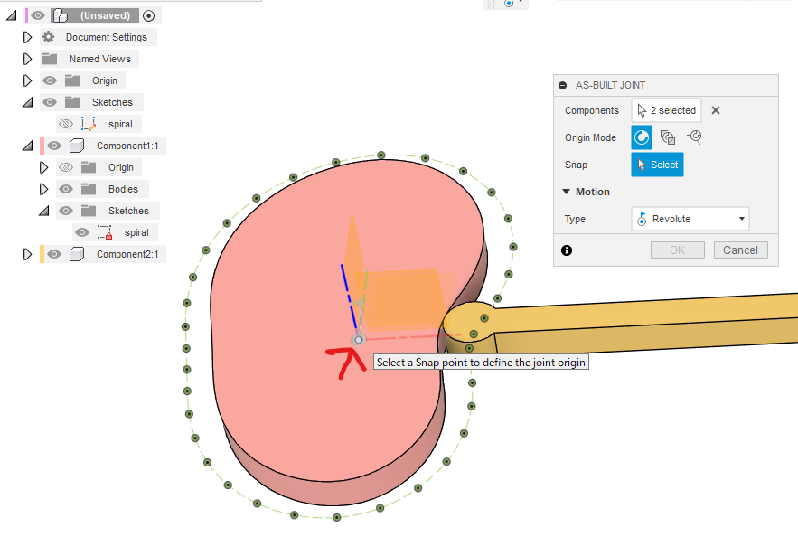</a>

フォロワーコンポーネントとルートコンポーネントを選択して、両者の間に構築済みジョイント（スライド）をフォロワーの辺に沿って生成します。

<a href="assets/cam11.png">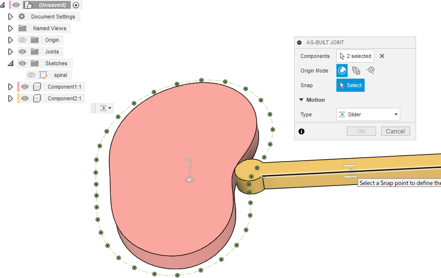</a>

## 接線関係の設定

カムとフォロワーとの間に接線関係を設定します。

<a href="assets/cam12.png">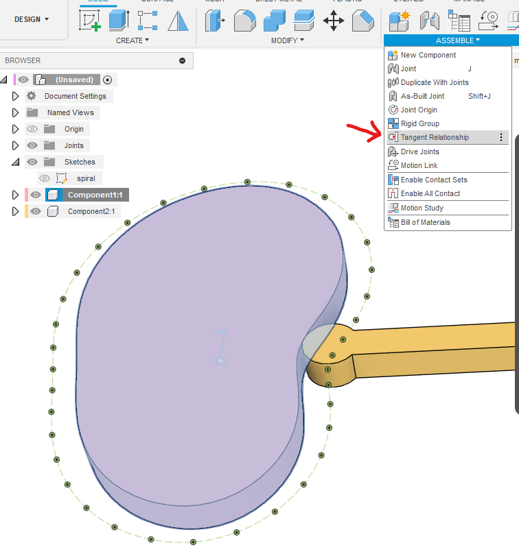</a>

<a href="assets/cam13.png">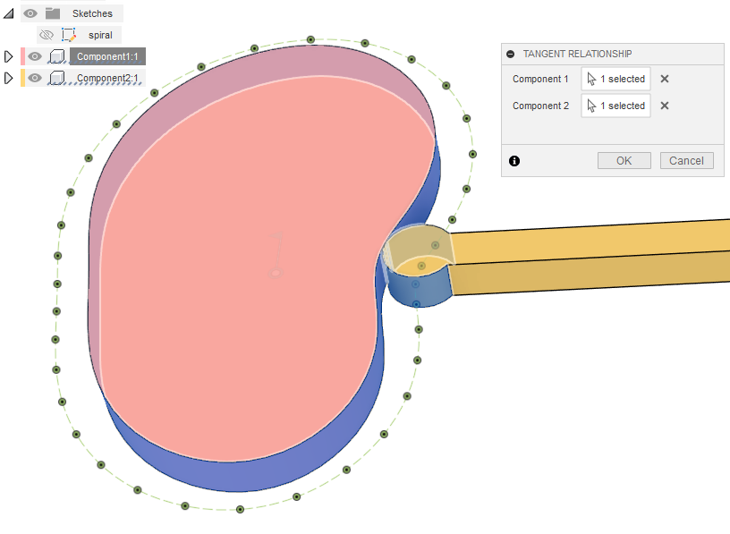</a>

## 動作確認

以上で、以下の条件で動作させられるようになりました。

- カムは中心周りに回転
- フォロワーは辺に沿ってスライド
- カムとフォロワーは接触

カムを回転して動画にしたのがこちらです。

確認用に仮想的なカム形状を同時に表示しています。
フォロワー先端の円の中心が仮想的なカム形状を追っていることを確認できます。

----
[[fusion360-study-gears チュートリアルへ戻る]](https://github.com/osamutake/fusion360-study-gears/blob/main/README-ja.md#チュートリアル)
