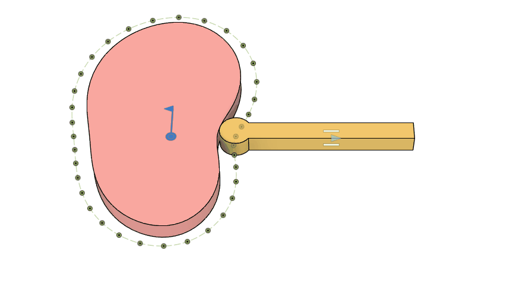
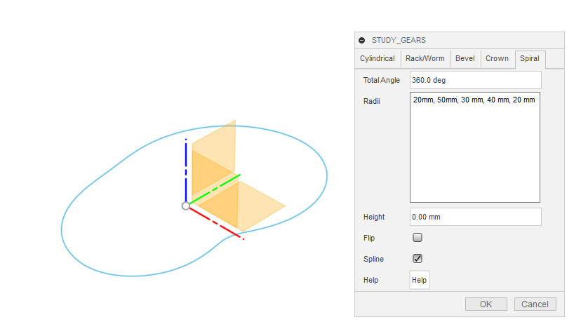
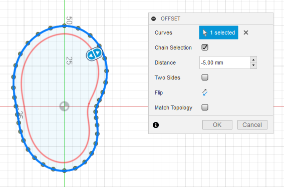
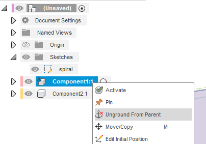
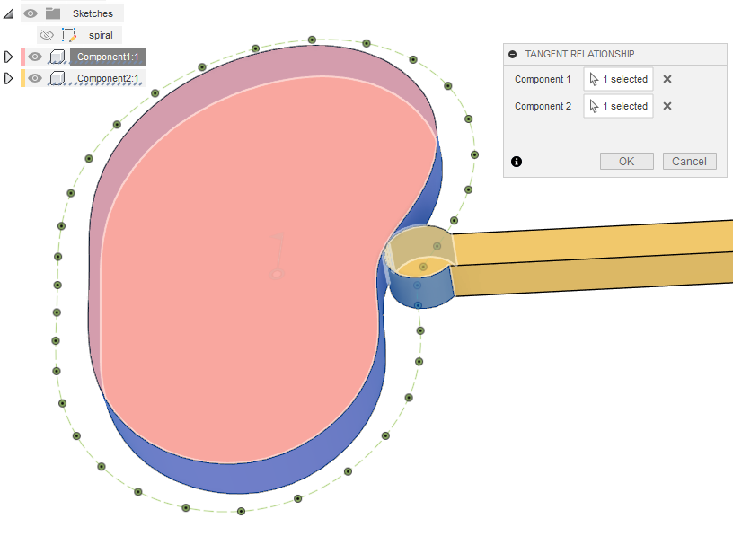

# Cam Mechanism

[[Go back to fusion360-study-gears Tutorials]](https://github.com/osamutake/fusion360-study-gears/#tutorials)

We will create and operate a cam mechanism using the Spiral tab.

The cam mechanism generated here consists of a disk with a varying radius and a rod-shaped follower with a rounded tip, as shown above. The cam rotates, causing the follower to reciprocate linearly.

## Generating the Cam Shape

Use the Spiral tab to generate the cam shape.

Setting the Total Angle to 360 degrees will evenly distribute the radii entered in the Radii field around the entire circumference.

By making the first and last values equal and checking Spline, you can generate a cam shape that operates smoothly.

The shape generated here is virtual.

In the following steps, the follower will operate by tracing this virtual cam shape.

To ensure smooth contact with the cam, the follower tip should either be rounded with a finite radius, as shown in the initial diagram, or equipped with a rotatable wheel.

The actual cam shape is offset inward by the radius of the follower tip from the virtual cam shape generated by the script.

Edit the sketch containing the generated cam shape.

Use the Offset feature to generate a shape offset inward by 5 mm.

Set the original virtual cam shape to Construction (dashed line).

## Generating the Follower

Draw a circle with a radius of 5 mm (diameter 10 mm), matching the offset used above.

This time, we combined it with a rectangle parallel to the x-axis to create the follower shape.

## Extrusion

Extrude the cam and follower shapes to create 3D bodies.

## Componentization

Separate the cam and follower bodies into individual components.

Since the first component is "fixed to the parent," remove the fixed constraint.

## Adding Joints

Select the cam component and the root component, and create an as-built joint (revolving) at the origin between them.

Select the follower component and the root component, and create an as-built joint (slider) along the follower's edge.

## Setting Tangent Relationship

Set a tangent relationship between the cam and the follower.

## Operation Check

With the above setup, the mechanism can now operate under the following conditions:

- The cam rotates around the origin.
- The follower slides along its edge parallel to x-axis.
- The cam and follower remain in contact.

Here is a video showing the cam in motion.

For verification, the virtual cam shape is displayed simultaneously. You can confirm that the center of the follower tip's circle traces the virtual cam shape.

----
[[Go back to fusion360-study-gears Tutorials]](https://github.com/osamutake/fusion360-study-gears/#tutorials)
