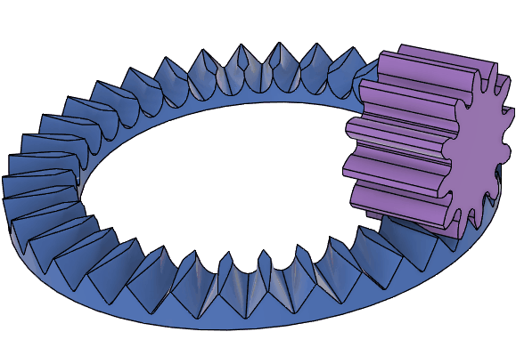
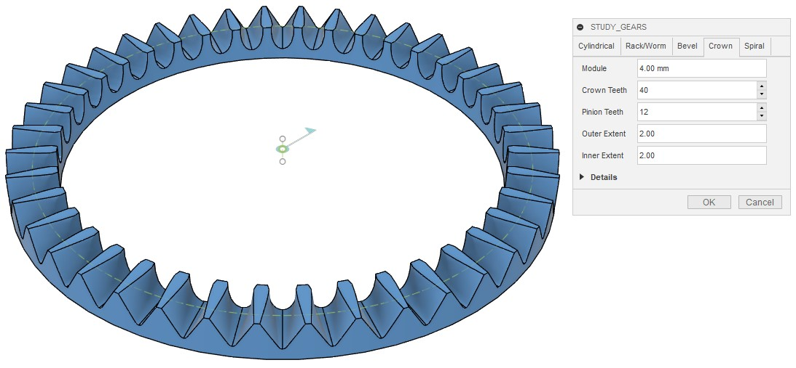
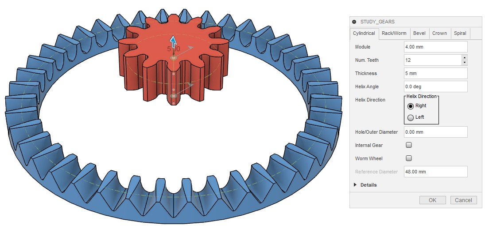
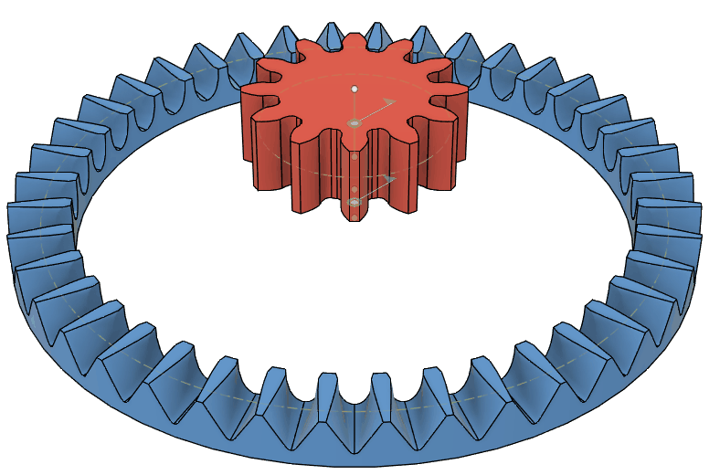
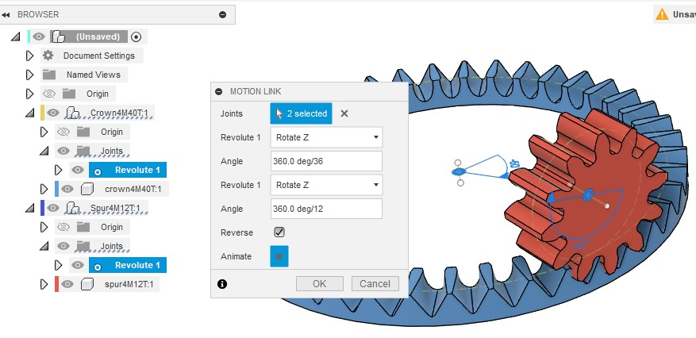
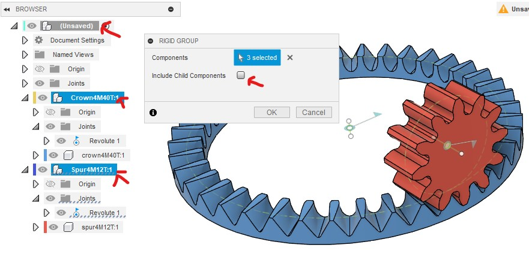
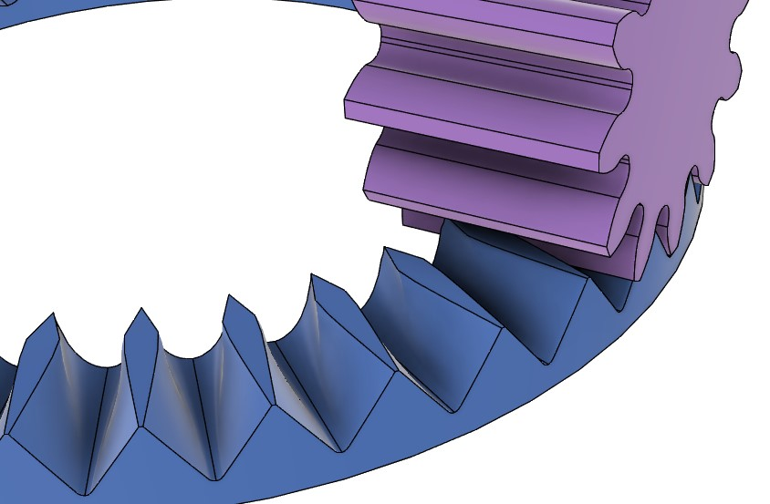
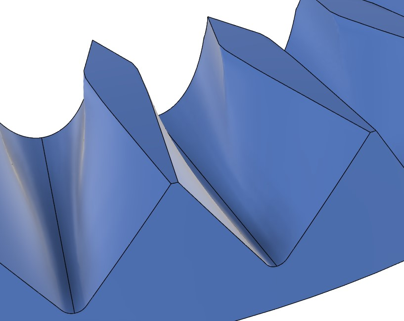
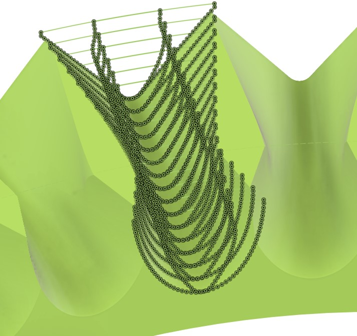

# クラウンギア（フェースギア）をピニオンギアと組み合わせて動かす

[[fusion360-study-gears チュートリアルへ戻る]](https://github.com/osamutake/fusion360-study-gears/blob/main/README-ja.md#チュートリアル)

クラウンギアはフェースギアとも呼ばれ、２つの軸が直角に交わる配置で噛み合うギアです。
相手のピニオン歯車には通常のインボリュート歯車が使えます。

クラウンギアは切削で作る場合には簡単な方法がないようですが、３Ｄプリンタを使って出力する分にはこのスクリプトが出力する形状をそのまま印刷すれば問題なく利用できると思います。

現状では、はすばのピニオン歯車には対応していません。

以下ではクラウンギアをピニオンギアと組み合わせて動かし、接触の様子などを確かめてみます。

## クラウンギアの生成

Crown タブを開いて OK を押すと、モジュール4で歯数40枚のクラウンギアが生成されます。

※計算にはかなり時間がかかります

クラウンギアの歯形は相手のピニオン歯車の歯数にも影響を受けるため、ここで生成されるクラウンギアは生成時に指定した通り、歯数 12 のピニオン歯車と組み合わせて使う必要があります。

Outer Extent, Inner Extent はそれぞれ、クラウンギアの基準円の外側及び内側に向けた歯の幅をモジュールを単位として指定します。ここではどちらも 2 が指定されていますので、外と内とにそれぞれ 2 x 4 mm = 8 mm で、合計 16 mm の歯幅になります。

## ピニオン歯車の生成

Cylindrical タブを開き、デフォルトの設定値から歯幅 Width のみ 20 mm に変更して OK を押すと歯数12のピニオン歯車を生成できます。

# かみ合い位置への移動

クラウンギアとピニオン歯車はどちらも z 軸を回転軸として生成されるため、そのままでは噛み合いません。

ピニオン歯車を噛み合い位置に移動するには以下の手順を踏みます。

- まずピニオン歯車を y 軸周りに９０度回転させます
- ピニオン歯車を回転軸 = x 軸に沿ってクラウンギアの基準円半径分だけ移動します
- クラウンギアはちょうどピニオン歯車の半径分だけ下方に基準面が来るよう生成されるため、これでピニオン歯車とクラウンギアの基準円が接するようになります
- ピニオン歯車をピッチの半分 (360 deg / 12 / 2 = 15 deg) だけ回転させます

これでぴったり噛み合い位置に置けました。

クラウンギアの Inner Extent と Outer Extent が等しくない場合には、
丁度よい位置に来るようにピニオン歯車の x 軸方向の移動量を調節してください。

## モーションリンクの設定

クラウンギアにもピニオンにも始めから回転ジョイントが生成されていますので、
これらの間にモーションリンクを設定することで両者を組み合わせて回せます。

このときちょうどギア比に合わせて角度を指定する必要がありますが、
両者とも 360 deg を歯数で割る形で入力すると間違いがないと思います。

どちらの歯車も、生成されるコンポーネントは２重になっており、
歯車本体は内側のコンポーネントに格納されています。

そしてジョイントは内側と外側のコンポーネント間に生成されていますので、
外側のコンポーネントとルートコンポーネントとの間に剛性グループを作成して
固定してやることで、内側のコンポーネントの回転軸周りの回転のみが許される
状況を実現できます。

剛性グループを作成する際には「子コンポーネントを含める」のチェックボックスを解除しておきます。
そうしないとルートコンポーネントを選んだだけですべてのコンポーネントが同時に選択され、そのまま剛性グループを作るとすべてのコンポーネントが固定され、動かせなくなってしまいます。

このチェックボックスを解除した後、ルートコンポーネント、クラウンギアの外側コンポーネント、
ピニオンギアの外側コンポーネント、の３つのコンポーネントを選んで剛性グループを作成します。

ここまでで歯車は回転のみが可能な形で固定されていますので、
歯車をマウスでドラッグすることで２つの歯車が連動する様子を確認できるはずです。

## クラウンギアの歯形

こちらはモジュール 8 の歯数36のクラウンギアと、歯数12のピニオンとの組み合わせです。
歯形の特徴を見るために、上の例よりもクラウンギアの幅を広めにとっています（モジュール単位で±3）。

クラウンギアの歯形は独特な形をしています。
歯形を上から見るとひし形をしていて、内側には短く、外側には長く伸びています。

この形状はインボリュート曲線などで表せるようなものではなく、実際にドーナツ状の部材からピニオンギア形状との間で干渉する部分を削り取る演算を行うことで求められています。

実はひし形の最も横に張り出した頂点部分よりも外側の部分のみがピニオンギアの歯面との間で接触する部分であり、
ここよりも内側の部分はピニオンギアとの干渉を避けるために削られた領域で、ピニオンと接触することはありませんので、動力の伝達にはまったく寄与しません。

ですので、フェースギアを生成する際には Inner Extent をあまり大きくしてもメリットはありません。

## 歯当たりを確認する

モジュール 8 の歯数36のクラウンギアと、歯数12のピニオンとを両者ともバックラッシュ -0.03 mm として生成し組み合わせて動作させながら、両者の干渉する部分を可視化しました。

歯の接触領域はひし形の頂点から直線状に伸びており、歯車の回転とともにひし形の頂点を中心に接触領域が回転するような接し方をすることが分かります。

ひし形の頂点より内側にまったく接触が生じないことも分かります。

* 計算精度と誤差 [#jac1d437]

クラウンギアの歯面をよく見ると、上面のひし形の頂点付近から下方に向かって歯面に折れ曲がりが生じています。

このスクリプトでは円周方向に多数の歯溝形状を計算してそれらをロフトで繋ぐことで歯形を得ているのですが、
この折れ曲がり部分を精度よく再現するには多数の点を取る必要があるようです。

Fusion360 は多数の点からなる非平面的な閉曲線にパッチを張る演算にかなりの時間を要するため、
現状ではクラウンギアの生成にはかなり長い時間がかかってしまっています。

精度と生成時間とを両立できるもっと良い方法があると良いのですが・・・

----
[[fusion360-study-gears チュートリアルへ戻る]](https://github.com/osamutake/fusion360-study-gears/blob/main/README-ja.md#チュートリアル)
