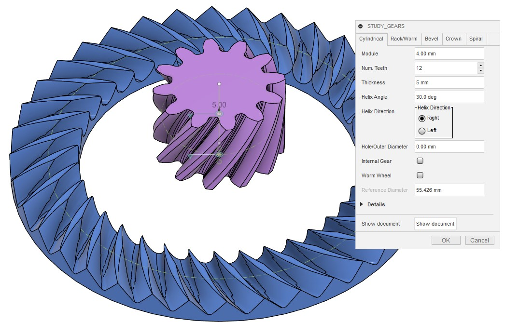
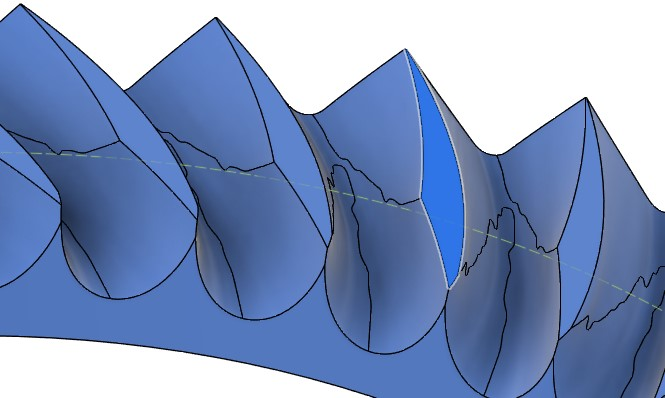

# クラウンギア（フェースギア）をピニオンギアと組み合わせて動かす

[[fusion360-study-gears チュートリアルへ戻る]](https://github.com/osamutake/fusion360-study-gears/blob/main/README-ja.md#チュートリアル)

クラウンギアはフェースギアとも呼ばれ、2つの軸が直角に交わる配置で噛み合うギアです。
相手のピニオン歯車には一般的なインボリュート歯車を使用できます。

クラウンギアは切削で作る場合には簡単な方法がないようですが、3Dプリンタを使用して出力する場合、このスクリプトが生成する形状をそのまま印刷すれば問題なく利用できると考えられます。

以下ではクラウンギアをピニオンギアと組み合わせて動かし、接触の様子などを確かめてみます。

## クラウンギアの生成

Crown タブを開いて OK を押すと、モジュール4で歯数40枚のクラウンギアが生成されます。

※計算にはかなり時間がかかります

クラウンギアの歯形は相手のピニオン歯車の歯数にも影響を受けるため、ここで生成されるクラウンギアは生成時に指定した通り、歯数 12 のピニオン歯車と組み合わせて使う必要があります。

Outer Extent と Inner Extent は、それぞれクラウンギアの基準円の外側および内側に向けた歯の幅をモジュール単位で指定します。ここではどちらも「2」が指定されているため、外側と内側それぞれに 2 × 4 mm = 8 mm、合計で16 mmの歯幅となります。

## ピニオン歯車の生成

Cylindrical タブを開き、デフォルトの設定値から歯幅 Width のみ 20 mm に変更して OK を押すと歯数12のピニオン歯車を生成できます。

## かみ合い位置への移動

クラウンギアとピニオン歯車はどちらも z 軸を回転軸として生成されるため、そのままでは噛み合いません。

ピニオン歯車を噛み合い位置に移動するには、以下の手順を実行します。

- まずピニオン歯車を y 軸周りに９０度回転させます
- ピニオン歯車を回転軸 = x 軸に沿ってクラウンギアの基準円半径分だけ移動します
- クラウンギアはちょうどピニオン歯車の半径分だけ下方に基準面が来るよう生成されるため、これでピニオン歯車とクラウンギアの基準円が接するようになります
- ピニオン歯車をピッチの半分 (360 deg / 12 / 2 = 15 deg) だけ回転させます

これでぴったり噛み合い位置に置けました。

クラウンギアの Inner Extent と Outer Extent が等しくない場合には、
丁度よい位置に来るようにピニオン歯車の x 軸方向の移動量を調節してください。

## モーションリンクの設定

クラウンギアにもピニオンにも始めから回転ジョイントが生成されていますので、
これらの間にモーションリンクを設定することで両者を組み合わせて回せます。

このとき、ギア比に合わせて角度を正確に指定する必要があります。両者とも「360度 ÷ 歯数」の形で入力すると間違いがありません。

どちらの歯車も、生成されるコンポーネントは２重になっており、
歯車本体は内側のコンポーネントに格納されています。

そしてジョイントは内側と外側のコンポーネント間に生成されていますので、
外側のコンポーネントとルートコンポーネントとの間に剛性グループを作成して
固定してやることで、内側のコンポーネントの回転軸周りの回転のみが許される
状況を実現できます。

剛性グループを作成する際には「子コンポーネントを含める」のチェックボックスを解除しておきます。
そうしないとルートコンポーネントを選んだだけですべてのコンポーネントが同時に選択され、そのまま剛性グループを作るとすべてのコンポーネントが固定され、動かせなくなってしまいます。

このチェックボックスを解除した後、ルートコンポーネント、クラウンギアの外側コンポーネント、
ピニオンギアの外側コンポーネント、の３つのコンポーネントを選んで剛性グループを作成します。

ここまでで歯車は回転のみが可能な形で固定されていますので、
歯車をマウスでドラッグすることで２つの歯車が連動する様子を確認できるはずです。

## クラウンギアの歯形

こちらはモジュール 8 の歯数36のクラウンギアと、歯数12のピニオンとの組み合わせです。
歯形の特徴を見るために、上の例よりもクラウンギアの幅を広めにとっています（モジュール単位で±3）。

クラウンギアの歯形は独特な形をしています。
歯形を上から見るとダイアモンド形をしていて、内側には短く、外側には長く伸びています。

この形状はインボリュート曲線などで表せるようなものではなく、実際にドーナツ状の部材からピニオンギア形状との間で干渉する部分を削り取る演算を行うことで求められています。

実はダイアモンド形の最も横に張り出した頂点部分よりも外側の部分のみがピニオンギアの歯面との間で接触する部分であり、
ここよりも内側の部分はピニオンギアとの干渉を避けるために削られた領域で、ピニオンと接触することはありませんので、動力の伝達にはまったく寄与しません。

ですので、フェースギアを生成する際にはダイアモンド形の頂点を大きく越えるほどに Inner Extent を大きくしてもメリットはありません。

## 歯当たりを確認する

モジュール 8 の歯数36のクラウンギアと、歯数12のピニオンとを両者ともバックラッシュ -0.03 mm として生成し組み合わせて動作させながら、両者の干渉する部分を可視化しました。

歯の接触領域はダイアモンド形の頂点から直線状に伸びており、歯車の回転とともにダイアモンド形の頂点を中心に接触領域が回転するような接し方をすることが分かります。

ダイアモンド形の頂点より内側にまったく接触が生じないことも分かります。

また小径のピニオンに対してはクラウンギアの歯先がピニオンギアの切り下げ領域と接触してしまうことも分かります。これは歯車の回転を阻害するものではありませんが、インボリュート領域以外の接触は本来期待されるものではありません。

クラウンギアの計算ではピニオンとして最大のフィレットを付けたものを用いていますので、
それよりも小さなフィレットを設定したピニオンと組み合わせることで、
この切り下げ領域での接触を避けることができます。

圧力角20度ではフィレットは 0.38 程度になりますので、接触を避けるにはこれよりも小さいフィレット半径、例えば 0.3 を指定すれば良いことになります。

## 計算精度と誤差

クラウンギアの歯面をよく見ると、上面のダイアモンド形の頂点付近から下方に向かって歯面に折れ曲がりが生じています。

このスクリプトでは円周方向に多数の歯溝形状を計算してそれらをロフトで繋ぐことで歯形を得ているのですが、
この折れ曲がり部分を精度よく再現するには１回のロフトでは難しいようでした。

そこでこのスクリプトではこの線より上のインボリュート領域と、
この線より下の切り下げ領域とを別に計算して２回のロフトで明確なエッジが形成されるようにしています。

スプライン曲線を含むロフト演算ではそれぞれの断面形状を構成する制御点の点数や相対位置が動いてしまうとロフト演算が曲線上での制御点の移動を追ってしまいおかしな曲面が形成されてしまうので、断面形状の指定時にこの折れ曲がり点に制御点を持ってきたり、そこで曲線を２つに分割したりというのがうまくできなかったためです。

いろいろ試してみると断面も断面上の点もかなりの数が必要で、しかも特にはすばの場合に対応するには断面形状の計算自体も重たいものとなって・・・結果的にクラウンギアの生成には非常に長い時間がかかるようになってしまっています。

断面形状の計算は、同じ計算をJavaScriptで行う場合は一瞬で終わるのですが、Pythonではその数十倍の時間がかかるようです。

また、クラウンギアのダイアモンド形の頂点付近から下方に向かって伸びる折れ曲がりは途中で途切れることになり、
そこから下ではインボリュート領域と切り下げ領域とがこの付近でほとんど重なることになります。
すると、小さな演算誤差（恐らく、主にはスプライン曲線・曲面による近似誤差だと思います）により、２つの面が上になったり、下になったりするために、生成結果の歯面には複雑な「継ぎ目」が形成されてしまいます。

見た目は悪いですが、この継ぎ目はほとんど角度ゼロで交わる２つの曲面の継ぎ目ですので、
この継ぎ目が波打ったりしていても、実際の歯車形状への影響は大きくないはずです。

## はすばピニオンへの対応

Helix Angle をゼロ以外(ここでは 30 deg)にすることではすばピニオンと組み合わせて使えるクラウンギアを生成できます。

組み合わせるピニオンギアにも同じ Helix Angle を設定します。

クラウンギアの基準円ははすば角分だけ大きくなるため、
$x$ 軸方向への移動量は $36 \times 4\,\mathrm{mm} / \cos(30\,\mathrm{deg}) / 2$ を指定します。

これで正しくかみ合います。

## はすばクラウンギアの歯形

はすばクラウンギアでは上面に現れる四角形の両サイドの頂点位置が内側と外側とでずれるため、四角形はダイアモンド形ではなくなります。特に、曲がった歯筋の外側では頂点位置が大きく内側へ移動していることに注目してください。

この場合もやはり四角形の両サイドの頂点位置よりも内側は動力伝達に寄与しませんので、
湾曲する歯筋の内側の歯面で動力伝達する回転方向よりも、
外側の歯面で動力伝達する回転方向の方が良い接触が得られることになります。

以下では負のバックラッシュ -0.02 mm を持たせたクラウンギアとピニオンギアとの干渉を見ることで
この事実を確認しました(モジュール4)。

湾曲する歯筋の外側の面は歯の接触している範囲が広く、
歯の接触も連続的に増減するのに対して、
内側の面は接触面積の増加も急峻で、
接触している範囲も小さいことが分かります。

かさ歯車で行ったのと同様に、
ピニオンギアの歯溝形状をクラウンギアの上で転がして歯の接触形状を見たのが次の動画です。

ピニオンを 120 度の範囲で回転させ、接触領域の移動の様子を見ました。

湾曲する歯筋の外側の歯面ではほぼ120度全域に渡って接触が得られているのに対して、
内側の歯面では接触の得られている範囲は45度程度しかないことが分かりました。

はすばのクラウンギアでは動力を伝える回転の方向を、
湾曲する歯筋の外側の歯面が相手を押す向きに取ることが重要であると思われます。

----
[[fusion360-study-gears チュートリアルへ戻る]](https://github.com/osamutake/fusion360-study-gears/blob/main/README-ja.md#チュートリアル)
