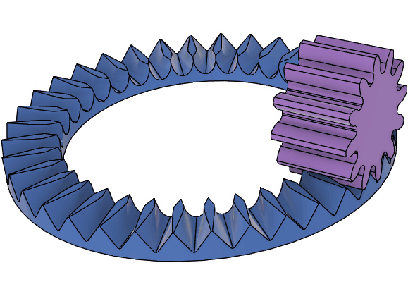
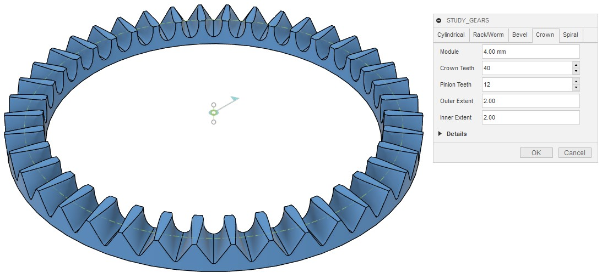
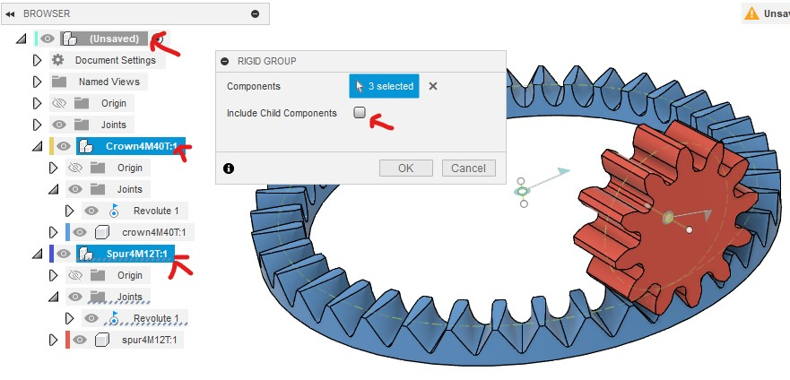
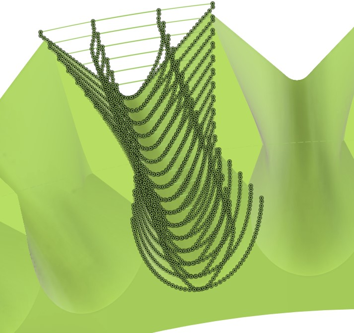

# Move Crown Gear (Face Gear) with Pinion Gear

[[Go back to fusion360-study-gears Tutorials]](https://github.com/osamutake/fusion360-study-gears/#tutorials)

The crown gear, also known as a face gear, is a type of gear that meshes with another gear at a right angle. A standard involute gear can be used as the mating pinion gear.

While there may not be a simple method to manufacture crown gears via cutting, the shape output by this script can be directly printed using a 3D printer without any issues.

Currently, helical pinion gears are not supported.

Below, we will combine a crown gear with a pinion gear to observe their interaction.

## Generating the Crown Gear

Open the Crown tab and press OK to generate a crown gear with module 4 and 40 teeth.

*Note: The calculation may take considerable time.*

The tooth profile of the crown gear is influenced by the number of teeth on the mating pinion gear. Therefore, the crown gear generated here must be used with a pinion gear with 12 teeth, as specified during generation.

Outer Extent and Inner Extent specify the tooth width outward and inward from the reference circle of the crown gear, respectively, in units of the module. Here, both are set to 2, resulting in a total tooth width of 16 mm (2 x 4 mm = 8 mm on each side).

## Generating the Pinion Gear

Open the Cylindrical tab, change only the Width to 20 mm from the default settings, and press OK to generate a pinion gear with 12 teeth.

# Moving to the Meshing Position

Both the crown gear and the pinion gear are generated with the z-axis as their rotation axis, so they do not mesh as-is.

To move the pinion gear to the meshing position, follow these steps:

- Rotate the pinion gear 90 degrees around the y-axis.
- Move the pinion gear along the x-axis by the reference circle radius of the crown gear.
- The crown gear is generated such that its reference plane is positioned below the construction origin by the radius of the pinion gear's reference circle. So, the above steps makes the reference circles of the pinion and crown gears touch each other.
- Rotate the pinion gear by half the pitch (360 deg / 12 / 2 = 15 deg).

This procedure places the gears in the correct meshing position.

If the Inner Extent and Outer Extent of the crown gear are not equal, adjust the x-axis movement of the pinion gear to achieve proper alignment.

## Setting Motion Links

Since rotational joints are generated with the crown gear and the pinion gear, by setting a motion link between them, you can rotate them together.

On the motion link dialog, you need to specify the angles matching the gear ratio. Enter the angle as 360 deg divided by the number of teeth for each gear makes this simple.

Both gears are generated as double-layered components, with the gear body stored in the inner component.

The joints are created between the inner and outer components. To allow only rotational movement around the rotation axis of the inner component, create a rigid group between the outer components and the root component.

When creating the rigid group, uncheck the "Include child components" checkbox. Otherwise, selecting the root component will select all components at once, and creating a rigid group on them will completely fix all components, making them immovable, i.e. not rotatable.

After unchecking the checkbox, select the root component, the outer component of the crown gear, and the outer component of the pinion gear to create the rigid group.

After creating the rigid group, the gears are fixed to allow only rotational movement. You should now be able to drag the gears with the mouse to observe their synchronized movement.

## Crown Gear Tooth Profile

The next figure shows a combination of a crown gear with module 8 and 36 teeth and a pinion with 12 teeth. To observe the tooth profile in detail, the width of the crown gear is set wider than that in the previous example.

As can be seen, the crown gear's tooth profile has a unique shape. Viewed from above, the tooth profile is diamond-shaped, with shorter teeth on the inner side and longer teeth on the outer side.

This tooth shape cannot be expressed using involute curves or similar mathematical curves. Instead, it is calculated by performing an operation to remove interfering parts from a donut-shaped material between the pinion gear shape.

Only the outer side of the diamond-shaped profile, beyond the widest points, comes into contact with the pinion gear. The inner side is just cut away to avoid interference with the pinion gear and does not contribute to power transmission.

Therefore, there is no benefit to setting a large Inner Extent when generating a face gear.

## Checking Tooth Contact

A crown gear with module 8 and 36 teeth and a pinion with 12 teeth were both generated with a backlash of -0.03 mm and combined. The interfering parts of the two gears were visualized while they were in motion.

The contact area of the teeth extends linearly from the side vertex of the diamond on the top surface, and the contact area rotates around the vertex as the gears rotate.

It is also evident that there is no contact on the inner side from the diamond's side vertices.

* Calculation Accuracy and Errors [#jac1d437]

Looking closely at the crown gear tooth surface, there is a sharp bend running downward from the diamond's side vertices.

This script calculates number of tooth groove shapes along the circumference and connects them with Fusion360's loft feature to create the tooth profile. Reproducing the bending part accurately requires a large number of points in the calculation.

Fusion360 requires significant time to generate patch from a non-planar closed curves containing many points. As a result, generating the crown gear currently takes a significantly long time.

It would be ideal to find a better method that balances precision and generation time.

----
[[Go back to fusion360-study-gears Tutorials]](https://github.com/osamutake/fusion360-study-gears/#tutorials)
