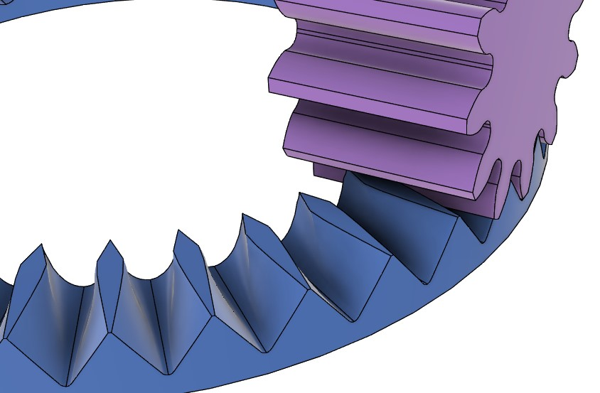
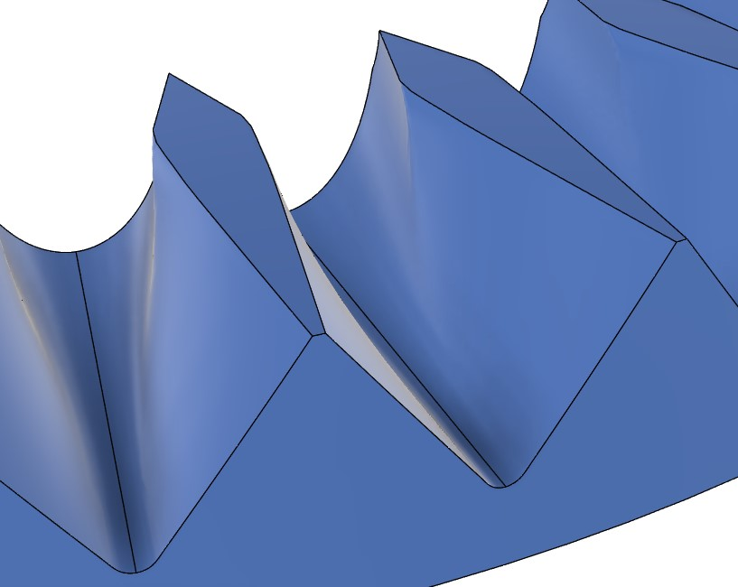

# Move Crown Gear (Face Gear) with Pinion Gear

[[Go back to fusion360-study-gears Tutorials]](https://github.com/osamutake/fusion360-study-gears/#tutorials)

The crown gear, also known as a face gear, is a type of gear that meshes with another gear at a right angle. A standard involute gear can be used as the mating pinion gear.

While there may not be a simple method to manufacture crown gears via cutting, the shape output by this script can be directly printed using a 3D printer without any issues.

Below, we will combine a crown gear with a pinion gear to observe their interaction.

## Generating the Crown Gear

Open the Crown tab and press OK to generate a crown gear with module 4 and 40 teeth.

*Note: The calculation may take considerable time.*

The tooth profile of the crown gear is influenced by the number of teeth on the mating pinion gear. Therefore, the crown gear generated here must be used with a pinion gear with 12 teeth, as specified during generation.

Outer Extent and Inner Extent specify the tooth width outward and inward from the reference circle of the crown gear, respectively, in units of the module. Here, both are set to 2, resulting in a total tooth width of 16 mm (2 x 4 mm = 8 mm on each side).

## Generating the Pinion Gear

Open the Cylindrical tab, change only the Width to 20 mm from the default settings, and press OK to generate a pinion gear with 12 teeth.

## Moving to the Meshing Position

Both the crown gear and the pinion gear are generated with the z-axis as their rotation axis, so they do not mesh as-is.

To move the pinion gear to the meshing position, follow these steps:

- Rotate the pinion gear 90 degrees around the y-axis.
- Move the pinion gear along the x-axis by the reference circle radius of the crown gear.
- The crown gear is generated such that its reference plane is positioned below the construction origin by the radius of the pinion gear's reference circle. So, the above steps makes the reference circles of the pinion and crown gears touch each other.
- Rotate the pinion gear by half the pitch (360 deg / 12 / 2 = 15 deg).

This procedure places the gears in the correct meshing position.

If the Inner Extent and Outer Extent of the crown gear are not equal, adjust the x-axis movement of the pinion gear to achieve proper alignment.

## Setting Motion Links

Since rotational joints are generated with the crown gear and the pinion gear, by setting a motion link between them, you can rotate them together.

On the motion link dialog, you need to specify the angles matching the gear ratio. Enter the angle as 360 deg divided by the number of teeth for each gear makes this simple.

Both gears are generated as double-layered components, with the gear body stored in the inner component.

The joints are created between the inner and outer components. To allow only rotational movement around the rotation axis of the inner component, create a rigid group between the outer components and the root component.

When creating the rigid group, uncheck the "Include child components" checkbox. Otherwise, selecting the root component will select all components at once, and creating a rigid group on them will completely fix all components, making them immovable, i.e. not rotatable.

After unchecking the checkbox, select the root component, the outer component of the crown gear, and the outer component of the pinion gear to create the rigid group.

After creating the rigid group, the gears are fixed to allow only rotational movement. You should now be able to drag the gears with the mouse to observe their synchronized movement.

## Crown Gear Tooth Profile

The next figure shows a combination of a crown gear with module 8 and 36 teeth and a pinion with 12 teeth. To observe the tooth profile in detail, the width of the crown gear is set wider than that in the previous example.

As can be seen, the crown gear's tooth profile has a unique shape. Viewed from above, the tooth profile is diamond-shaped, with shorter teeth on the inner side and longer teeth on the outer side.

This tooth shape cannot be expressed using involute curves or similar mathematical curves. Instead, it is calculated by performing an operation to remove interfering parts from a donut-shaped material between the pinion gear shape.

Only the outer side of the diamond-shaped profile, beyond the widest points, comes into contact with the pinion gear. The inner side is just cut away to avoid interference with the pinion gear and does not contribute to power transmission.

Therefore, there is no benefit to set the Inner Extent beyond the diamond-shaped apex when generating a crown gear.

## Checking Tooth Contact

A crown gear with module 8 and 36 teeth and a pinion with 12 teeth were both generated with a backlash of -0.03 mm and combined. The interfering parts of the two gears were visualized while they were in motion.

The contact area of the teeth extends linearly from the side vertex of the diamond on the top surface, and the contact area rotates around the vertex as the gears rotate.

It is also evident that there is no contact on the inner side from the diamond's side vertices.

Additionally, for smaller pinions as this example, it can be observed that the crown gear's tooth tips may come into contact with the undercut region of the pinion gear. While this does not hinder the rotation of the gears, contact outside the involute region is not expected by design.

In this script, the crown gear calculation uses a pinion with the maximum fillet radius. By using a pinion with a smaller fillet radius, this contact in the undercut region can be avoided.

For a pressure angle of 20 degrees, the fillet radius is approximately 0.38. To avoid contact, specify a fillet radius smaller than this, such as 0.3.

When the pinion is helical, the transverse pressure angle deviates from 20 degrees. In such cases, check the contact with Fusion 360 by, for example, cross-section analysis.

## Calculation Accuracy and Errors

Looking closely at the crown gear's tooth surface, a bend can be seen on the tooth surface extending downward from the apex of the diamond shape on the top surface.

This script calculates number of tooth groove shapes in the circumferential direction and connects them with the loft feature to form the tooth profile. However, reproducing this bend accurately with a single loft was difficult.

Therefore, this script calculates the involute region above this line and the undercut region below it separately, forming a clear edge with the two lofts.

In loft operations involving spline curves, if the number or relative position of control points defining each cross-sectional shape changes, the loft operation may follow the movement of control points along the curve, resulting in an incorrect surface. This is why it was difficult to position control points at the bend or split the curve into two at that point.

Various attempts revealed that a significant number of cross-sections and points on the cross-section profiles are required to generate accurate tooth profile. In addition, especially for helical gears, the calculation of cross-sectional shapes itself becomes computationally heavy, resulting in very long generation times for the crown gear.

The calculation of cross-sectional shapes, when performed in JavaScript, completes almost instantly. However, in Python, it takes tens of times longer...

The bend extending downward from the apex of the diamond shape on the crown gear's top surface terminates in the middle of the surface, and below that point, the involute region and the undercut region almost overlap. As a result, small computational errors (likely due to approximation errors from spline curves and surfaces) cause the two surfaces to alternate between being on top or below each other, forming complex "seams" on the generated tooth surface.

Although these seams may look unsightly, they are seams between two surfaces that intersect at almost zero angles. Therefore, even if the seams appear wavy, their impact on the actual gear shape should be minimal.

## Compatibility with Helical Pinions

By setting the Helix Angle to a non-zero value (here, 30 degrees), a crown gear compatible with a helical pinion can be generated.

Set the same Helix Angle for the pinion gear.

The reference circle of the crown gear increases by the helix angle by a factor of $1/\cos(30\,\mathrm{deg})$, so specify the movement along the $x$-axis as $36 \times 4\,\mathrm{mm} / \cos(30\,\mathrm{deg}) / 2$.

This ensures proper meshing.

## Tooth Profile of Helical Crown Gears

In helical crown gears, the positions of the vertices on both sides of the rectangle appearing on the top surface differ between the inner and outer sides, so the rectangle is no longer diamond-shaped. Notably, the vertex positions on the outer side of the curved tooth trace shift significantly inward, i.e. closer to the center of the crown.

Even in this case, the inner side of the rectangle's vertices does not contribute to power transmission. Therefore, better contact is achieved in the rotation direction where the outer side of the curved tooth trace transmits power.

To confirm this, interference between a crown gear and a pinion gear with a negative backlash of $-0.02\,\mathrm{mm}$ was observed with module 4 and helical angle 30 deg.

The outer surface of the curved tooth trace shows wider contact range, with continuous increases and decreases in contact, while the inner surface shows a steep increase in contact area and a smaller contact range.

As with bevel gears, the following videos show the contact shape of the teeth by rolling the pinion gear's tooth groove shape over the crown gear.

The pinion was rotated over a range of 120 degrees to observe the movement of the contact area.

On the outer surface of the curved tooth trace, contact is achieved over almost the entire 120-degree range, whereas on the inner surface, the contact range is only about 45 degrees.

For helical crown gears, it is important to set the rotation direction for power transmission such that the outer surface of the curved tooth trace pushes the mating gear.

----
[[Go back to fusion360-study-gears Tutorials]](https://github.com/osamutake/fusion360-study-gears/#tutorials)
