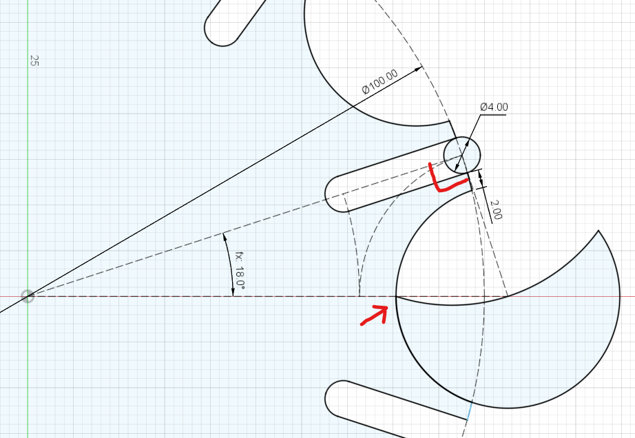
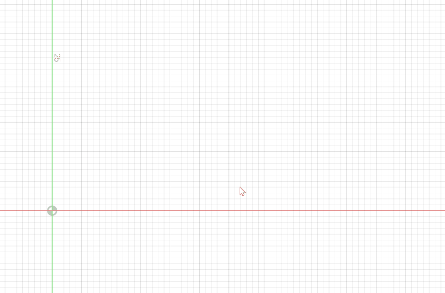
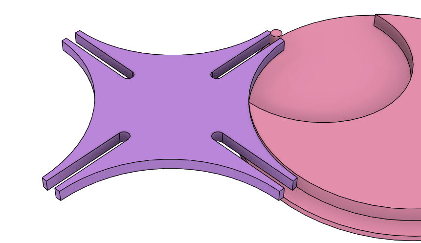

# ゼネバ歯車

[[fusion360-study-gears チュートリアルへ戻る]](https://github.com/osamutake/fusion360-study-gears/blob/main/README-ja.md#チュートリアル)

英語だと Geneva Gear で、下図のようなものです。

https://karakurist.jp/?p=21 で紹介されていたのを参考にしました。

右の歯車(駆動輪)が一定速度で回るとき、左の歯車(被駆動輪)は間欠的に回転するので、
たとえば時計の日付表示の文字盤を回転させるのに使ったりできるそうです。

リンク部分の拡大：
- 回転は被駆動輪のスロットに入った駆動輪のピンによって伝えられる
- 回転していない間は２つの歯車の円弧部分が接することによりロックされる

# ゼネバ歯車の設計・作図

ゼネバ歯車は study-gears のようなスクリプトを使わなくても、
以下の手順で手作業で作図が可能です。

次の２つの条件から歯車の形状が決まります：

+ ピンがスロットへまっすぐ入るという条件
+ ピンがスロットへ入った瞬間にロックが外れるという条件

これらの条件により、

- １つ目の条件のおかげでピンが入った瞬間、被駆動輪は速度ゼロから徐々に加速する
- ２つ目の条件のおかげでピンがスロットの外にある間は円弧部分によりしっかりロックされる

が実現されることになります。

作図は以下の手順の通りに行うと良いようです。

- 上図のようにピンがスロットの入る瞬間を作図する
- 被駆動輪の中心と駆動輪の中心が $x$ 軸上にあるとする
- 被駆動輪のスロット数を決める (ここでは 10)
- するとピンがスロットへ入る角度が決まる (ここでは $\theta=$18 deg = 360 deg / 10 / 2)
- 被駆動輪の外径を決める (ここでは　$R = 100\,\text{mm} / 2$)
- ピンの位置が決まる
-- 被駆動輪の中心から角度 $\theta$ で引いた半径と円弧との交点
- 駆動輪の中心位置が決まる
-- ピンから２つの歯車の中心に引いた２本の線分は直交する
-- 駆動輪の中心は $x$ 軸上にある
- スロットの深さが決まる
-- ピンの中心から駆動輪の中心の周りに $x$ 軸まで円弧を描く
-- $x$ 軸と円弧との交点から被駆動輪の中心周りにスロット中心軸まで円弧を描く
-- スロット中心軸と円弧との交点がスロット最奥のピン位置になる
- ピンの太さを決める ( 4 mm )
- 被駆動輪の先端幅を決める ( 2 mm )
- ロック円弧の半径が決まる
- 駆動輪のロック円弧は被駆動輪のロック円弧の中心から始まる (赤矢印)
- 駆動輪のロック円の切り欠き部分は被駆動輪のロック円弧と干渉しない限りどんな形状でも構わない
-- ここでは確実に被駆動輪の歯先円の外にあることが分かっている「駆動輪の中心」を通る円弧にした
- ここまでですべての形状が決まる
- 必要なパーツをスロット数だけ円状に複製すれば完成

この手順動画ではスロット側をピンより少し広げてバックラッシュを付けていますが、
ピンの直径をスロット幅より少し小さく取る方が簡単でしたね。

この設計手順では自由パラメータは次の５つだけになる：
- スロット数 = 10
- スロット車の外径 = φ100 mm
- ピンの太さ = φ4 mm
- スロット車の先端幅 = 2 mm
- バックラッシュ 0.1 mm x 2 = 0.2 mm

CAD の設計をうまくパラメータ可変にしておけば、様々なスロット数、サイズのものを簡単に生成できそうです。
（とはいえスロット数の変更でおかしくなってしまうことも多いようです？）

# Fusion 360 でのシミュレーション

- ２つの歯車のそれぞれの中心を回転ジョイントで固定
- ２つの歯車の間に「接触セット」を作成

これでピンとスロット、ロック円弧の接触が正しく解釈され、
上の動画の通り正しい動作解析が行えました。

----
[[fusion360-study-gears チュートリアルへ戻る]](https://github.com/osamutake/fusion360-study-gears/blob/main/README-ja.md#チュートリアル)
