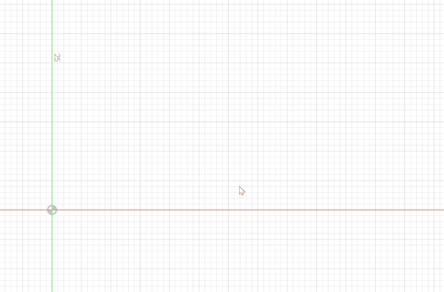
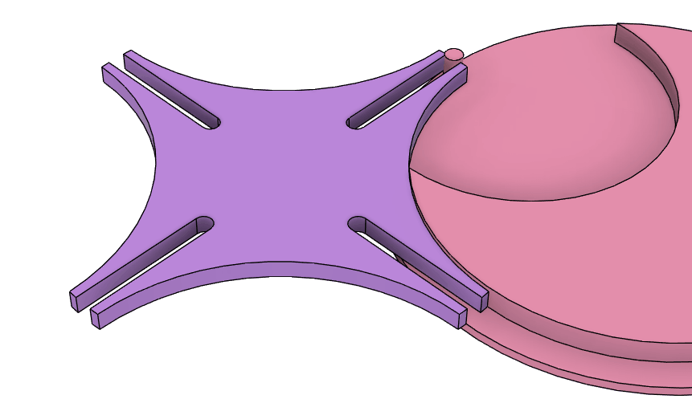

# Geneva Gear

[[Back to fusion360-study-gears tutorial]](https://github.com/osamutake/fusion360-study-gears/blob/main/README.md#tutorials)

A geneva gear translates a continuous rotation movement into intermittent rotary motion as shown in the figure.

I learned geneva gear from the introduction on this page https://karakurist.jp/?p=21.

When the gear on the right (drive wheel) rotates at a constant speed, the gear on the left (driven wheel) rotates intermittently. This mechanism can be used, for example, to rotate the date display dial of a clock.

Close-up of the linkage:
- Rotation is transmitted by the pin of the drive wheel entering the slot of the driven wheel.
- While not rotating, the arcs of the two gears contact each other to lock the rotation.

# Designing and Drawing a Geneva Gear

Even without using scripts like study-gears, you can manually draw a Geneva gear by following the following steps.

The shape of the gear is determined by the two conditions:

+ The pin enters the slot straight.
+ The lock is released the moment the pin enters the slot.

These conditions ensure that:

- Thanks to the first condition, the driven wheel gradually accelerates from zero speed the moment the pin enters.
- Thanks to the second condition, the circular arcs securely lock the gears when the pin is outside the slot.

The drawing can be done as follows:

- Draw the configuration at the moment when the pin enters the slot, as shown above.
- Assume the centers of the driven and drive wheels are on the $x$-axis.
- Decide the number of slots on the driven wheel (e.g., 10).
- The angle at which the pin enters the slot is determined. (e.g., $\theta=$18 deg = 360 deg / 10 / 2).
- Decide the outer diameter of the driven wheel (e.g., $R = 100\,\text{mm} / 2$).
- The pin's position is determined:
  - It is at the intersection of the radius drawn at angle $\theta$ from the center of the driven wheel and the circular arc.
- The center position of the drive wheel is determined:
  - The two line segments drawn from the pin center to the centers of the two gears are perpendicular.
  - The center of the drive wheel is on the $x$-axis.
- The depth of the slot is determined:
  - Draw an arc around the center of the drive wheel from the pin to the $x$-axis.
  - Draw another arc around the center of the driven wheel from the intersection of the $x$-axis and the first arc to the center axis of the slot.
  - The intersection of the slot center axis and the arc determines the deepest position of the pin center in the slot.
- Decide the pin thickness (4 mm).
- Decide the tip width of the driven wheel (2 mm).
- The radius of the locking arc is determined.
- The locking arc of the drive wheel starts from the center of the locking arc of the driven wheel (red arrow).
- The cutout portion of the locking arc on the drive wheel can have any shape as long as it does not interfere with the locking arc of the driven wheel:
  - Here, it is chosen as an arc passing through the "center of the drive wheel," because it is clearly outside the tip circle of the driven wheel.
- At this point, all shapes are determined.
- Replicate the necessary parts in a circular pattern according to the number of slots to complete the design.

In this video, the slot side is slightly widened to add backlash, but it would have been simpler to make the pin diameter slightly smaller than the slot width.

With this design process, the free parameters are the following five:
- Number of slots = 10
- Outer diameter of the driven wheel = φ100 mm
- Pin thickness = φ4 mm
- Tip width of the driven wheel = 2 mm
- Backlash = 0.1 mm x 2 = 0.2 mm

If the CAD design is made parameter-adjustable, it should be easy to generate Geneva gears with various slot numbers and sizes.
(Sometimes changing the number of slots breaks the design, though.)

## Simulation in Fusion 360

- Fix the centers of the two gears with rotation joints.
- Create a "contact set" between the two gears.

This ensures that the contact between the pin and slot, as well as the locking arcs, is correctly interpreted, allowing for accurate motion analysis as shown in the video above.

----
[[Back to fusion360-study-gears tutorial]](https://github.com/osamutake/fusion360-study-gears/blob/main/README.md#tutorials)
