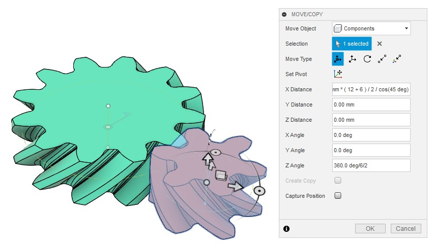
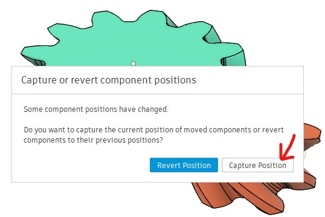
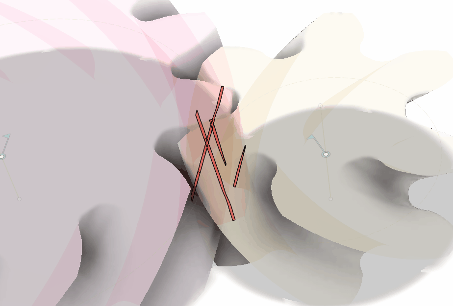
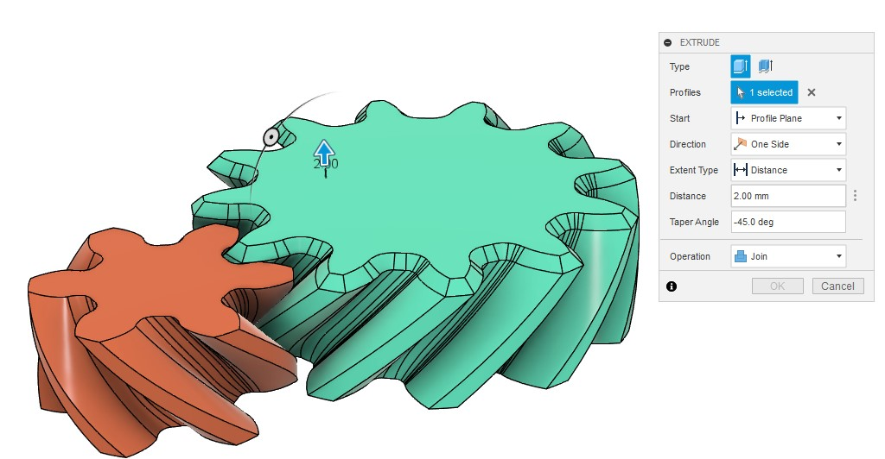

# はすば歯車２つを組み合わせて回し、噛み合いを確認する

[[fusion360-study-gears チュートリアルへ戻る]](https://github.com/osamutake/fusion360-study-gears/blob/main/README-ja.md#チュートリアル)

## ２つの歯車を生成する

パラメータは以下の通りとしました。

<table>
<tr><th><th>　　１つ目　　<th>　　２つ目　　
<tr><th>Module<td colspan="2" align="center">4 mm
<tr><th>Num. Teeth<td align="center">12<td align="center">6
<tr><th>Thickness<td colspan="2" align="center">20 mm
<tr><th>Helix Angle<td colspan="2" align="center">45 deg
<tr><th>Helix Direction<td align="center">Right<td align="center">Left
<tr><th>Backlash<td colspan="2" align="center">-0.01 mm
</table>

- 互いに噛み合う２つのはすば歯車のねじれ方向は逆向きにしておく必要があります。
- 噛み合いの様子を確認するために、負のバックラッシュを設定しています。
   - この２つの歯車は互いに干渉して標準の軸間距離に配置することができませんが、以下で見るように Fusion 360 ではその干渉部分を可視化することで歯の接触位置を確認できます。

このとき基準円の直径は、

- １つ目 67.882 mm = 4 mm * 12 / cos(45 deg)
- ２つ目 33.941 mm = 4 mm * 6 / cos(45 deg)

となるので、２つ目を

- 4 * 18 / cos(45 deg) / 2 = 50.9115 mm だけX方向に移動
- 中心軸に対して 30 deg 回転

することで噛み合い位置に置くことができます。

移動量は式のままで書けるので、50.9115 mm をコピペするのでなく 4 mm * (12 + 6) / cos(45 deg) / 2 などと書くことができます。

* 歯当たりを確認する

「調査」メニューの「干渉」を起動し、２つの歯車ボディを選択します。

すると「動かしたコンポーネントの位置を元に戻すか？」と聞かれるので、「位置をキャプチャ」を選択して現在位置を確定しておきます。

２つの歯車ボディを選択してから「計算」をクリックすると、
干渉する部分を表示するとともにその体積が計算されます。

* はすば歯車のメリット [#q6560e91]

はすば歯車は異なる回転方向を持つ多数の平歯車が歯車の厚さ方向に重なっているものとみなせます。したがって厚さ方向に見て一部の噛み合いが取れていない時も他の部分では噛み合いが取れていることが多く、また、歯が当たったり、離れたりするタイミングも厚さ方向で分散するため、安定した噛み合いと低騒音を実現できるのだそうです。

これを見るために、２つの歯車を少しずつ回転させながら干渉の計算を行い、それらを繋げて動画にしてみました。

ここでは右側の歯車が小さいために切り下げが生じており、噛み合いが外れる時間が大きくなっているのですが、それでも歯車の回転に伴い歯と歯の接触する領域が歯の厚さ方向に連続的に移動しながら、どこかしらが噛み合う状況が続いていることを確認できます。また、歯の接触面積は一気に増えたり減ったりせず徐々に面積が増えたり減ったりしていて、低騒音になりそうな感じも見て取れます。（この動画は「干渉」検査の結果を１枚１枚手で繋ぎ合わせて作ったものです。残念ながらこのような動画を自動的に作成する機能はない＆簡単には作れない、のだと思います？？？）

同じことを平歯車で行ったのと比べると、この差は歴然です。平歯車では途中で２つの歯車が全く接触しなくなる時間が生じてしまっており、また、歯の接触も瞬間敵に増えたり、減ったりしていて、振動や騒音が大きそうです。

# やまば歯車 ← はすば歯車のデメリットをなくす

このようにはすば歯車にはメリットが大きいのですが、回転軸平行方向の荷重（アキシャル荷重・スラスト荷重）を生んでしまうというデメリットがあります。

そこで反対方向にねじれたはすば歯車を２枚重ねることでスラスト荷重を打ち消すようにしたのがやまば歯車です。 分厚くなるのがデメリットと言えばデメリット？？？

やまば歯車ははすば歯車を上面で鏡面対称に複製することで簡単に作成できます。

２つの歯車共に鏡面複製するとやまば歯車の完成です。

## 間に隙間を空ける

ただこのままだと２つのはすば歯車を貼り合わせた部分に遊びがなく、窮屈なのかもしれません。

ここに遊びを作るために、鏡面対称操作をする前に歯車上面を負のテーパー角付きで押し出すことにより面取り効果を得て、 それから対称複製してみたのがこちらです。

ちょっと変な形ではありますが、45度のテーパー角であれば３Ｄプリンターでもサポートなしに印刷できるので、悪くはないんじゃないかと思っています。

----
[[fusion360-study-gears チュートリアルへ戻る]](https://github.com/osamutake/fusion360-study-gears/blob/main/README-ja.md#チュートリアル)

