# Combining Two Helical Gears and Checking Their Meshing

[[Back to fusion360-study-gears tutorial]](https://github.com/osamutake/fusion360-study-gears/blob/main/README.md#tutorial)

## Generating Two Helical Gears

The parameters are as follows:

<table>
<tr><th><th>First Gear<th>Second Gear
<tr><th>Module<td colspan="2" align="center">4 mm
<tr><th>Num. Teeth<td align="center">12<td align="center">6
<tr><th>Thickness<td colspan="2" align="center">20 mm
<tr><th>Helix Angle<td colspan="2" align="center">45 deg
<tr><th>Helix Direction<td align="center">Right<td align="center">Left
<tr><th>Backlash<td colspan="2" align="center">-0.01 mm
</table>

- The helix directions of the two meshing helical gears need to be opposite.
- A negative backlash is set to check the meshing condition.
  - These two gears cannot be placed at the standard center distance due to interference, but Fusion 360 can visualize the interference areas that helps checking the contact area of the two gears.

The pitch diameters of helical gears are elongated compared to the standard spur gears by a factor of $1/\cos(45\mathrm{\,deg})$ in this case:

- First Gear: 67.882 mm = 4 mm * 12 / cos(45 deg)
- Second Gear: 33.941 mm = 4 mm * 6 / cos(45 deg)

Thus, the second gear should be positioned by:

- Moving 50.9115 mm in the X direction = 4 * 18 / cos(45 deg) / 2
- Rotating 30 deg around the center axis

The movement can be written as 4 mm * (12 + 6) / cos(45 deg) / 2 instead of copying 50.9115 mm.

<a href="assets/helical2.jpg">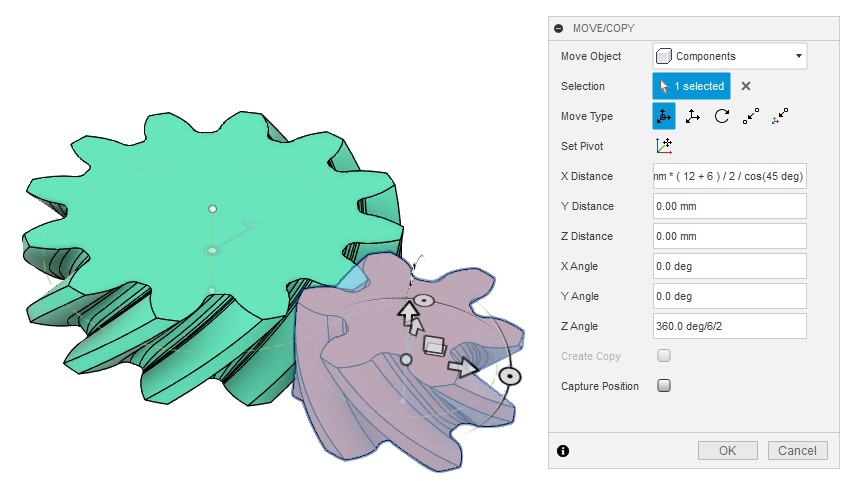</a>

## Checking Tooth Contact

Invoke the "Interference" tool from the "Inspect" menu.

When asked "Do you want to capture the position of the moved components?", select "Capture Position" to keep the current position of gears.

<a href="assets/helical3.jpg">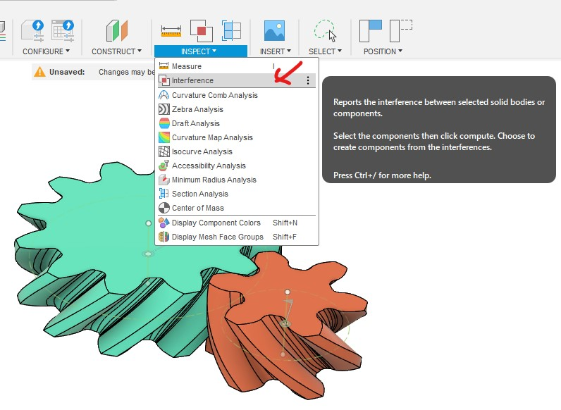</a>
<a href="assets/helical4.jpg">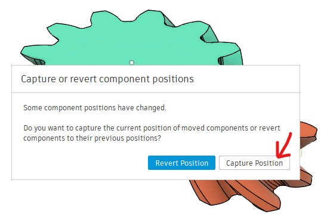</a>

Select the two gear bodies. Then, click "Compute" to display the interfering regions and calculate their volume.

<a href="assets/helical5.png">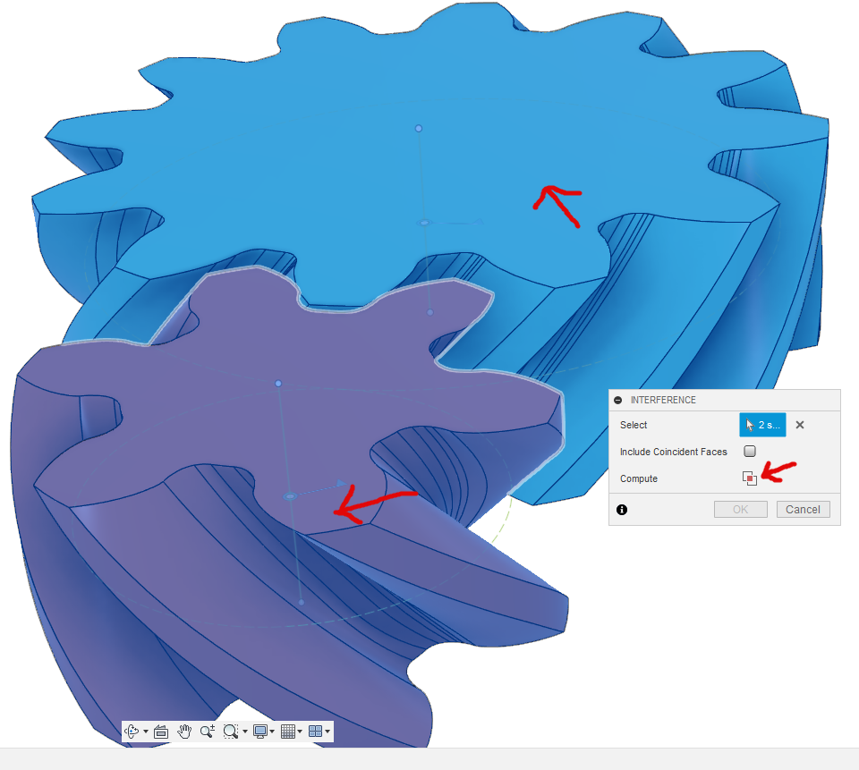</a>
<a href="assets/helical6.png">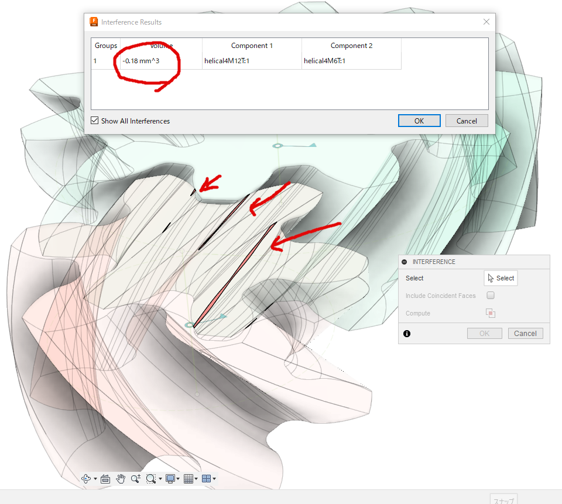</a>

## Advantages of Helical Gears

Helical gears can be considered as multiple spur gears with different rotation directions stacked along the gear thickness. Therefore, even if some parts are not meshing, other parts often are. The timing of tooth contact and separation is distributed along the thickness. These characteristics results in stable meshing and low noise.

To see it, the two gears are rotated step by step while calculating the interference on each step:

<a href="assets/helical7.gif">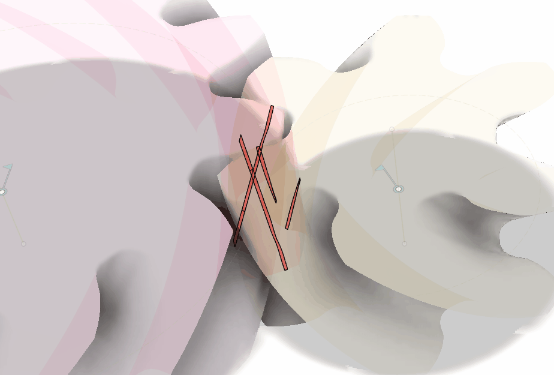</a>

Here, the smaller gear on the right has small involute region due to large undercut, which results in some part of rotation period missing meshing. However, as the gears rotate, the contact area moves continuously along the gear thickness and even when some part lost meshing, some other part maintains meshing. The contact area increases and decreases gradually, suggesting low noise. 

(By the way, this video was manually created by connecting the results of the "Interference" inspection. Unfortunately, there is no automatic function to create such a video.)

Comparing this with spur gears, the difference is clear. Spur gears have periods with no contact and sudden changes in contact area, likely causing vibration and noise.

<a href="assets/helical8.gif">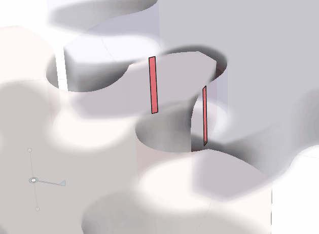</a>

# Double Helical Gears: Eliminating Helical Gear Disadvantages

Helical gears have significant advantages but also generate unfavorable axial thrust loads.

Double helical gears, which combine two helical gears with opposite helix angles, cancel out the thrust loads. Its only one disadvantage might be increased thickness.

Double helical gears can be easily created by mirroring a helical gear along its top surface.

<a href="assets/helical9.jpg">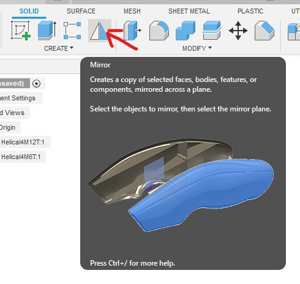</a>
<a href="assets/helical10.jpg">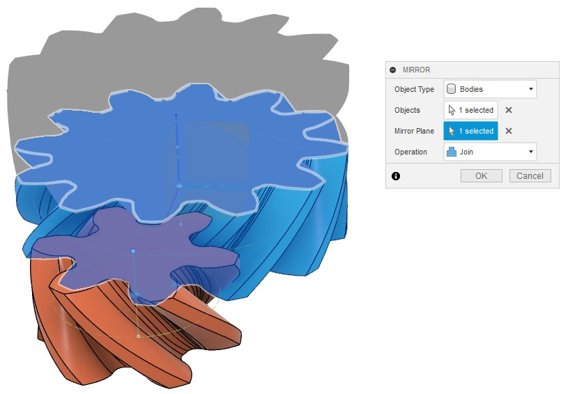</a>

Mirroring both gears completes the double helical gear.

## Creating a Gap

The kink part of the teeth of the double helical gears may cause tight contact when combined.

To create some gap there, extruding the top surface of the gear with a negative taper angle before mirroring may help.

<a href="assets/helical12.jpg">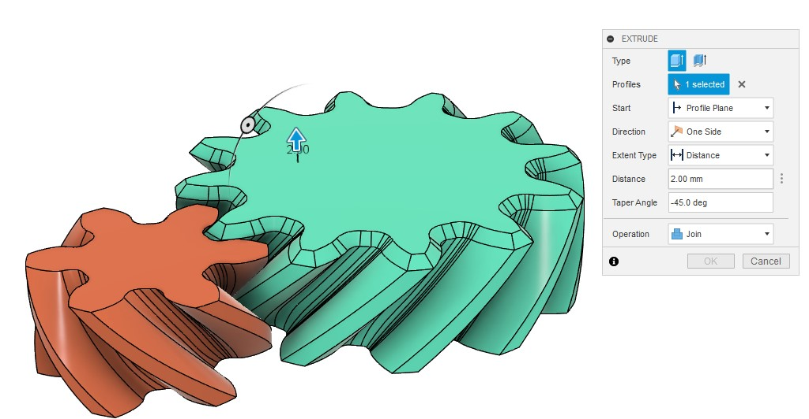</a>

Although the shape is a bit weird, a 45-degree taper angle allows 3D printing without support, making it a viable option.

# Adjusting the Center Distance of Helical Gears to a Convenient Number

For helical gears, the pitch diameter is not an integer multiple of the module, resulting in an irrational center distance for standard gears. This makes design difficult, so two methods are introduced below to adjust the center distance to a convenient number.

## Using Profile Shift to Adjust the Center Distance

Usually, profile shift is used to adjust the center distance.

Profile shift means moving the position of the rack cutter closer or further during gear cutting, allowing the meshing distance to be changed without altering the module or number of teeth. However, for gears with a finite number of teeth, the amount of profile shift and the change in meshing distance are not equal. Instead, a complex calculation is required to obtain the amount of profile shift to achieve the desired center distance.

Using the [Gear Design Calculator (Spur and Helical Gears: Calculate Profile Shift from Center Distance)](../calc.html?calculator=1), this calculation can be performed.

First, to find the center distance without profile shift, [Gear Design Calculator (Spur and Helical Gears: Calculate Center Distance)](../calc.html?calculator=0) was used as following:

- Module: 4
- Number of Teeth: 6 & 12
- Helix Angle: 45 deg

The center distance was 50.9117 mm without profile shift.

<a href="assets/helical14.png">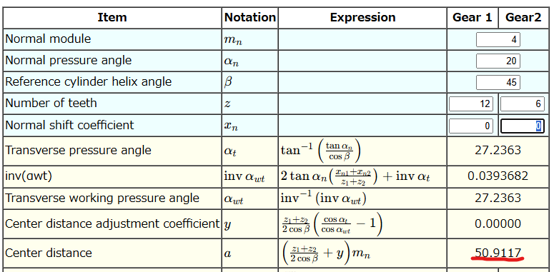</a>

To adjust this to exactly 50 mm, [Gear Design Calculator (Spur and Helical Gears: Calculate Profile Shift from Center Distance)](../calc.html?calculator=1) was used to find the required profile shift.

<a href="assets/helical15.png">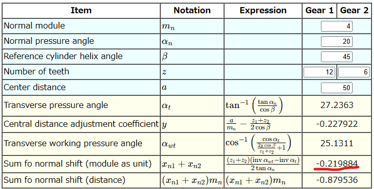</a>

It showed that a combined shift coefficient of -0.219884 is needed.

By applying a profile shift of -0.219884 to the 12-tooth gear while keeping the 6-tooth gear at zero shift, the gears meshed perfectly at a center distance of 50 mm as calculated.

<a href="assets/helical16.jpg">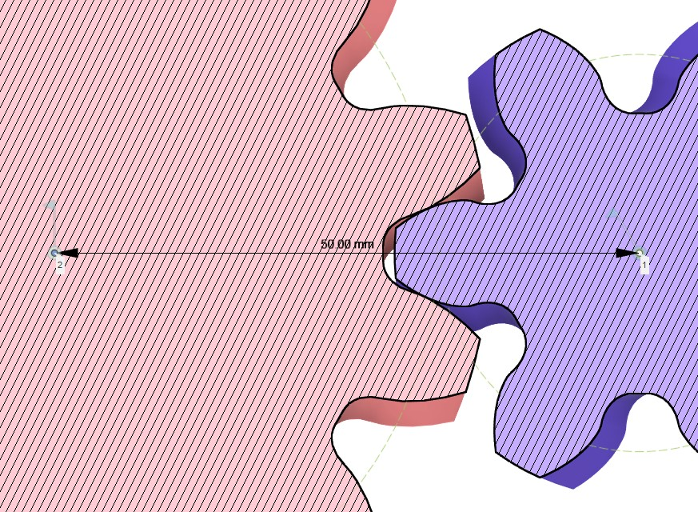</a>

## Using Non-Standard Module to Adjust the Center Distance

When using a 3D printer to output gears individually, it is not necessary to use standard modules, so adjusting the center distance with a non-standard module is also convenient.

For this purpose, I added a function to the [Gear Design Calculator (Spur and Helical Gears: Calculate Center Distance)](../calc.html?calculator=0) to calculate the adjusted module value from the desired center distance.

<a href="assets/helical17.png">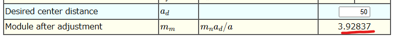</a>

It showed that a module of 3.92837 is needed.

Testing this, the gears meshed perfectly as calculated.

<a href="assets/helical18.png">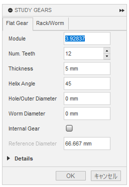</a>
<a href="assets/helical19.png">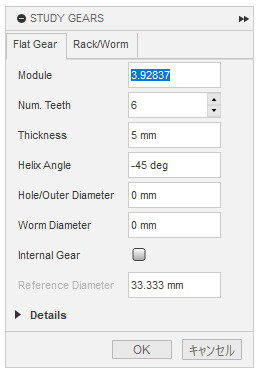</a>

----
[[Back to fusion360-study-gears tutorial]](https://github.com/osamutake/fusion360-study-gears/blob/main/README.md#tutorial)
