# Intermittent Gear

[[Back to fusion360-study-gears tutorial]](https://github.com/osamutake/fusion360-study-gears/blob/main/README.md#tutorials)

Let's create and simulate an intermittent gear.

<a href="assets/intermittent40.gif">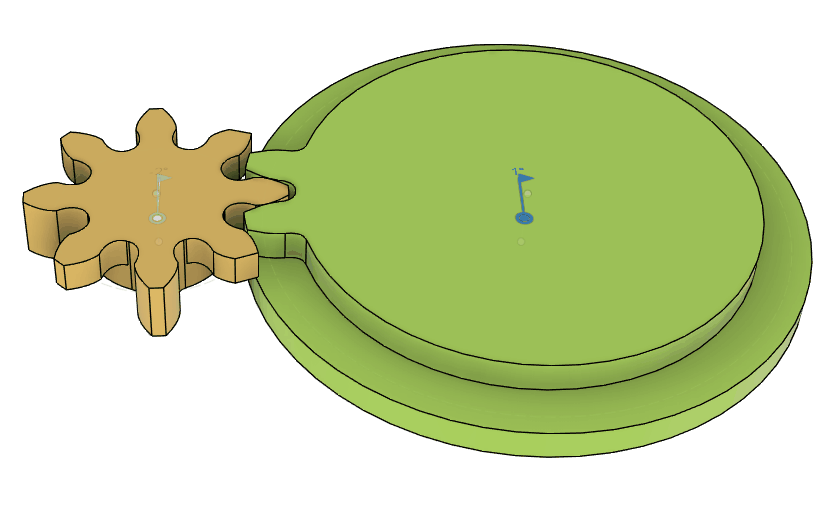</a>

The intermittent gear created on this page has the following characteristics:

- When the right gear completes one revolution, the left gear rotates 1/4 turn.
- The left gear is based on an 8-tooth gear:
  - The upper half is an 8-tooth gear as is.
  - In the lower half, every other tooth is removed.
- The right gear is based on a 20-tooth gear:
  - The tip circle radius is reduced to avoid interference with the small gear.
  - The upper half retains only two teeth, with the rest removed.
  - The lower half has grooves cut only between the two teeth.
- Power is transmitted by the two teeth of the right gear.
- When the teeth are not meshing, the tip circle of the lower half of the right gear contacts the remaining teeth of the lower half of the small gear, preventing the small gear from rotating.

Below, we introduce the design method and simulation process in Fusion 360.

## Generating the Gears

Create an 8-tooth and a 20-tooth gear with module 4 and thickness 10 mm.

<a href="assets/intermittent1.jpg">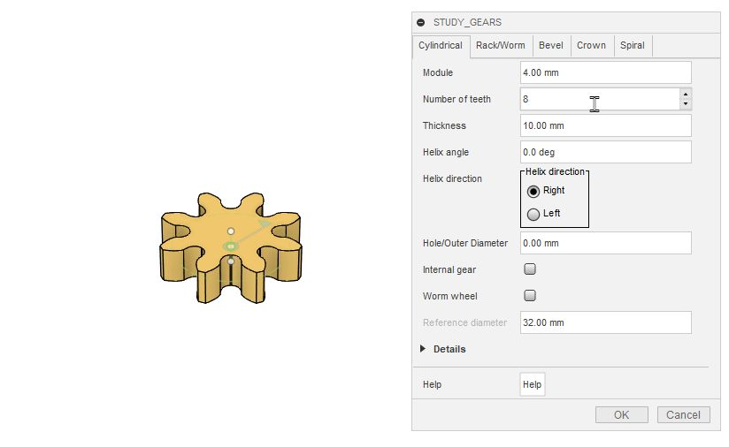</a>

## Moving to the Meshing Position

Move the large gear component along the x-axis by $4\,\mathrm{mm}\times(8+20)/2$.

Rotate the small gear body around its axis by $360\,\mathrm{deg}/8/2$.

<a href="assets/intermittent3.jpg">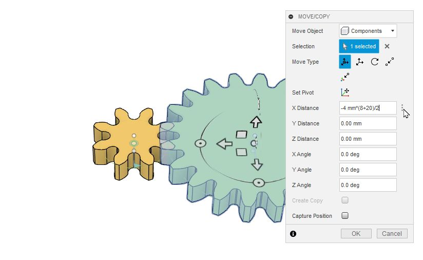</a>

## Removing Every Other Tooth on the Lower Half of the Small Gear

Create a new sketch on the xy-plane:
- Capture the position of the gear component.

Project the outer shape of the small gear onto the sketch:
- Right-click on the small gear.
- Select "Sketch."
- Select "Project."
- Set the filter to "Body," select the gear, and click OK.

<a href="assets/intermittent8.jpg">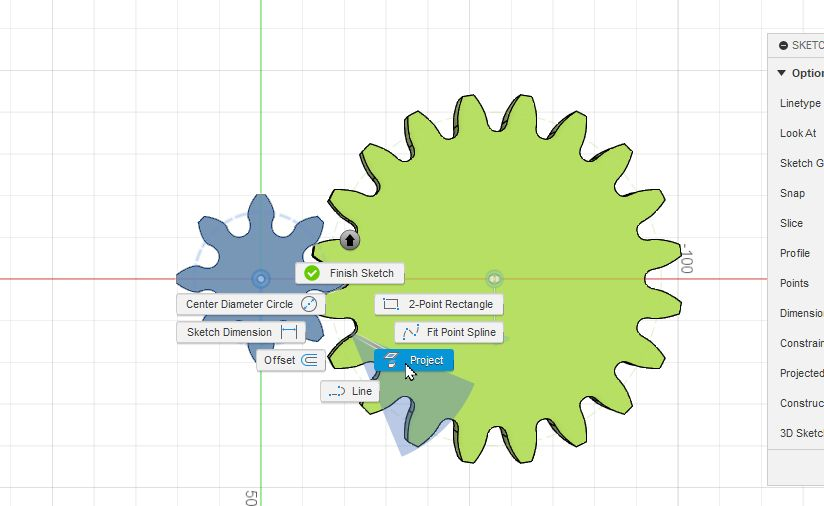</a>
<a href="assets/intermittent9.jpg">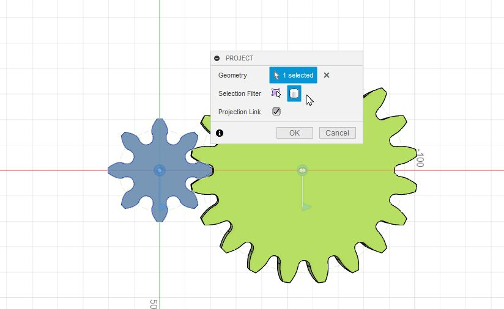</a>

Draw the root circle.

Select the four teeth shown in the diagram and remove them using extrusion.

<a href="assets/intermittent12.jpg">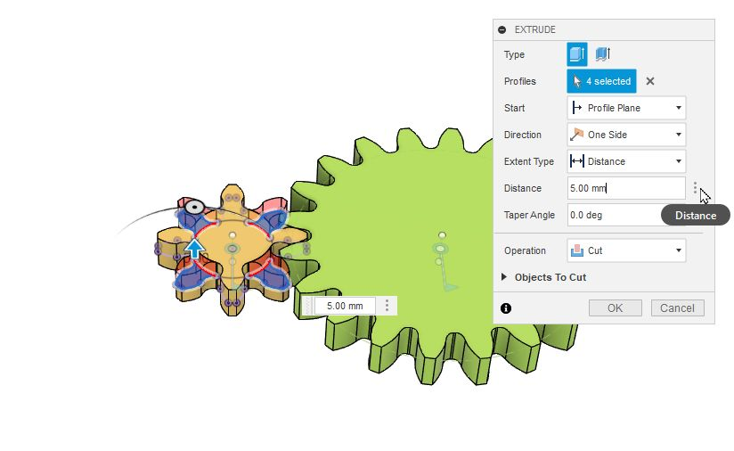</a>

## Reducing the Tip of the Large Gear

Create a new sketch based on the reference circle of the large gear.

Project the tooth profile of the small gear and draw a curve offset by 0.1 mm.

<a href="assets/intermittent15.jpg">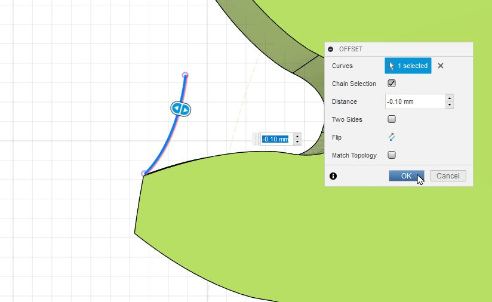</a>

Draw a circle from the center of the large gear (origin of the sketch).

Make it tangent to the offset curve created above:
- Since a tangent constraint cannot be set between them, adjust manually.

<a href="assets/intermittent17.jpg">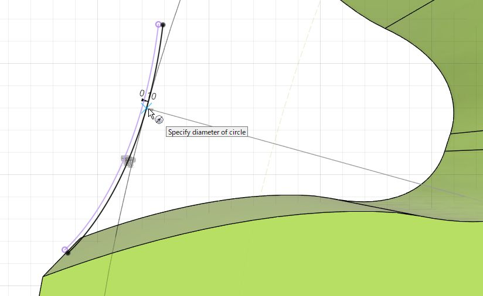</a>

Extrude the circle infinitely in both directions and calculate intersection with the gear.

This trims the tip of the large gear.

## Creating the Lower Half of the Large Gear

Create a new sketch based on the reference circle of the large gear (diagram omitted).

Project the two points at the tip of the teeth onto the sketch.

Draw two radii and arcs based on these points.

Extrude the resulting profile to fill all but one tooth groove.

<a href="assets/intermittent22.jpg">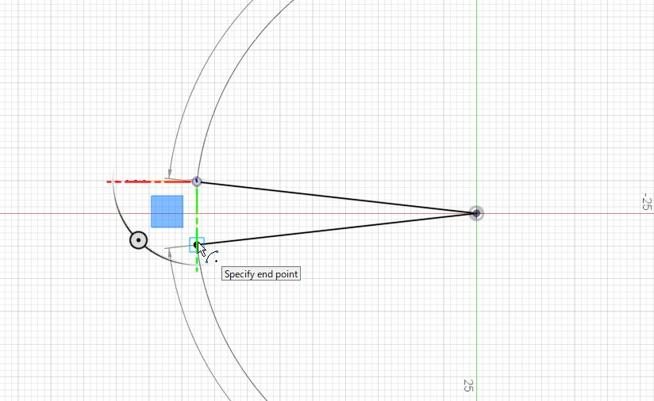</a>

Switch the view to the opposite side for the next step.

## Creating the Upper Half of the Large Gear

Create a new sketch based on the reference circle of the large gear.

Draw a line tilted by $360\,\mathrm{deg}/20$ from the x-axis.

Mirror it across the x-axis.

Draw an arc larger than the tip circle.

<a href="assets/intermittent26.jpg">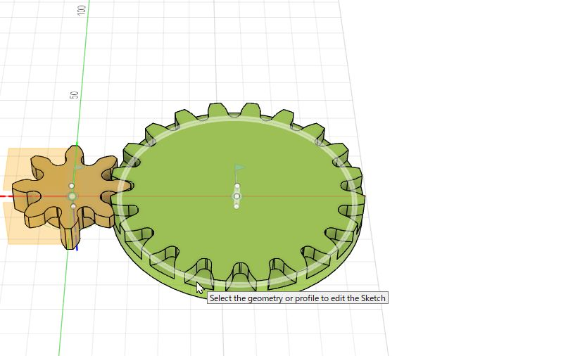</a>
<a href="assets/intermittent27.jpg">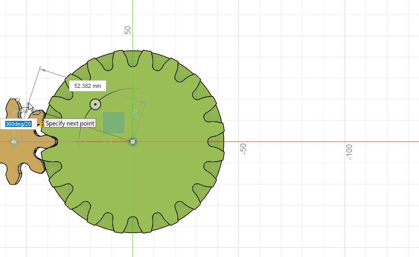</a>

<a href="assets/intermittent29.jpg">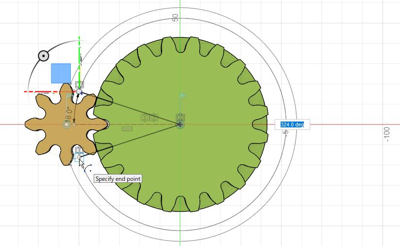</a>

Project the root point onto the sketch.

Draw an arc passing through the point and intersecting the two radii.

<a href="assets/intermittent30.jpg">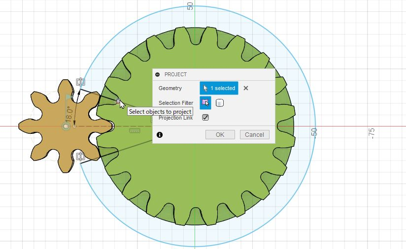</a>
<a href="assets/intermittent31.jpg">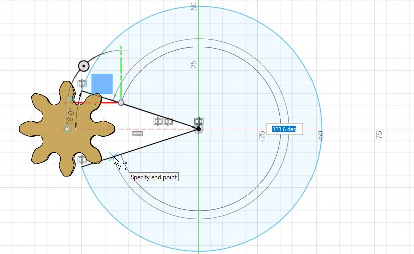</a>

Extrude the profile to remove all but two teeth.

<a href="assets/intermittent32.jpg">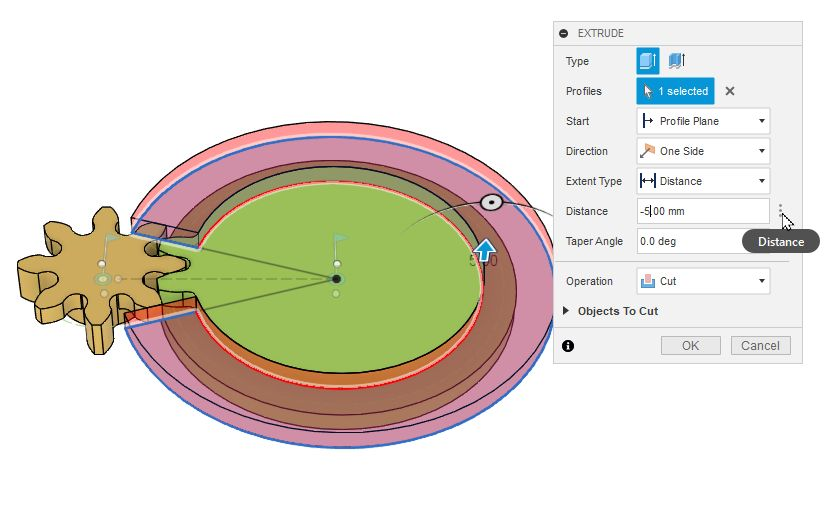</a>

## Fixing the Rotation Axes of the Gears

Create a rigid group including the two gear components and the root component:
- Select the two gear components and choose "Create Rigid Group."
- When asked whether to include the rotation axes, select "Yes."
- Uncheck "Include child components."
- Add the root component and click OK.

<a href="assets/intermittent34.jpg">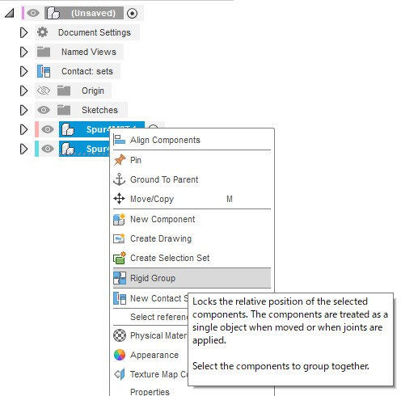</a>
<a href="assets/intermittent35.jpg">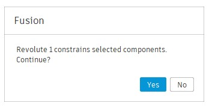</a>

## Setting a Contact Set Between the Gears

Select "Enable Contact Set" from the Assemble menu.

Select "New contact set".

Select the two gears and click OK.

<a href="assets/intermittent38.jpg">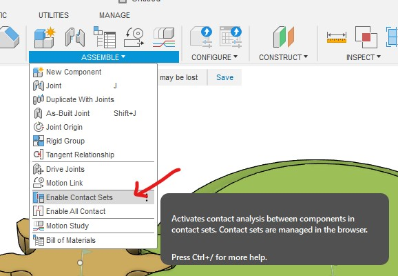</a>

<a href="assets/intermittent39.jpg">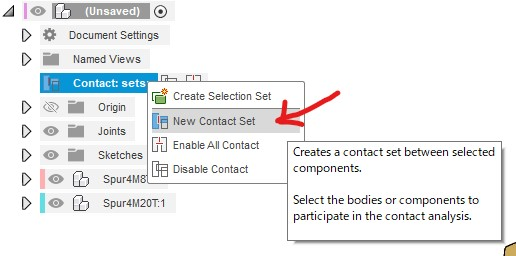</a>

## Testing the Rotation

I spend some time to obtain the video below because
somehow the simulation using the contact set does not to run smoothly.

It can be seen that the rotation speed of the small gear changes discontinuously, preventing smooth operation of gears.

This is significantly different from the [Geneva gear](geneva.md), which also performs intermittent motion but accelerates gradually from zero speed.

The intermittent gear with missing teeth shown here is likely only suitable for light loads and slow speeds.

----
[[Back to fusion360-study-gears tutorial]](https://github.com/osamutake/fusion360-study-gears/blob/main/README.md#tutorials)
