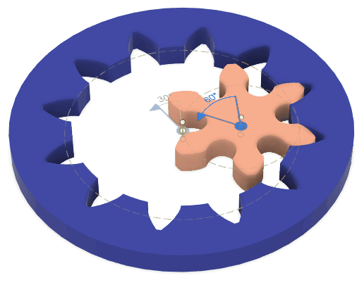
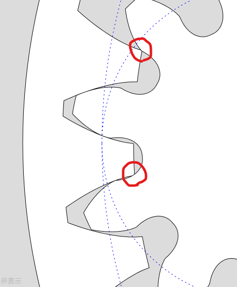
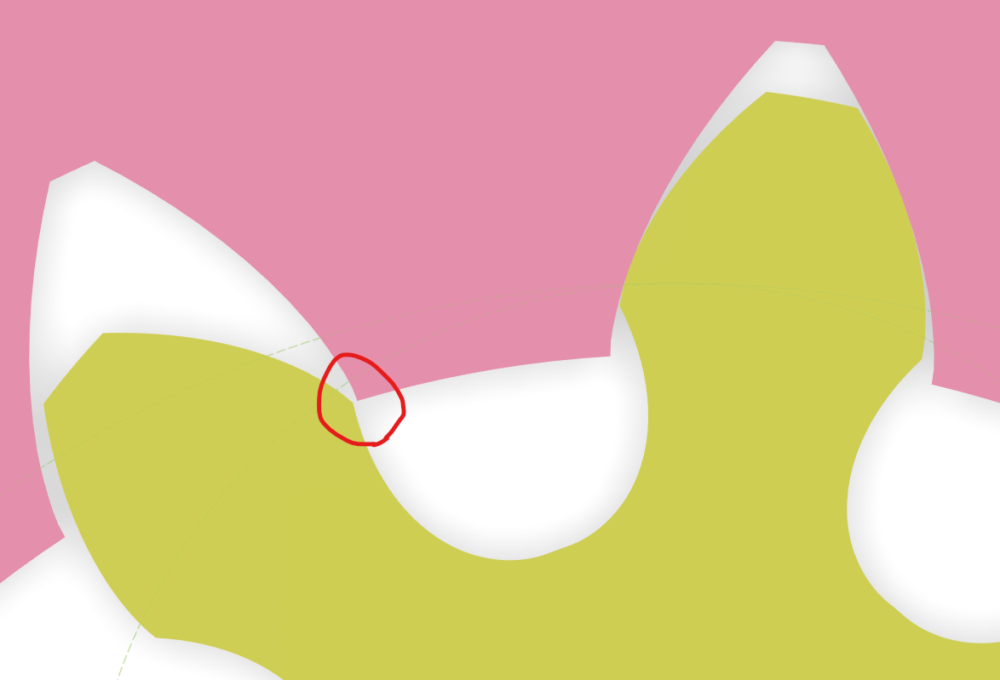
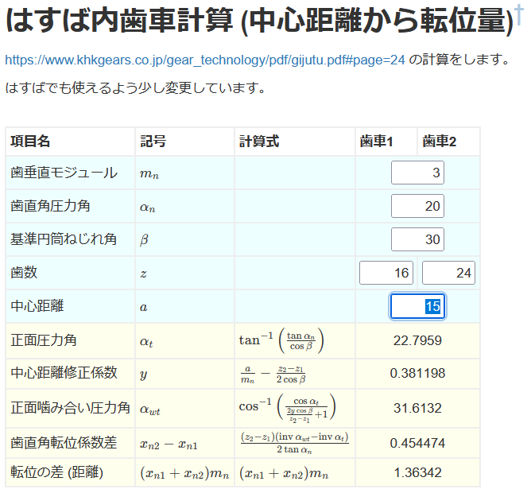
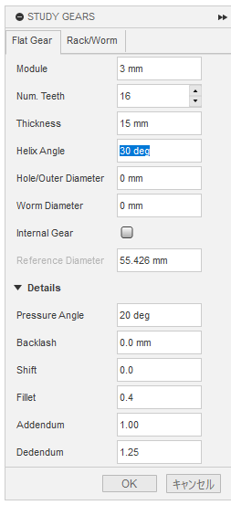
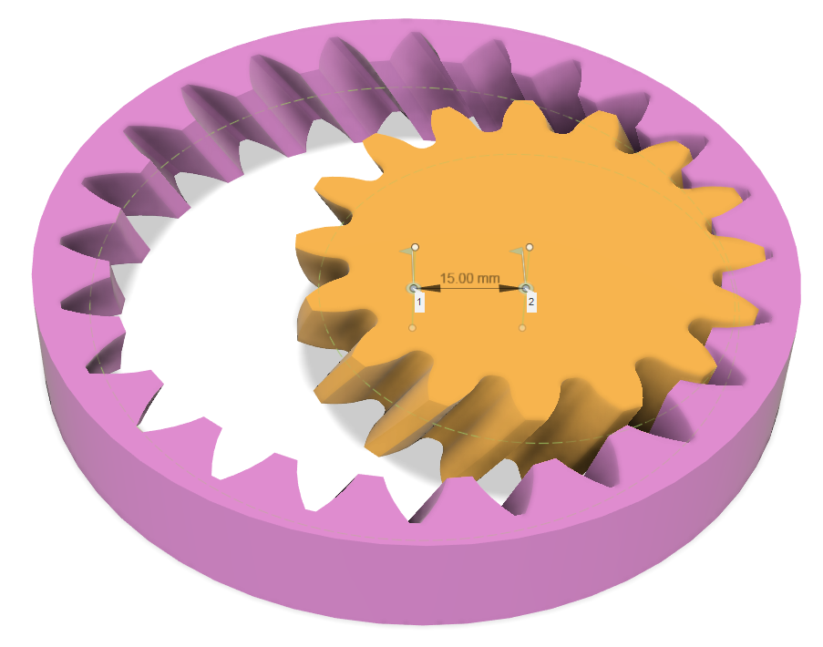
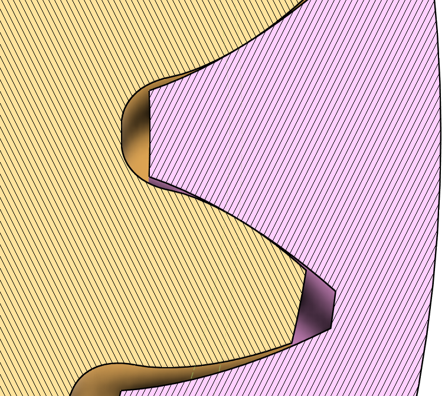

# 内歯車を生成して外歯車と組み合わせる

[[fusion360-study-gears チュートリアルへ戻る]](https://github.com/osamutake/fusion360-study-gears/blob/main/README-ja.md#チュートリアル)

# 内歯車の生成

Cylindrical タブにて Internal Gear のチェックを付け、
Hole/Outer Diameter に Reference Diameter より十分大きな値を入れると内歯車を生成できます。

内歯車にも回転軸やジョイントが生成されるため、簡単に他の歯車と連動させることができます。

例えば歯数 6 の平歯車を作り X 方向に $4\,\mathrm{mm}\times(12-6)/2=12\,\mathrm{mm}$ 動かしてかみ合わせたのがこちらです。

この例のように歯の数が少ない内歯車は基礎円が歯先円より大きくなってしまいます。

内歯車の歯形は基礎円より内側では生成できないため、そのような場合にはスクリプトは自動的に歯末の長さを調整し、歯先円を基礎円と一致させて歯車を生成するようになっています。

その結果、Addendum に指定した値よりも歯末の丈の短い歯車が出来上がりますので注意してください。

歯末の丈の調整が必要になるかどうかは [歯車計算機（内歯車: 軸間距離を計算）](../calc.html?calculator=2) で確認できます。

エラーチェックに「歯先を切詰」が表示されており、内歯車の歯末の丈（切り詰め後）が本来 1 であるはずのところ 0.361850 しかありません。歯丈が大きく切り詰められており、噛み合いが悪くなっていることを示しています。

# 組み合わせによってはぶつかる

内歯車は相手の歯車との組み合わせによっては干渉を起こして回らない場合があります。

- 左は内歯車の歯先が平歯車の歯元に食い込むインボリュート干渉
    - ２つの歯車のサイズが違いすぎるときに起きます
- 右は内歯車の歯先と平歯車の歯先がぶつかるトロコイド干渉
    - ２つの歯車のサイズが近すぎるときに起きます

[歯車計算機（内歯車: 軸間距離を計算）](../calc.html?calculator=2) ← こちらの計算機では指定の組み合わせで干渉が起きないことをチェックできるようになっているのですが・・・表示される結果は必ずしも正しくないため注意が必要です。

例えば上の例でも「エラーチェック」のところに「インボリュート干渉」の警告が出ていますが、実際にはこの組み合わせでは干渉は生じません。

というのも、文献などで見つかる「インボリュート干渉の条件式」は多くの場合に相手の歯車の切り下げを考慮しておらず、切り下げの行われた歯車を相手にした場合の判別を手軽に行う方法を探せずにいます。

上で作成した歯数12の内歯車と歯数6の外歯車の組み合わせをバックラッシュ 0 で作成して組み合わせてみた下図からは、この組み合わせでインボリュート干渉が起きないことを確認できます。これは歯数6の歯車に切り下げが発生している（歯元のトロコイド曲線が基礎円より上まで来ておりインボリュート領域が本来の長さまで到達していない）ためであり、切り下げがなければ小歯車のインボリュート曲線と内歯車の歯先が干渉します。判別式は小歯車の切り下げを考慮していないためにこの「仮想的な干渉」を検出してしまいます。

ですのでこのエラーチェックは、エラーが出なければ安全と考えてよいですが、切り下げの生じる歯車についてエラーが出た場合には、本当に使えないのかどうか確認してみる余地があるということになります。

# 転位

転位を用いた中心間距離の調整の計算を [歯車計算機（内歯車: 中心距離から転位を計算）](../calc.html?calculator=3) でできることを確認します。

具体的には https://www.khkgears.co.jp/gear_technology/pdf/gijutu.pdf#page=19 と同じパラメータで歯車を作って組み合わせてみました。

計算通りの中心間距離で噛み合いが得られていることを確認できました。

# はすばの場合

はすばの場合はどうか？

KHK さんの資料にははすば内歯車についての計算式が載っていなかったので、[歯車計算機（内歯車: 中心距離から転位を計算）](../calc.html?calculator=3) では外歯車の計算をまねて計算式を作りました。

その結果を元にして中心距離を設定したところぴったり一致していることを確認できました。

----
[[fusion360-study-gears チュートリアルへ戻る]](https://github.com/osamutake/fusion360-study-gears/blob/main/README-ja.md#チュートリアル)
