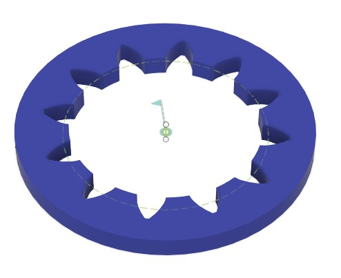

# Generate an internal gears and combine with an external gear

[[Back to fusion360-study-gears tutorial]](https://github.com/osamutake/fusion360-study-gears/blob/main/README.md#tutorials)

# Generating an internal gear

In the Cylindrical tab, check Internal Gear and enter a value significantly larger than the Reference Diameter in the Hole/Outer Diameter to generate an internal gear.

Since the rotation axes and joints are also generated for internal gears, they can be easily linked with other gears.

For example, here is a combination of a spur gear with 6 teeth moved in the X direction by $4\,\mathrm{mm}\times(12-6)/2=12\,\mathrm{mm}$.

As in this example, internal gears with a small number of teeth will have a base circle larger than the addendum circle.

Since the tooth profile of internal gears cannot be generated inside the base circle, the script automatically adjusts the addendum length and generates gears with the tip circle matching the base circle in such cases.

As a result, the gear will have a shorter addendum than the value specified in the Addendum field. Please be aware of this.

You can check whether addendum length adjustment is necessary or not, with the [Gear Calculator (Internal Gear: Calculate Center Distance)](../calc.html?calculator=2).

The Error check field shows "Shorten Addendum", indicating that the addendum length (after trimming) of the internal gear is only 0.361850 instead of the original 1. This indicates that the addendum has been significantly trimmed, resulting in poor meshing.

# An internal gear may interfere with an external gear depending on the combination

Internal gears may not rotate properly due to interference, depending on the combination with the mating gear.

- The left shows involute interference where the tip of the internal gear digs into the root of the spur gear.
  - This occurs when the sizes of the two gears are too different.
- The right shows trochoid interference where the tips of both the internal and spur gears collide.
  - This occurs when the sizes of the two gears are too close.

The [Gear Calculator (Internal Gear: Calculate Center Distance)](../calc.html?calculator=2) allows you to check whether any interference may occur or not with the specified combination, but the displayed results are not always accurate.

For example, in the above case, the Error check field shows a warning for "Involute Interference", but in reality, there is no interference for this combination.

This is because the involute interference check formula found in literature often does not consider the undercutting of the mating gear, and we have not found an easy way to accurately determine occurrence of interference when the mating gear is undercut.

In the figure below, the internal gear with 12 teeth is combined with the external gear with 6 teeth with zero backlash. It can be confirmed that there is no involute interference with this combination. This is because the gear with 6 teeth is undercut (the trochoid curve of the tooth root reaches above the base circle, and the involute region does not reach the base circle). Without undercutting, the involute curve of the small gear would interfere with the addendum of the internal gear. The interference check formula does not consider the undercutting of the small gears, thus detecting this "virtual interference".

Therefore, this error check can be considered safe if no error is shown, but even when an error is reported for a gear with undercutting, there is room to verify whether it is really unusable.

# Profile shift

You can calculate center distance adjusted by using profile shift with the [Gear Calculator (Internal Gear: Calculate Profile Shift from Center Distance)](../calc.html?calculator=3).

Here, I tested gears with the same parameters as in https://www.khkgears.co.jp/gear_technology/pdf/gijutu.pdf#page=19.

It was confirmed that meshing was obtained at the calculated center distance.

# It also works with helical internal gears

What about helical gears?

Since the KHK document did not include formulas for helical internal gears, I created the formulas by imitating the calculations for helical external gears in the [Gear Calculator (Internal Gear: Calculate Profile Shift from Center Distance)](../calc.html?calculator=3).

Based on the results, I set the center distance and confirmed that it matched perfectly.

----
[[Back to fusion360-study-gears tutorial]](https://github.com/osamutake/fusion360-study-gears/blob/main/README.md#tutorials)
