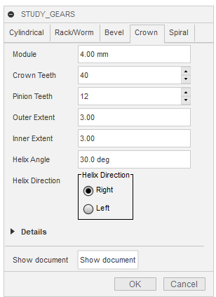

# パラメータリファレンス

[[fusion360-study-gears チュートリアルへ戻る]](https://github.com/osamutake/fusion360-study-gears/blob/main/README-ja.md#チュートリアル)

値をいろいろ変えながら生成してみると理解しやすいと思います。

その際、小さなものから始めるようにしてください。

大きなものは生成に時間がかかったり、途中で Fusion 360 ごと落ちたりしますので・・・

## Cylindrical タブ

平歯車（すぐ歯、はす歯、内歯車）およびウォームホイールを生成できます
<table><tr>
<td>

 

<td>
<dl>
<dt>Module
<dd>モジュール数（歯のピッチをπで割ったもの）
<dt>Num. Teeth
<dd>歯の数
<dt>Thickness
<dd>歯車の厚さ
<dt>Helix Angle
<dd>はす歯およびウォームホイールを作る場合のねじれ角
<dt>Helix Direction
<dd>はす歯およびウォームホイールを作る場合のねじれ方向
<dt>Hole/Outer Diameter
<dd>歯車中心に開ける穴の直径、内歯車では外径を指定する
<dt>Internal Gear
<dd>内歯車を作る場合にチェックを入れる
<dt>Worm Wheel
<dd>ウォームホイールを作る場合にチェックを入れる
  <dl>
  <dt>Worm Diameter
  <dd>ウォームホイールを作る場合の相手のウォーム直径
  <dt>Num. Spirals
  <dd>ウォームホイールを作る場合の相手のウォーム条数
  </dl>
</dl>
</table>

## Rack/Worm タブ

ラック（すぐ歯、はす歯）およびウォームを生成します。

<table><tr><td>

<td>
<dl>
<dt>Module
<dd>モジュール数（歯のピッチをπで割ったもの）
<dt>Thickness
<dd>ラックの厚さ、ウォームの基準円直径
<dt>Length
<dd>ラック・ウォームの長さ
<dt>Helix Angle
<dd>はす歯ラックのねじれ角、負の値も入れられる 
ウォームのねじれ角は自動計算される
<dt>Direction
<dd>はす歯あるいはウォームのねじれ方向
<dt>Num. Spiral
<dd>ウォームの条数（0 ならラックが生成される）
<dt>Height
<dd>ラックの高さ（底から基準線までの距離）
</dl>
</table>

## Bevel タブ

かさ歯車（すぐ歯、はす歯）を生成します。

<table><tr><td>

<td>
<dl>
<dt>Axes Angle
<dd>２つの軸間の角度
<dt>Module
<dd>モジュール数（歯のピッチをπで割ったもの） 
はすばの場合、歯垂直モジュールを表します
<dt>Num. Teeth 1
<dd>歯の数
<dt>Num. Teeth 2
<dd>歯の数
<dt>Width
<dd>歯の幅
<dt>Spiral Angle
<dd>曲がり歯かさ歯車の曲がり角
</dl>
</table>

## Crown タブ

クラウンギアを生成します。
クラウンギアはフェースギアとも呼ばれる歯車です。

現状でははすばには対応していません。

<table><tr><td>

<td>
<dl>
<dt>Module
<dd>モジュール数（歯のピッチをπで割ったもの）
<dt>Crown Teeth
<dd>クラウンギアの歯数
<dt>Pinion Teeth
<dd>相手のピニオンギアの歯数 
クラウンギアは特定の歯数のピニオンギア用に設計されます。
<dt>Outer Extent
<dd>クラウンギアの基準円から外向き方向の歯幅をモジュールを単位として指定する
<dt>Inner Extent
<dd>クラウンギアの基準円から内向き方向の歯幅をモジュールを単位として指定する
<dt>Helix Angle
<dd>相手のピニオンギアのはすば角
<dt>Helix Direction
<dd>相手のピニオンギアのはすば回転方向
</dl>
</table>

## Spiral タブ

らせんやカム形状を生成するためのタブ。

<table><tr><td>

<td>
<dl>
<dt>Total Angle
<dd>らせんの生成角度~
360 deg * 4 のように式で入れるといい 
<dt>Radii
<dd>らせんの動径長さをカンマ区切りで入れる 
たくさん入れると均等に割り当てられた角度に対してそれぞれの動径長となるよう間が線形補間される
<dt>Height
<dd>らせんを高さ方向に伸ばす場合に値を入れる
<dt>Flip
<dd>らせんの巻き方向を逆転する
<dt>Spline
<dd>Total Angle = 360 deg であり、Radii の最初と最後が等しく、Radii に 5 つ以上の値が指定されている場合に、指定されった半径の間を線形補間ではなくスプライン補間する。
</dl>
Radii に２つの値だけ入れれば、初期半径と終了半径でらせんが描かれる。

一方、ここに多数の値を並べ Total Angle を 360 deg にすることでカム形状を生成することもできる。
</table>

## Details

多くのタブに共通の詳細設定項目。

<table><tr><td>

<td>
<dl>
<dt>Pressure Angle
<dd>圧力角へ 20度が標準 
14度が使われることもあるらしい
<dt>Backlash
<dd>負の値も入れられる 
(歯当たりを確認したり、切削工具を生成するため)
<dt>Shift
<dd>転位量（ラックには適用されない）
<dt>Fillet
<dd>歯切り工具側のフィレット半径 
（モジュールを単位とした最大値）
<dt>Addendum
<dd>歯末の高さ（モジュールを単位とする）　標準値は 1.0
<dt>Dedendum
<dd>歯元の高さ（モジュールを単位としている）　標準値は 1.25
<dt>Radial Clearance
<dd>頂隙（モジュールを単位としている）　標準値は 0.25 
通常は $(\mathrm{Dedendum}) - (\mathrm{Addendum})$ に等しい 
歯車ではなくホブの形状を生成したいときにこの関係が崩れるため別途指定できるようにした 
<dt>Tip Fillet
<dd>歯先をフィレット付きで延長でする延長量（モジュールを単位とする） 
延長する場合の標準値は 0.25 
歯車ではなくホブとして使う際に利用する 
平歯車（はすば含む）、ラック、ウォームに対して有効
</dl>
</table>

----

[[fusion360-study-gears チュートリアルへ戻る]](https://github.com/osamutake/fusion360-study-gears/blob/main/README-ja.md#チュートリアル)
