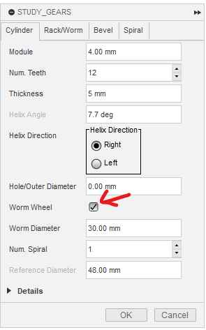
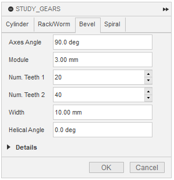
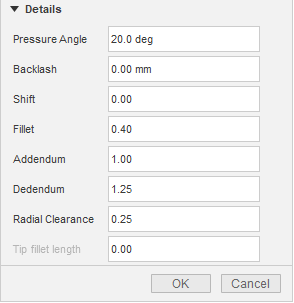

# Reference of Parameters

[[Go back to fusion360-study-gears Tutorials]](https://github.com/osamutake/fusion360-study-gears/#tutorials)

It may be easier to understand them by generating gears with setting various values for the parameters.

But when you try, please start with small gears.
Generating large gears may take long time and sometimes cause Fusion 360 to crash...

## Cylinder Tab

This tab allows generation of cylindrical gears, i.e. spur gears, helical gears, internal gears (incl. helical) and worm wheels.

<table><tr>
<td>

 

<td>
<dl>
<dt>Module
<dd>Pitch of the teeth divided by $\pi$
<dt>Num. Teeth
<dd>Number of teeth
<dt>Thickness
<dd>Thickness of the gear
<dt>Helix Angle
<dd>Helix angle for helical gears and worm
<dt>Helix Direction
<dd>Helix direction for helical gears and worm
<dt>Hole/Outer Diameter
<dd>Diameter of the hole in the center of the gear, or outer diameter for internal gears
<dt>Internal Gear
<dd>Check this to create an internal gear
<dt>Worm Wheel
<dd>Check this to create a worm wheel
  <dl>
  <dt>Worm Diameter
  <dd>Diameter of the mating worm for the worm wheel
  <dt>Num. Spirals
  <dd>Number of spirals of the mating worm for the worm wheel
  </dl>
</dl>
</table>

## Rack/Worm Tab

This tab allows generation of racks (straight, helical) and worms.

<table><tr><td>

<td>
<dl>
<dt>Module
<dd>Pitch of the teeth divided by $\pi$
<dt>Thickness
<dd>Thickness of the rack or reference diameter of the worm
<dt>Length
<dd>Length of the rack or worm
<dt>Helix Angle
<dd>Helix angle for helical racks, negative values are also allowed 
Helix angle for worms is automatically calculated
<dt>Direction
<dd>Helix direction for helical racks or worms
<dt>Num. Spiral
<dd>Number of spirals for the worm (0 generates a rack)
<dt>Height
<dd>Height of the rack (distance from the base to the reference line)
</dl>
</table>

## Bevel Tab

This tab allows generation of bevel gears (straight, helical).

<table><tr><td>

<td>
<dl>
<dt>Axes Angle
<dd>Angle between the two axes
<dt>Module
<dd>Pitch of the teeth divided by $\pi$ 
At this moment, this specifies the normal module, so be careful
<dt>Num. Teeth 1
<dd>Number of teeth for the first gear
<dt>Num. Teeth 2
<dd>Number of teeth for the second gear
<dt>Width
<dd>Width of the gear teeth
<dt>Helical Angle
<dd>Helix angle for helical bevel gears
</dl>
</table>

## Spiral Tab

Tab for generating spirals and cam shapes.

<table><tr><td>

<td>
<dl>
<dt>Total Angle
<dd>Generation angle of the spiral 
It is good to enter it as an expression like "360 deg * 4"
<dt>Radii
<dd>Enter the radii of the spiral separated by commas 
If you enter multiple values, they will be linearly interpolated in between
<dt>Height
<dd>Enter a value to extend the spiral in the height direction
<dt>Flip
<dd>Reverse the winding direction of the spiral
</dl>
If you enter only two values for radii, a spiral curve will be drawn with using the specified initial and final radii.

On the other hand, by entering many values there and setting Total Angle to 360 deg, you can generate cam shapes.
</table>

## Details

Detailed settings common to many tabs.

<table><tr><td>

<td>
<dl>
<dt>Pressure Angle
<dd>Pressure angle, 20 degrees is standard 
14 degrees is also sometimes used
<dt>Backlash
<dd>Negative values are also allowed 
(Used to check tooth contact or generate cutting tools)
<dt>Shift
<dd>Shift amount (not applied to racks)
<dt>Fillet
<dd>Fillet radius on the cutting tool side 
(Maximum value in terms of module)
<dt>Addendum
<dd>Height of the tooth tip (in terms of module), standard value is 1.0
<dt>Dedendum
<dd>Height of the tooth root (in terms of module), standard value is 1.25
<dt>Radial Clearance
<dd>Radial clearance (in terms of module), standard value is 0.25 
Usually equal to $(\mathrm{Dedendum}) - (\mathrm{Addendum})$ 
This relationship can be broken when generating the shape of a hob, so it can be specified separately
<dt>Tip Fillet
<dd>Extension amount with fillet at the tooth tip (in terms of module) 
Used when using as a hob instead of a gear 
Effective for spur gears (including helical), racks, and worms
</dl>
</table>

---- 

[[Go back to fusion360-study-gears Tutorials]](https://github.com/osamutake/fusion360-study-gears/#tutorials)