# 遊星歯車

[[fusion360-study-gears チュートリアルへ戻る]](https://github.com/osamutake/fusion360-study-gears/blob/main/README-ja.md#チュートリアル)

遊星歯車を作り動かしてみます。

<a href="assets/planetary25.gif">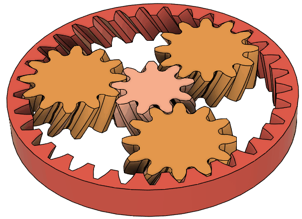</a>

遊星歯車は中央の太陽歯車と内歯車との間で遊星歯車が回転するよう組み合わされた歯車です。

太陽歯車、遊星歯車、内歯車のどれを固定するかで３つの動作モードがあります。

<a href="assets/planetary23.gif">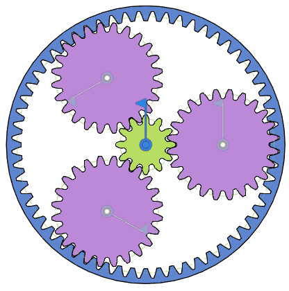</a>

同軸のまま減速したり、回転方向を反転させたりできるという特徴を持っています。

## 歯車の比率を決める

遊星歯車を等間隔に配置する場合、以下の条件を満たせば良さそうです。

- 太陽歯車の歯数と内歯車の歯数は遊星歯車の数 (例えば 3) の整数倍になっている
- (内歯車の歯数) = (太陽歯車の歯数) + 2 × (遊星歯車の歯数)
- 内歯車と遊星歯車の歯数は干渉せず回る値になっている
- 遊星歯車同士が干渉せず回る値になっている

ここでは以下のようにしてみました。

- 遊星歯車の数 3
- 太陽歯車の歯数 12
- 遊星歯車の歯数 24
- 内歯車の歯数 60 = 12 + 2 × 24

## ３種の歯車を生成

歯数 12 と 24 の平歯車、歯数 60 の内歯車を生成。厚さは 10 mm、内歯車の外径は 260 mm としました。ただしこのとき下記のように遊星歯車として用いる歯数 24 の平歯車については通常よりもフィレットを薄く付けるよう設定を変更しました。

名前を変更しておきます。

### 遊星歯車のフィレット設定を小さくする

上で選んだ歯数の組み合わせは次のものでした。

- 遊星歯車の歯数 24
- 内歯車の歯数 60

これらを標準設定で生成するとインボリュート干渉が生じてしまい正しく歯車が回転しないようでした。

これは、内歯車の歯先が遊星歯車の歯元に当たってしまっている状況です。

この問題、今回のケースでは遊星歯車のフィレットを薄くするだけで解決できました。

標準設定でフィレットを最大限付けたピンクの歯車は、右の緑の内歯車の歯先と接触してしまいますが、フィレットを 0.0 としたオレンジの歯車は明らかに接触しません。青はフィレット 0.2 でこれでぎりぎり触るか、触らないか、という感じでした。

歯元のフィレット部分でだけ干渉が生じる場合にはフィレット値を小さくするだけで手段で簡単に干渉の問題を取り除けることもあるようです。

## 噛み合い位置に移動

遊星歯車のコンポーネントを x 方向に 4 mm * (12+24) / 2 だけ移動します。

<a href="assets/planetary3.png">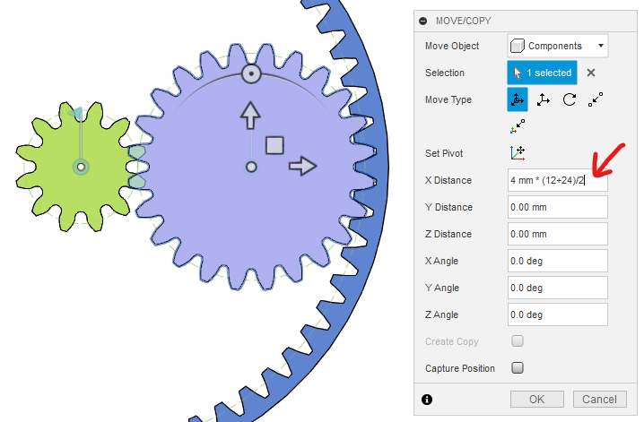</a>

太陽歯車のボディを z 軸中心に 360 deg / 12 / 2 回転します。

<a href="assets/planetary4.png">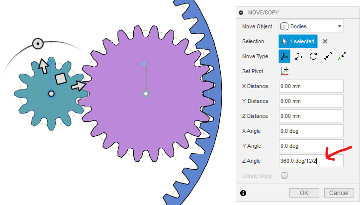</a>

## 遊星歯車を複製

z 軸の周りに３つに増やします。

<a href="assets/planetary5.png">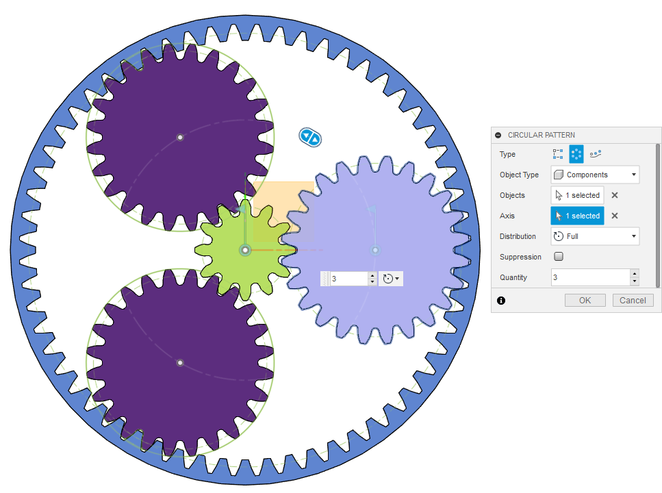</a>

## コンポーネントに入れ全体の回転軸を作成

ルート直下に入れ子になった２つコンポーネントを作りました。

- 外側は PlanetaryGear
- 内側は PlanetaryGearInner

先ほど作った５つの歯車を PlanetaryGearInner の中に入れました。

<a href="assets/planetary6.png">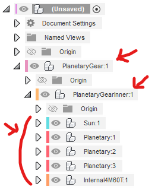</a>

PlanetaryGear を 親に固定

<a href="assets/planetary7.png">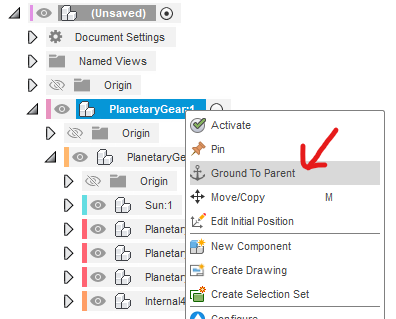</a>

PlanetaryGear と PlanetaryGearInner との間に構築済み回転ジョイントを作成。

<a href="assets/planetary8.png">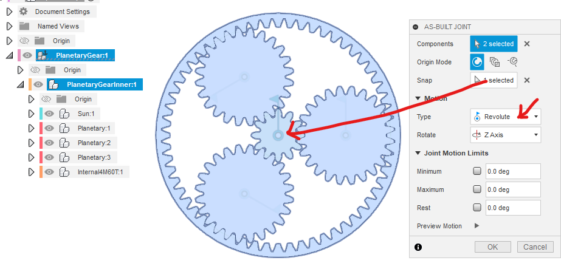</a>

## コンポーネント内で回転軸の位置を固定

PlanetaryGearInner とその子コンポーネントを選択して、剛性グループを作成。

回転ジョイントが含まれるがよいかと聞かれるので Yes

<a href="assets/planetary10.png">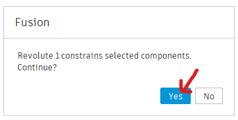</a>

「子コンポーネントを含める」を解除して OK

<a href="assets/planetary11.png">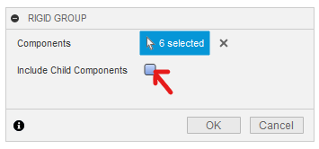</a>

ここまでで、太陽歯車、遊星歯車、内歯車が原点を中心に回転可能になっているはずです。

## モーションリンクを設定

太陽歯車と左上の遊星歯車の回転軸の間にモーションリンクを作成。

中央は回転ジョイントが重なっているため、図のようにブラウザからジョイントを選ぶと分かりやすいです。

回転量は 360 deg を歯数で割る形で指定すると分かりやすいです。

<a href="assets/planetary13.png">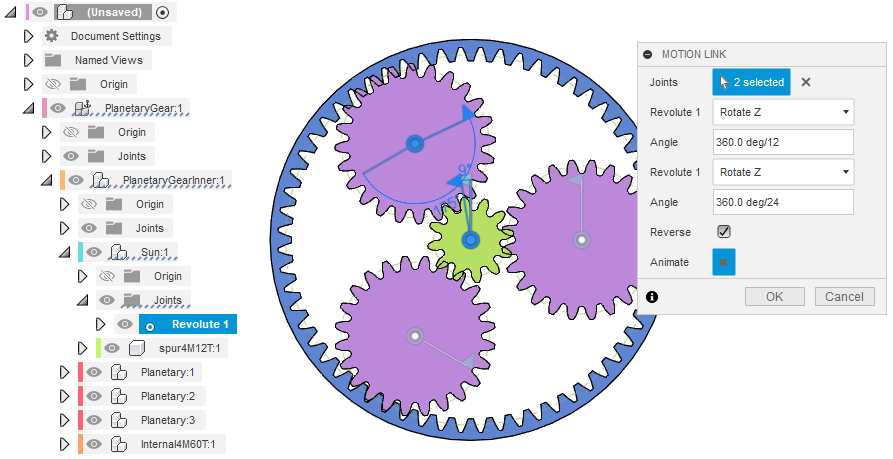</a>

左上と左下、左下と右の遊星歯車の回転軸にモーションリンクを作成。

<a href="assets/planetary14.png">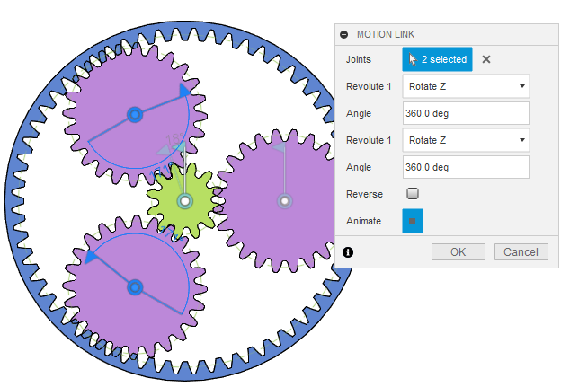</a>

太陽歯車と内歯車の回転軸の間にモーションリンクを作成。

回転量は 360 deg を歯数で割る形で指定すると分かりやすいです。

<a href="assets/planetary16.png">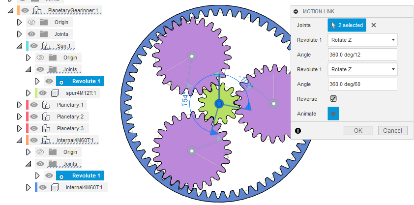</a>

これですべての歯車が連動するようになりました。

ただ、現状ではどの歯車も固定していないのですべての歯車が回転してしまっています。

## 遊星歯車を固定する

遊星歯車の軸は PlanetaryGearInner に固定されているので、
PlanetaryGearInner を右クリックして「ピン留め」することで遊星歯車を固定できます。

コンポーネントのアイコンに鍵🗝のマークが付いていることを確認してください。

<a href="assets/planetary20.png">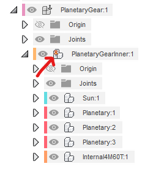</a>

このとき、

- 太陽歯車に対して遊星歯車は歯数の比により 12/24 = 1/2 の速度で回転します
- 遊星歯車に対して内歯車は歯数の比により 24/60 = 2/5 の速度で回転します
- 結局、太陽歯車に対して内歯車は歯車の比の通り 12/60 = 1/5 の速度で回転します
- 内歯車の回転方向は太陽歯車とは逆方向になります

太陽歯車 (歯数 $z_s$) と内歯車(歯数 $z_i$) とのギア比は $z_s/z_i$ になります

## 内歯車を固定する

内歯車のコンポーネントは二重になっていて、外と内の２つのコンポーネントの間に回転ジョイントが作られています。

このうち内側のコンポーネントを右クリックして「ピン留め」します。
コンポーネントのアイコンに鍵🗝のマークが付きます。

PlanetaryGearInner のピン止めは外します。

すると内歯車が固定されるため、太陽歯車の回転に合わせて遊星歯車が太陽歯車の周りを回る動作を確認できます。

<a href="assets/planetary18.png">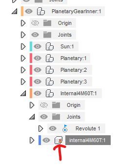</a>

- 太陽歯車が遊星歯車に対して１回転する間に内歯車は遊星歯車に対して $-z_s/z_i=-1/5$ 回転します
- 内歯車を固定して考えると、遊星歯車群が原点に対して $z_s/z_i=1/5$ 回転する間に太陽歯車は $1+z_s/z_i=6/5$ 回転します

結果的に太陽歯車と遊星歯車群の原点中心の回転とのギア比は

$$\frac1{1+z_s/z_i}\cdot \frac{z_s}{z_i}=\frac{z_s}{z_s+z_i}=\frac16$$

となります。

## 太陽歯車を固定する

内歯車のピン留めを外して太陽歯車をピン留めします。

外歯車と遊星歯車とが回るようになります。

- 太陽歯車が遊星歯車に対して１回転する間に内歯車は遊星歯車に対して $-z_s/z_i=-1/5$ 回転します
- つまり内歯車は太陽歯車の周りを $1+z_s/z_i=6/5$ 回転します

したがって、遊星歯車に対する内歯車のギア比は $1+z_s/z_i=6/5$ となります。

## ピン留めの代わりに剛性グループを作成する

上で歯手間を省くためピン留めを使いましたが、
実際の組み立て時にはピン留めの代わりに、
固定したい歯車と一番外側の PlanetaryGear との間に剛性グループ
あるいは剛性ジョイントを作成すると良いでしょう。

## はすばの場合

平歯車の代わりにはすば歯車を使う場合は、太陽歯車と遊星歯車のねじれ方向を逆に取ります。遊星歯車と内歯車は同じ向きです。

そして始めに噛み合い位置に持って来る際に移動量が変わってきますが、そのほかは全く同じ手順でできますね。

ここでは

- 太陽歯車の歯数 9
- 遊星歯車の歯数 12
- 内歯車の歯数 33
- はすば角 30 deg

としてみました。

内歯車を固定した場合、ギア比は $9/(9+33) = 3/14$ になります。

こちらでもフィレットを最大に取ると干渉が生じましたが、フィレット 0 では問題なく回転するようでした。

----
[[fusion360-study-gears チュートリアルへ戻る]](https://github.com/osamutake/fusion360-study-gears/blob/main/README-ja.md#チュートリアル)
