# Planetary Gears

[[Go back to fusion360-study-gears Tutorials]](https://github.com/osamutake/fusion360-study-gears/#tutorials)

Let's create and move planetary gears.

Planetary gears are a type of gear system where planetary gears rotate between a central sun gear and an internal gear.

Depending on which of the sun gear, planetary gears, or internal gear is fixed, there are three modes of operation.

<a href="assets/planetary23.gif">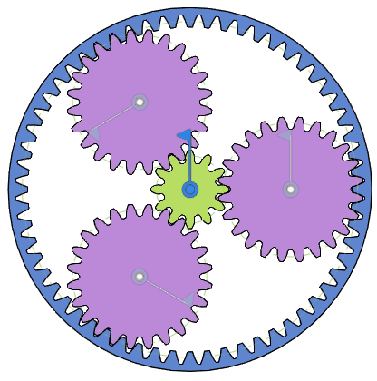</a>

They are able to largely reduce speed or reverse the direction of rotation while remaining coaxial.

## Determining Gear Ratios

When arranging planetary gears at equal intervals, the following conditions should be satisfied:

- The number of teeth on the sun gear and the internal gear should be integer multiples of the number of planetary gears (e.g., 3).
- $z_\mathrm{int} = z_\mathrm{sun} + 2 z_\mathrm{plan}$, where number of teeth on the internal gear $z_\mathrm{int}$, number of teeth on the sun gear $z_\mathrm{sun}$, and number of teeth on the planetary gears $z_\mathrm{plan}$.
- The number of teeth on the internal gear and planetary gears should allow them to rotate without interference.
- The planetary gears should not interfere with each other during rotation.

Here, we used the following configuration:

- Number of planetary gears: $z_\mathrm{plan}=3$
- Number of teeth on the sun gear: $z_\mathrm{sun}=12$
- Number of teeth on the planetary gears: $z_\mathrm{int}=24$
- Number of teeth on the internal gear: $z_\mathrm{int}= 60 = 12 + 2 \times 24 = z_\mathrm{sun}+2z_\mathrm{int}$

## Generating the Three Types of Gears

Generate spur gears with `12` and `24` teeth and an internal gear with `60` teeth.
The thickness is `10 mm`, and the outer diameter of the internal gear is `260 mm`.

<a href="assets/planetary1.jpg">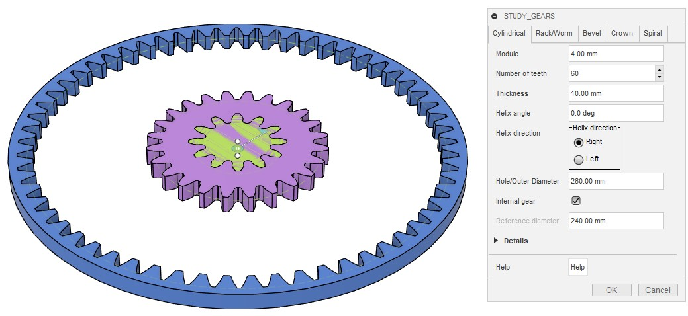</a>

Rename the components as `sun` and `planetary` for clarity.

<a href="assets/planetary2.png">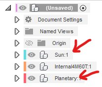</a>

## Moving to the Meshing Position

Move the planetary gear component in the $x$-direction by `4 mm * (12 + 24) / 2`.

<a href="assets/planetary3.png">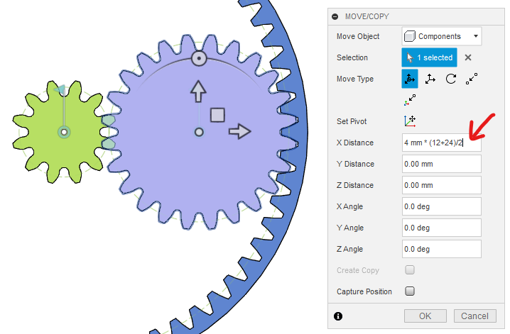</a>

Rotate the sun gear body around the $z$-axis by `360 deg / 12 / 2`.

<a href="assets/planetary4.png">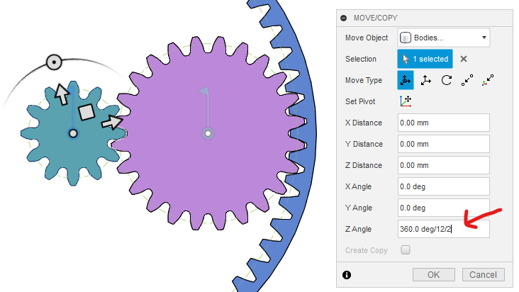</a>

## Duplicating the Planetary Gears

Duplicate the planetary gears around the $z$-axis to create three gears.

## Creating Components and a Central Rotation Axis

Create two nested components directly under the root:

- Name the outer component as `PlanetaryGear`.
- Name the inner component as `PlanetaryGearInner`.

Place the five gears created earlier inside PlanetaryGearInner.

<a href="assets/planetary6.png">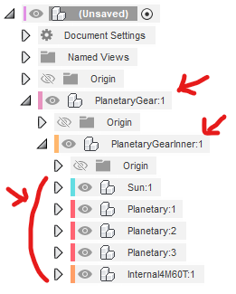</a>

Ground `PlanetaryGear` to the parent.

<a href="assets/planetary7.png">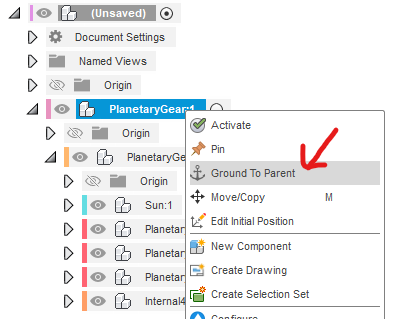</a>

Create an as-built rotational joint between `PlanetaryGear` and `PlanetaryGearInner`.

<a href="assets/planetary8.png">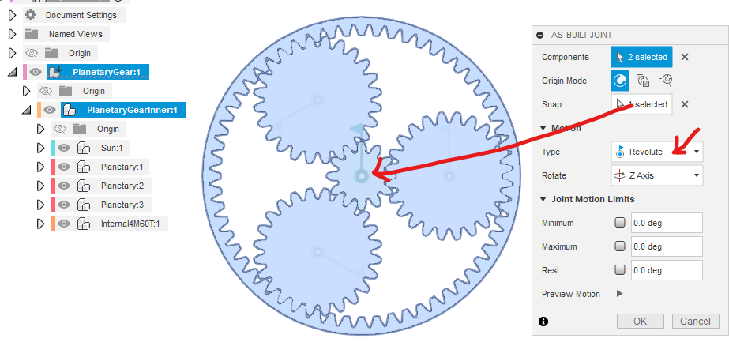</a>

## Fixing the Rotation Axis Position Within the Component

Create a rigid group between `PlanetaryGearInner` and its child components.

<a href="assets/planetary9.png">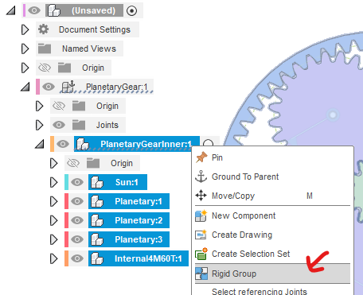</a>

When asked if you continue with a revolute constraint is selected in the rigid group, select `Yes`.

<a href="assets/planetary10.png">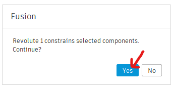</a>

Uncheck "Include child components" and click OK.

<a href="assets/planetary11.png">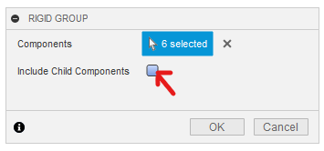</a>

At this point, the sun gear, planetary gears, and internal gear can be rotated around the origin.

<a href="assets/planetary12.gif">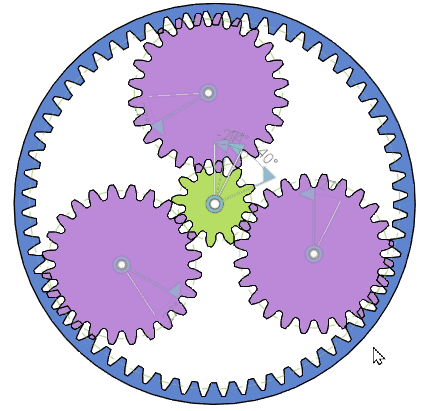</a>

## Setting Motion Links

Create a motion link between the revolve joint of the sun gear and that of the top-left planetary gear.

Since multiple rotational joints overlaps at the origin, select the joint from the browser, as shown in the figure, to make it easier to identify.

Specify the rotation amount as 360 deg divided by the number of teeth for correct gear ratio.

<a href="assets/planetary13.png">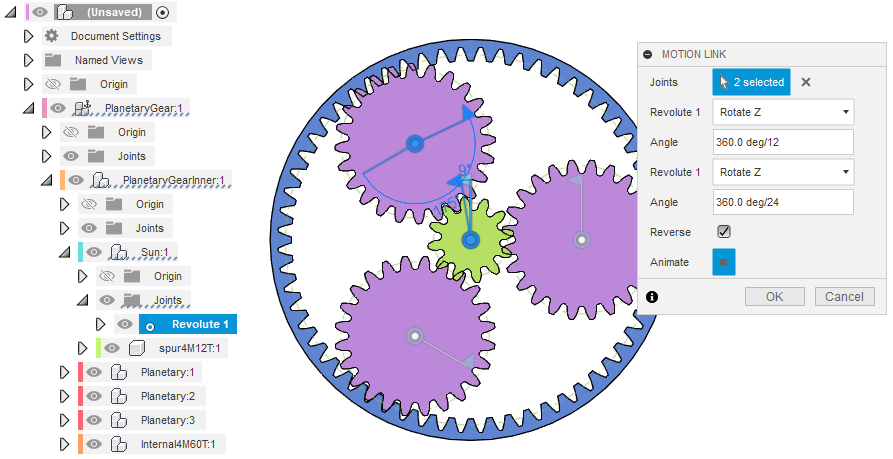</a>

Create motion links between the revolve joints of the top-left and bottom-left planetary gears, and between the bottom-left and right planetary gears.

<a href="assets/planetary14.png">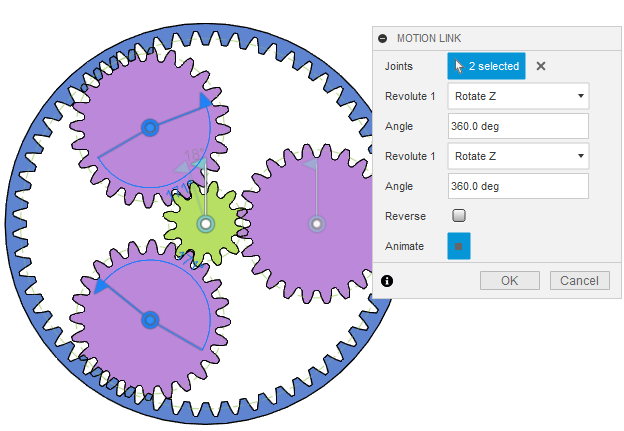</a>
<a href="assets/planetary15.png">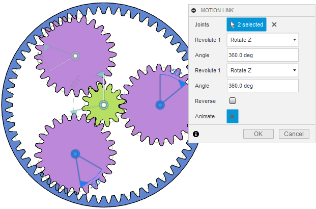</a>

Create a motion link between the rotational axes of the sun gear and the internal gear.

Specify the rotation amount as 360 deg divided by the number of teeth for correct gear ratio.

<a href="assets/planetary16.png">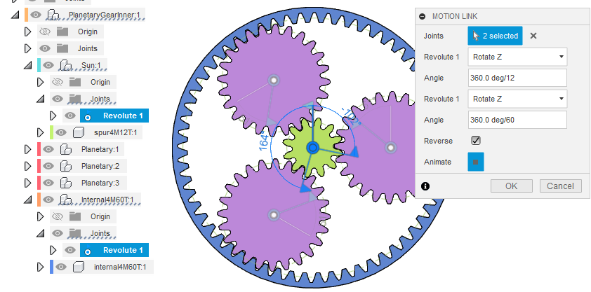</a>

Now all the gears are linked and move together correctly.

<a href="assets/planetary17.gif">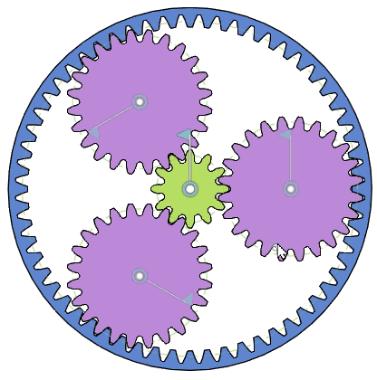</a>

However, at this stage, none of the gears are fixed, so all the gears rotate freely.

To realize one of the three operational mode, fix one of the sun gear, the planetary gears, and the internal gear as followings.

## Fixing the Planetary Gears

Since the planetary gear shafts are fixed to PlanetaryGearInner, you can fix the planetary gears by right-clicking PlanetaryGearInner and selecting "Pin".

Ensure that the component icon has a key 🗝 symbol.

<a href="assets/planetary20.png">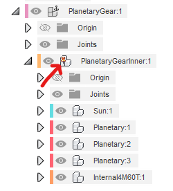</a>

In this operational mode:

- The planetary gears rotate at a speed of $12/24 = 1/2$ relative to the sun gear.
- The internal gear rotates at a speed of $24/60 = 2/5$ relative to the planetary gears.
- Ultimately, the internal gear rotates at a speed of $12/60 = 1/5$ relative to the sun gear.
- The internal gear rotates in the opposite direction to the sun gear.

The gear ratio between the sun gear (number of teeth $z_s$) and the internal gear (number of teeth $z_i$) is $z_s/z_i$.

## Fixing the Internal Gear

First, unpin `PlanetaryGearInner`.

The internal gear component is double-layered, with a rotational joint between the outer and inner components.

Right-click the inner component and select "Pin". The component icon will have a lock 🗝 symbol.

This fixes the internal gear, allowing you to observe the planetary gears orbiting around the sun gear.

<a href="assets/planetary18.png">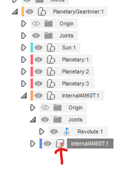</a>

- For every full rotation of the sun gear relative to the planetary gears, the internal gear rotates $-z_s/z_i=-1/5$ relative to the planetary gears.
- Fixing the internal gear, the planetary gear group rotates $z_s/z_i=1/5$ relative to the origin, while the sun gear rotates $1+z_s/z_i=6/5$.

The gear ratio between the sun gear and the planetary gear group relative to the origin is:

$$\frac1{1+z_s/z_i}\cdot \frac{z_s}{z_i}=\frac{z_s}{z_s+z_i}=\frac16$$

## Fixing the Sun Gear

Unpin the internal gear and pin the sun gear.

This allows the internal gear and planetary gears to rotate.

<a href="assets/planetary22.png">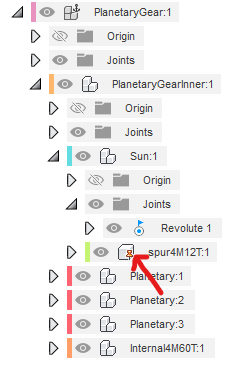</a>

- For every full rotation of the sun gear relative to the planetary gears, the internal gear rotates $-z_s/z_i=-1/5$ relative to the planetary gears.
- Thus, the internal gear orbits the sun gear $1+z_s/z_i=6/5$.

The gear ratio between the planetary gears and the internal gear is $1+z_s/z_i=6/5$.

## Using Rigid Groups Instead of Pinning

To save time, we used pinning above, but in actual assembly, it is better to create a rigid group or rigid joint between the gear you want to fix and the outermost `PlanetaryGear`.

## Using Helical Gears

When using helical gears instead of spur gears for a planetary gear system, the twist direction of the sun gear and planetary gears should be opposite. The planetary gears and internal gear should have the same twist direction.

The initial meshing position will differ, but the rest of the procedure remains the same.

- Number of teeth on the sun gear: 9
- Number of teeth on the planetary gears: 12
- Number of teeth on the internal gear: 33
- Helix angle: 30 deg

The gear ratio is $9/(9+33) = 3/14$.

----
[[Go back to fusion360-study-gears Tutorials]](https://github.com/osamutake/fusion360-study-gears/#tutorials)
