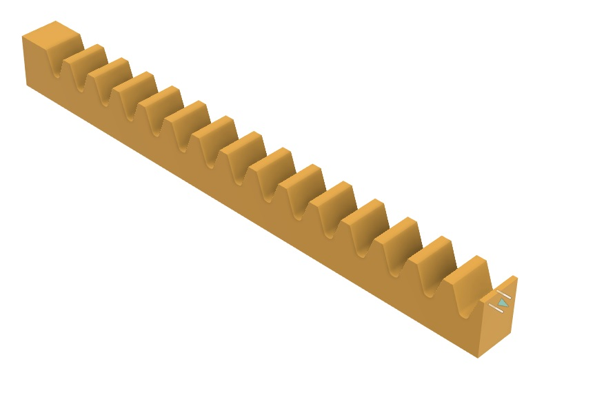
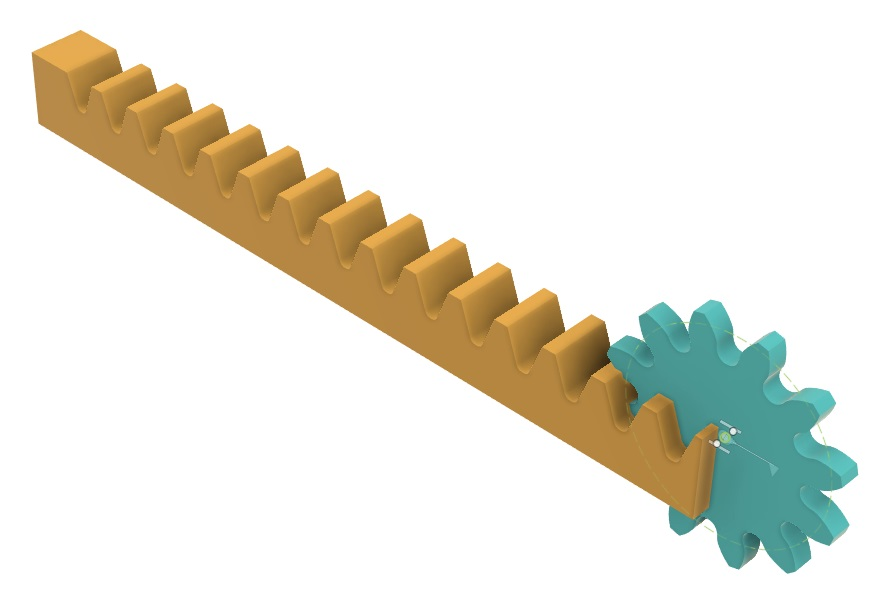
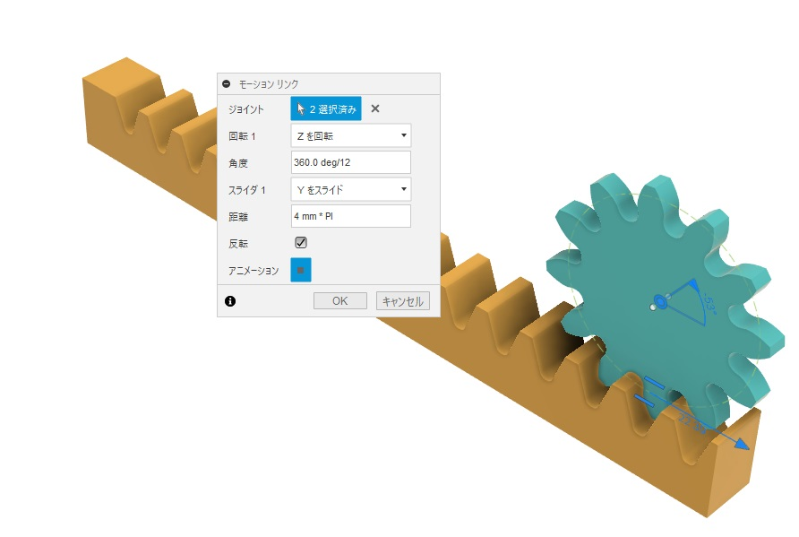
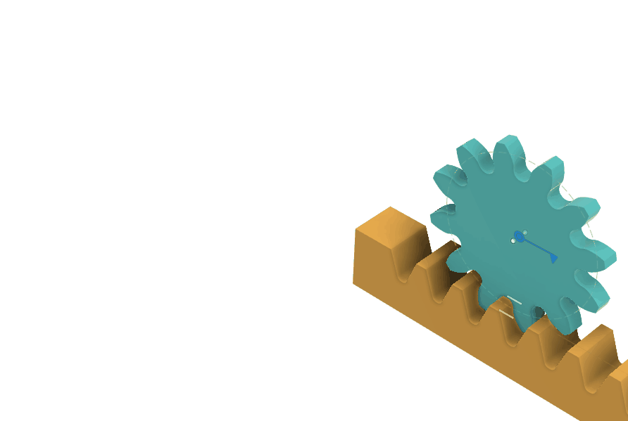
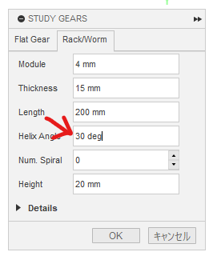
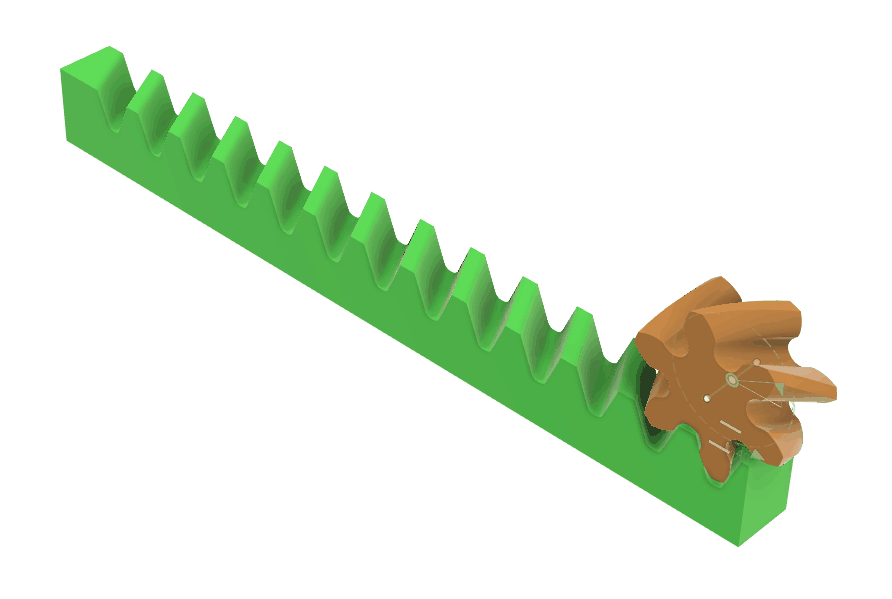

# ラックとピニオンを生成して組み合わせて動かしてみます

[[fusion360-study-gears チュートリアルへ戻る]](https://github.com/osamutake/fusion360-study-gears/blob/main/README-ja.md#チュートリアル)

# ラックの生成

Rack/Worm タブを開いて OK を押すと、ラックが生成されます。

# ピニオンと合わせる

デフォルトの12枚歯の平歯車を作ってピニオンとして使います。

生成直後はかみ合っていませんが、ラックの基準面は $yz$ 平面に一致するのでピニオンを基準半径だけ $x$ 方向に動かすとかみ合い位置に持ってこられます。

# モーションリンク

ラックには並進軸が生成されています。

モーションリンクでピニオンの歯１枚分の回転 ($360\,\mathrm{deg} / (\text{歯数})$) に対してラックの１ピッチ分（ $(\text{モジュール}) \times \text{PI} / \cos(\text{ねじれ角})$ ）だけ動くように設定すると正しく連動するようになります。

# はすばラック

Helix Angle に値を入れるとはすばラックが作れます。

ピニオンにも符号を反転せずに同じ値を入れるとかみ合います。

- ピニオンの $x$ 方向移動量は $(\text{モジュール}) \times (\text{歯数}) / \cos(\text{ねじれ角})$
- ピニオン回転は $360\,\text{deg} / (\text{歯数})$
- ラック並進量は $(\text{モジュール}) \times \text{PI} / \cos(\text{ねじれ角})$

とします。

# 噛み合いの確認

上の Helix Angle = $30\,\text{deg}$ のはすばラックと６歯のピニオンをバックラッシュを負にして作成し、噛み合わせ時の干渉を見ることで歯の接触領域を確認しました。

噛み合い領域が滑らかに増減しながら移動していく様子が分かります。

# ピニオン軸までの距離

ラックとピニオンの場合、ピニオンが転位されれば丁度転位した分だけ軸までの距離が変化します。

したがってラック＆ピニオンの場合には転位したピニオンであっても軸までの距離を求めるのに難しい計算は必要になりません。

----
[[fusion360-study-gears チュートリアルへ戻る]](https://github.com/osamutake/fusion360-study-gears/blob/main/README-ja.md#チュートリアル)
