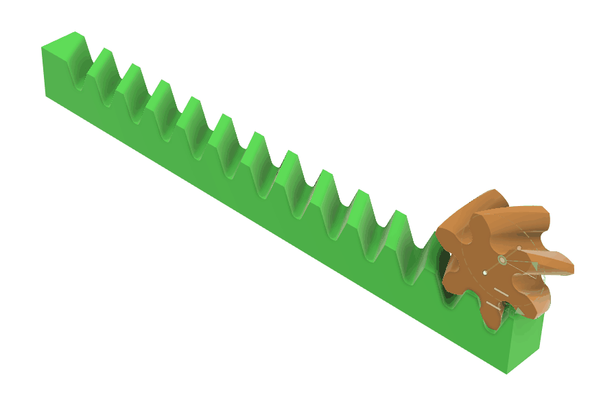
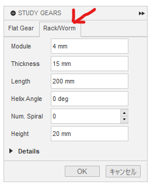
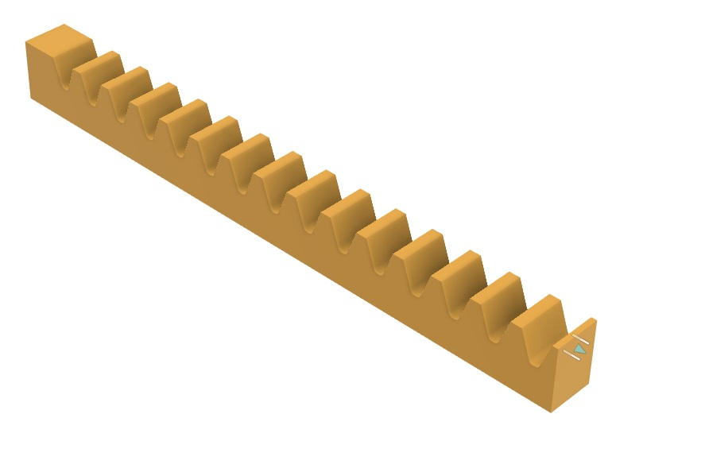
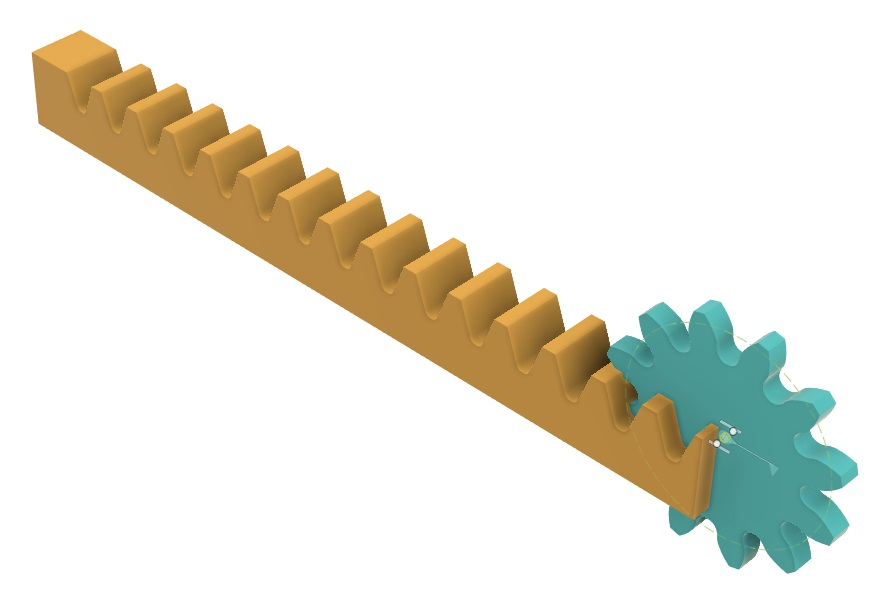
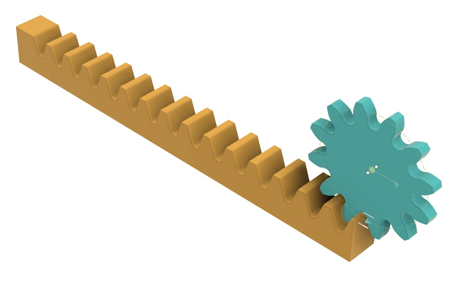
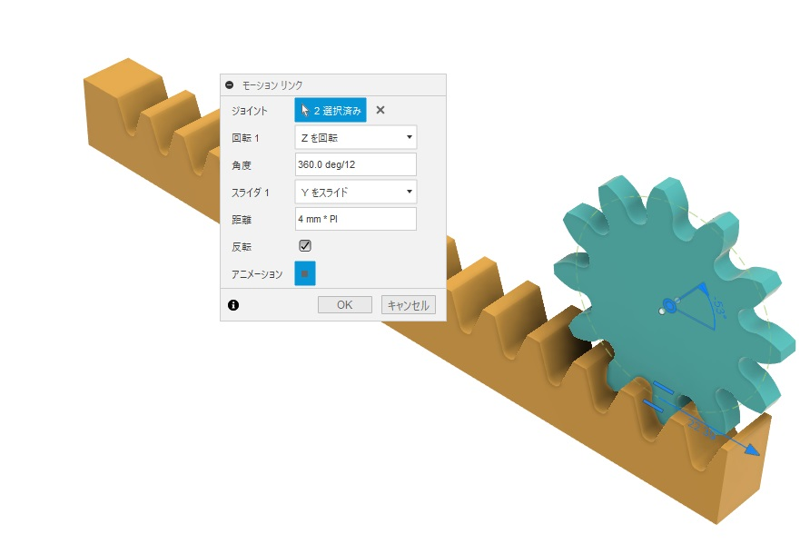
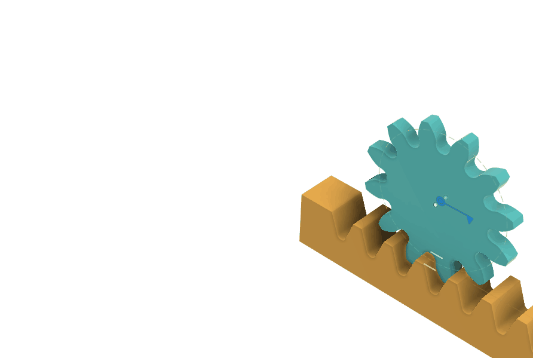
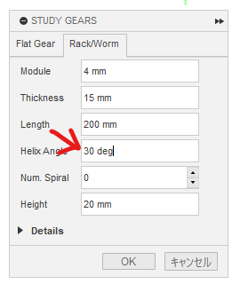
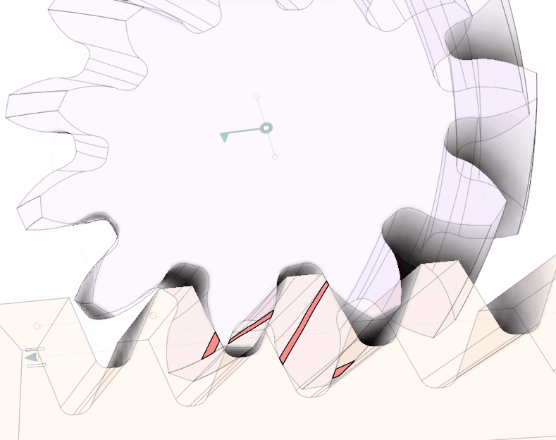

# Generate and Combine Rack and Pinion

[[Go back to fusion360-study-gears Tutorials]](https://github.com/osamutake/fusion360-study-gears/#tutorials)

# Generate Rack

Open the Rack/Worm tab and press OK to generate the rack.

# Combine with Pinion

Create a default 12-tooth spur gear to use as a pinion.

Initially, they do not mesh. The reference plane of the rack matches the $yz$ plane, so you can move the pinion in the $x$ direction by the reference radius to bring it into the meshing position.

# Motion Link

A translational axis is automatically generated for the rack.

Set the motion link between the translation joint of the rack and the revolution joint of the pinion so that the rack moves by one pitch ( $(\text{module}) \times \text{PI} / \cos(\text{helix angle})$ ) while the pinion rotates by one tooth ($360\,\mathrm{deg} / (\text{number of teeth})$) to ensure proper synchronization.

# Helical Rack

Entering a value in the Helix Angle creates a helical rack.

Enter the same value for the pinion without reversing the sign to mesh them.

- The $x$ direction movement of the pinion is $(\text{module}) \times (\text{number of teeth}) / \cos(\text{helix angle})$
- Pinion rotation is $360\,\text{deg} / (\text{number of teeth})$
- Rack translation is $(\text{module}) \times \text{PI} / \cos(\text{helix angle})$

# Check Meshing

A helical rack with a Helix Angle of $30\,\text{deg}$ and a 6-tooth pinion with the same Helix Angle, both with negative backlash, was generated to check the interference during meshing and confirm the contact area of the teeth.

You can see the contact area smoothly increasing and decreasing while moving.

# Distance to Pinion Axis

In the case of rack and pinion, if the pinion is displaced, the distance to the axis changes exactly by the amount of displacement.

Therefore, even for a displaced pinion in a rack and pinion system, no complex calculations are required to determine the distance to the axis.

----
[[Go back to fusion360-study-gears Tutorials]](https://github.com/osamutake/fusion360-study-gears/#tutorials)
