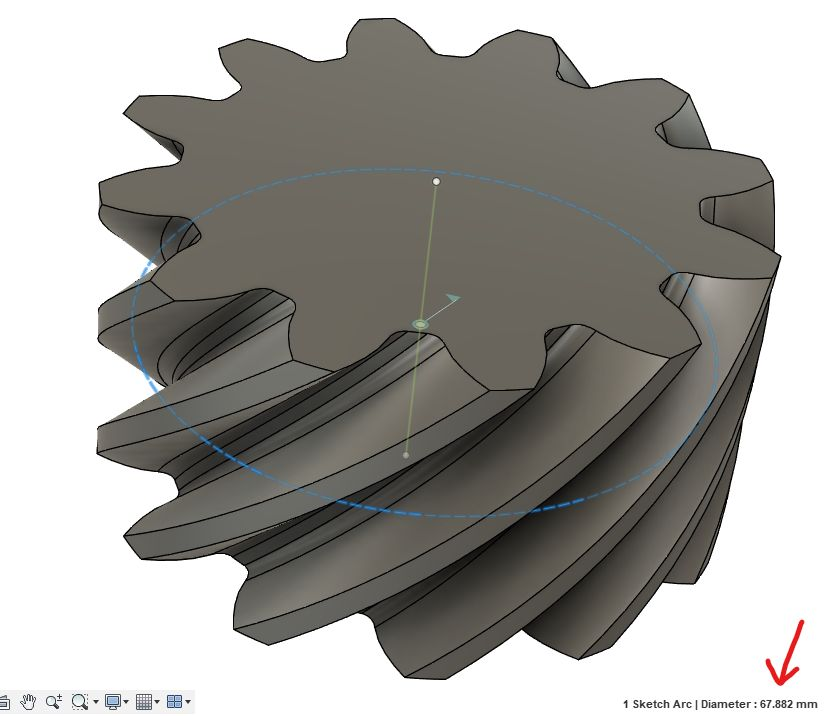
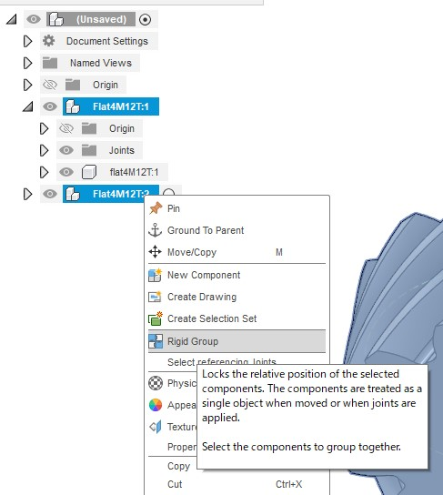

# ネジ歯車

[[fusion360-study-gears チュートリアルへ戻る]](https://github.com/osamutake/fusion360-study-gears/blob/main/README-ja.md#チュートリアル)

同じ方向にねじれた２つのはすば歯車を、はすば角の合計分だけねじれた角度を持つ軸に対して配置することでねじ歯車として使えます。

## 作成手順

ここでは45度のはすば歯車を、同じものを２つ用意して90度で交わる軸に配置して組み合わせてみます。

まず、はすば角45度のはすば歯車を生成します。
基準円直径は 67.882 mm になりました。

歯車を複製して噛み合い位置に移動します。
具体的には基準円直径だけ移動、90度回転、半ピッチだけ回転、の組み合わせになりました。

ルートコンポーネントと２つの歯車とを含めた剛性グループを作成することで、歯車の位置を固定します。このとき、子コンポーネントを含めないようにすることで、回転軸だけが固定されて回転は可能な状態になります。

２つの回転軸を選択してモーションリンクを作成します。

これで正しく回転するようになりました。

----
[[fusion360-study-gears チュートリアルへ戻る]](https://github.com/osamutake/fusion360-study-gears/blob/main/README-ja.md#チュートリアル)
