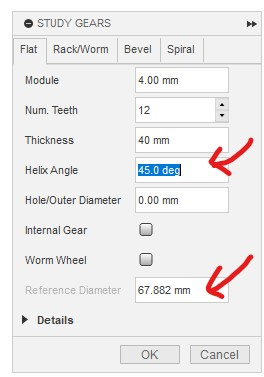
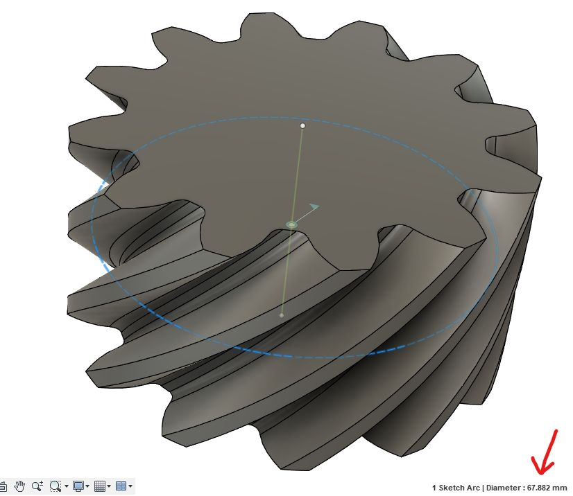
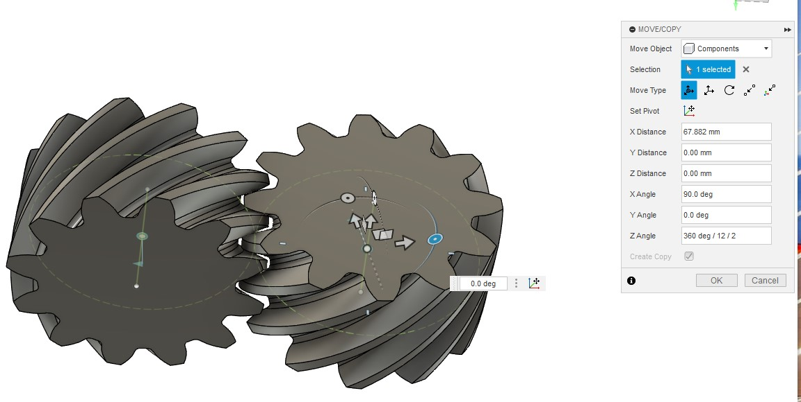
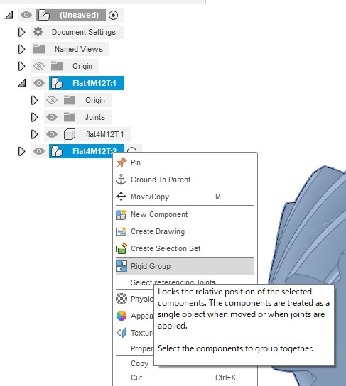
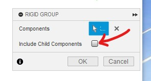
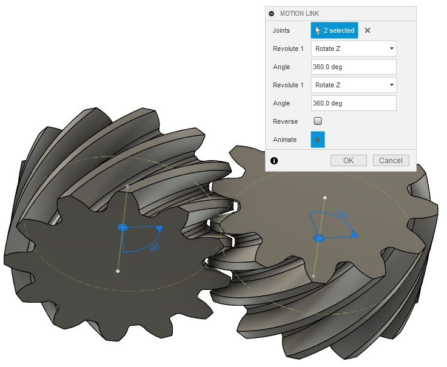

# Screw Gear

[[Go back to fusion360-study-gears Tutorials]](https://github.com/osamutake/fusion360-study-gears/#tutorials)

You can use two helical gears twisted in the same direction as a screw gear by placing them on a shaft twisted by the sum of the helix angles.

## Creation Procedure

Here, we will prepare two 45-degree helical gears and combine them by placing them on shafts intersecting at 90 degrees.

First, generate a 45-degree helical gear.
The reference circle diameter is 67.882 mm.

Duplicate the gear and move it to the meshing position.
Specifically, move by the reference circle diameter, rotate 90 degrees, and rotate by half a pitch.

Create a rigid group including the root component and the two gears to fix the position of the gears. By not including child components, only the rotation axis is fixed, allowing rotation.

Select the two rotation axes and create a motion link.

Now it rotates correctly.

----
[[Go back to fusion360-study-gears Tutorials]](https://github.com/osamutake/fusion360-study-gears/#tutorials)
