# 平歯車

[[fusion360-study-gears チュートリアルへ戻る]](https://github.com/osamutake/fusion360-study-gears/blob/main/README-ja.md#チュートリアル)

平歯車を４つ作成して、図のように組み合わせて回してみましょう。

<a href="assets/spur.gif">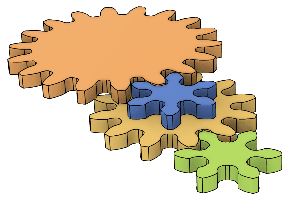</a>

## １つ目の歯車を作成

１つ目の歯車はデフォルトのまま作成します。

新しいドキュメントを作成し、`Shift+S` を押して `study_gears` を実行し、そのまま OK します。

作成されるのはモジュール $m=\mathrm{4\,mm}$、歯数 $z=12$ なので、基準円の直径は $mz=\mathrm{48\,mm}$ になります。

この基準円直径は後からでも基準円を表す破線をクリックすることで画面右下に表示される値で確認できます。

<a href="assets/spur2.jpg">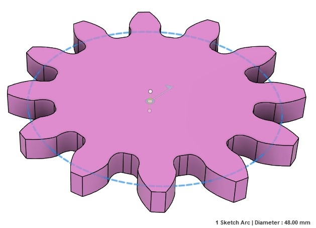</a>

## ２つ目の歯車を作成

２つ目の歯車は歯数を $z=6$ として作成します。

`Shift+S` を押して `study_gears` を実行し、そのまま OK します。

作成されるのはモジュール $m=\mathrm{4\,mm}$、歯数 $z=6$ なので、基準円の直径は $mz=\mathrm{24\,mm}$ になります。

## 組み合わせる

軸間距離を $(12+6)\times \mathrm{4\,mm}/2$ とするため、ブラウザ上で 6 枚歯の歯車を選択して $m$ を押して自由移動 (Free Move) で $x$ 軸方向へこの距離だけ移動、そのままだと噛み合わなかったので $z$ 十区周りに半ピッチ分 $\mathrm{360\,deg}/6/2$ だけ回転しました。

<a href="assets/spur5.jpg">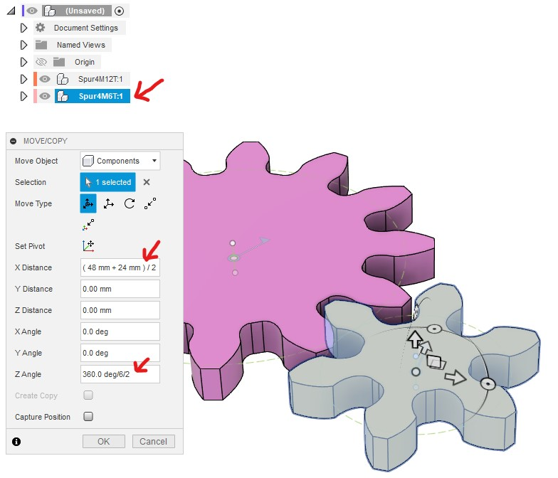</a>
<a href="assets/spur6.png">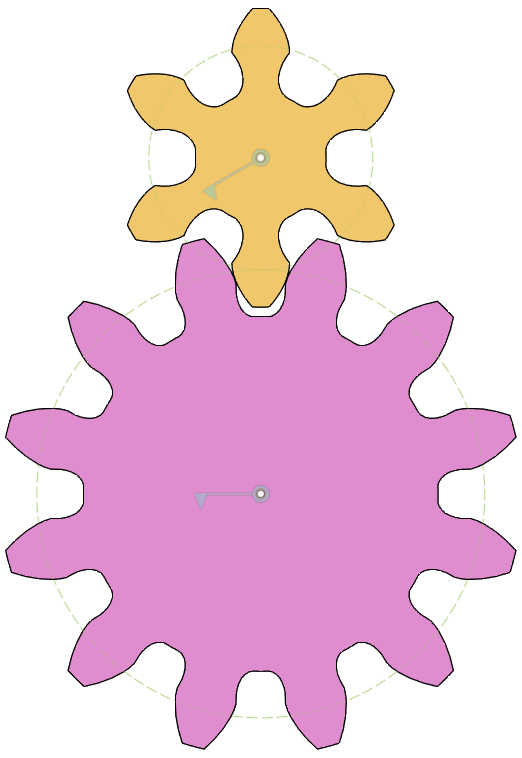</a>

## 歯車の軸を固定する

生成したままだの歯車はどこも固定されていないため、ドラッグするとそのまま平行移動してしまいます。

生成された歯車コンポーネントは二重になっていて、外側のコンポーネントと、実際に歯車が格納されている内側のコンポーネントとの間に回転ジョイントが作られています。

<a href="assets/spur7.png">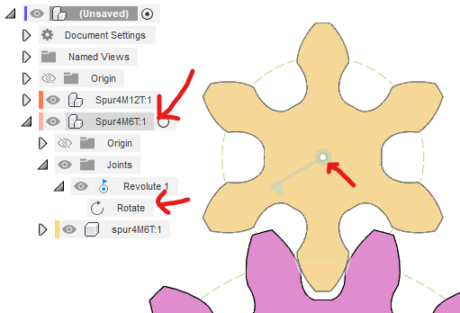</a>

ですので、外側のコンポーネントを固定してやれば歯車の回転軸を固定することになり、内側のコンポーネントはその軸の周りで自由に歯車を回転できるようになります。

外側のコンポーネントを固定するには、コンポーネントの右クリックで現れる「親に固定」を使えばよさそうに感じられるのですが、これは罠でしかありません。これを使うとせっかく望みの位置に移動したコンポーネントが元の位置に戻されてしまうので選んではダメです。

代わりに、ルートコンポーネント上で右クリックして「剛性グループを作成」を選択します。

すると、コンポーネントを元の位置に戻すかどうかを聞かれますが、ここでは戻したくないので「キャプチャ位置」（「位置をキャプチャ」の誤訳）を選んで、現在の位置を取り込みます。

<a href="assets/spur9.png">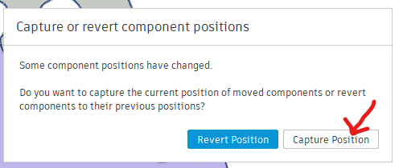</a>

さらに、選択した中に回転ジョイントが含まれているけれど剛性グループに含めてしまって構わないか？ という内容を聞かれます。剛性グループに含めてしまうと回転もできなくなってしまうため、含めてもらっては困るのですが、ここでは Yes を押さないと先へ進めないため一旦 Yes を選択します。

するとようやく「どのコンポーネントを剛性グループへ含めるか」を選択するダイアログへたどり着けます。

ルートコンポーネントだけを選択したのに「固定対象に回転ジョイントが含まれる」と警告が出たのは、このダイアログの「子孫コンポーネントを含める」にチェックが入っているためでした。

そのために、ルートコンポーネントだけを選択し、選択数も１になっているにもかかわらず、表示上で見るとその下にあるすべての子孫コンポーネントが選択状態になっていることが分かります。

このチェックを外すと、子や孫コンポーネントの選択状態が解除されます。

そこで改めて２つの歯車の外側のコンポーネントを選び直して、これら２のコンポーネントをルートコンポーネントに固定します。

すると、歯車をドラッグしても平行移動することはなくなり、回転軸の周りに回転するようになりました。

## ２つの回転軸を連動させる

以上の手順で２つの歯車の回転軸を固定して、その周りで回転運動するように設定できましたが、まだ２つの歯車の回転は連動していません。

「モーションリンク」の機能を使うことで、２つの歯車を連動させることができます。

ダイアログが表示されたら２つの軸を選択し、それぞれの回転量を、360 deg を歯数で割る形で指定すると、ギア比を間違いなく指定できます。今のように隣り合う２つの歯車に対しては回転方向が逆になるので「反転」のチェックボックスをチェックしておきます。

<a href="assets/spur16.png">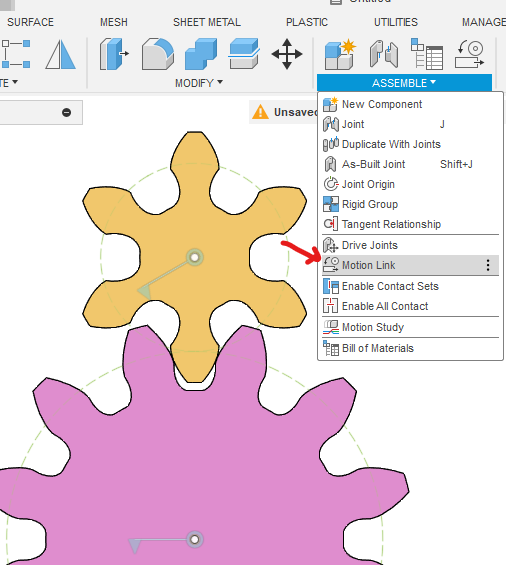</a>

これで２つの歯車が連動して動くようになりました。
一方の歯車をドラッグして回すと、もう一方も正しく回転していることが分かります。

<a href="assets/spur18.gif">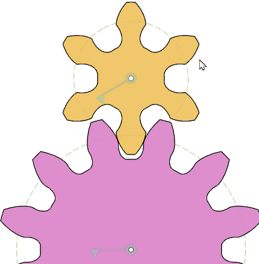</a>

## バックラッシュのシミュレーション

上記の方法で連動させた軸の動作はバックラッシュを反映しません。

拡大するとわかるように２つの歯車は実際には接触しておらず、両者の間には常にバックラッシュ分の間隙が保たれています。つまり、歯車同士が触れていないにもかかわらず一方の回転が他方に伝わっていることになります。

<a href="assets/spur19.gif">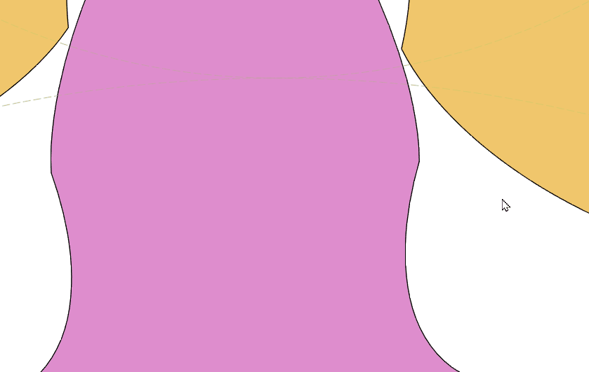</a>

バックラッシュを含めた正しい回転の様子をシミュレーションするには、一旦モーションリンクを「抑制」し、代わりに「接触解析」を使います。

先ほど作ったモーションリンクの上で右クリックして「抑制」を選択し、アセンブリから「接触セットを有効化」を選択します。

<a href="assets/spur20.png">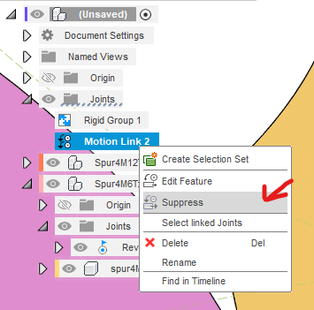</a>
<a href="assets/spur21.png">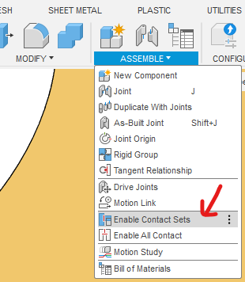</a>

そして「接触セット」の右クリックから「接触セットを作成」で、２つの歯車ボディを選択し、両者の間の接触解析を有効化します。

<a href="assets/spur22.png">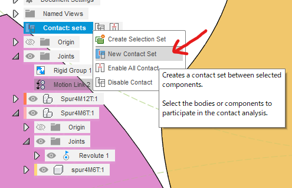</a>
<a href="assets/spur23.png">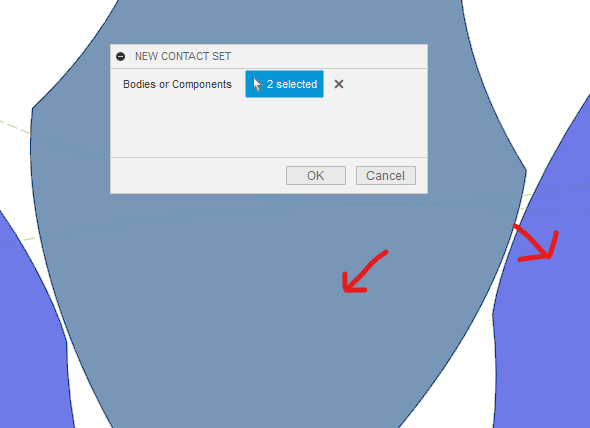</a>

これで２つのボディが接触した時のみ動作が相手に伝わるようになり、バックラッシュによる遊びの影響を含めた現実的な歯車の動作をシミュレーションすることができるようになります。

<a href="assets/spur24.gif">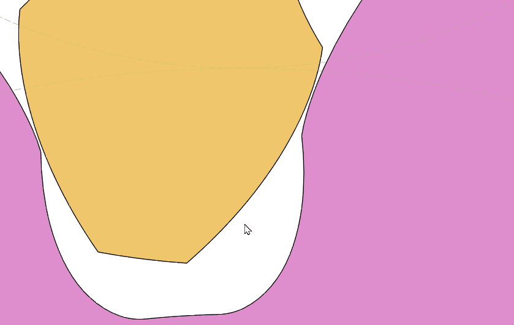</a>

当然、モーションリンクよりも接触解析の方が計算は大変なはずなので、どうしてもこの解析が必要なわけでないならモーションリンクの方を使うのが良いのだと思います。

## ここではこのままいきます

ここでは多段に組み合わせた歯車間のバックラッシュの伝わり方を見たいので、引き続き接触解析をメインに使っていくことにします。

## ３枚目の歯車を追加

６枚歯の歯車を生成します。

今度は $z$ 方向に $\mathrm{5\,mm}$ 動かして１枚目の歯車に重ねます。

次にこの歯車を先に作った剛性グループへ追加したいのですが、剛性グループを作成した時点でこの歯車は存在しなかったためそのまま「剛性グループの編集」を選んでも追加することができません。

そこで履歴上で剛性グループの生成フィーチャを歯車生成フィーチャの後に来るように順番を入れ替えます。

ただここにも罠があって、今の段階で順番を入れ替えてしまうと、せっかく移動した歯車の位置が元に戻ってしまいます。

そこで、入れ替えを行う前に、「キャプチャ位置」（「位置をキャプチャ」の誤訳）をしておきます。

そして履歴上でフィーチャを入れ替えます。

その後、件の剛性グループを編集して、この歯車を含めることで回転軸の位置を固定します。

<a href="assets/spur28.png">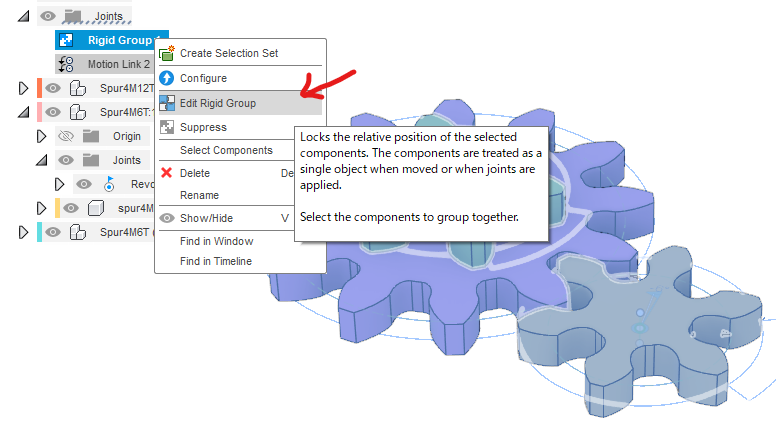</a>

さらに、１つ目の歯車の回転軸と３つ目の歯車の回転軸との間にモーションリンクを作成して、２つの歯車を連動させます。

このとき、接触セットが有効になっているために「アニメーション」を有効化していると動作がもたつくので、解除しておくことをお勧めします。

<a href="assets/spur30.png">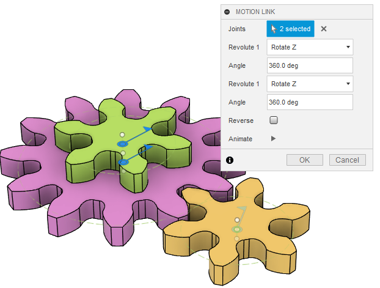</a>

これで、３つの歯車が正しく連動するようになりました。

## ４つ目の歯車を追加

歯数を18とした歯車を追加して、３つ目の歯車とかみ合う位置へ移動します。

その際、１枚目の歯車の回転角をゆっくり回してゼロに戻しておくと、噛み合い角度を探しやすいです。

その後、先と同様の手順で「位置をキャプチャ」した後、履歴上で「剛性グループ」の作成を先頭に持ってきて、４枚目の歯車を剛性グループに追加します。

最後に、３枚目の歯車と４枚目の歯車の２つのボディの間に接触セットを作成します。

これで準備は完璧です！

## どうやらこれではうまく行かないようでした・・・

と思ったのですが、この手順で作成した歯車は引っかかってしまい回ってくれませんでした。

どうやら２つの接触セットの間にモーションリンクによる回転が含まれると運動の解析がうまく行かないようです。

## 回転軸のモーションリンクをやめて剛性セットを作成した

そこで、歯車１と歯車３の間に作成したモーションリンクを抑制して、代わりにこれら２つの歯車の「子コンポーネント」同士の間に剛性グループを作成しました。

すると今度は解析を正しく行えて、バックラッシュを考慮に入れた歯車間の運動の伝達を再現できました。

----
[[fusion360-study-gears チュートリアルへ戻る]](https://github.com/osamutake/fusion360-study-gears/blob/main/README-ja.md#チュートリアル)