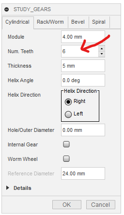
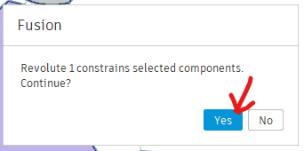
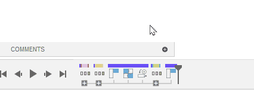

# Spur Gear

Let's create four spur gears and combine them as shown in the figure to see how they rotate.

## Create the First Gear

Create the first gear with the default settings.

Create a new document, press `Shift+S` to run `study_gears`, and click OK.

The created gear will have a module $m=\mathrm{4\,mm}$ and a number of teeth $z=12$, so the pitch circle diameter will be $mz=\mathrm{48\,mm}$.

You can check this pitch circle diameter by clicking the dashed line representing the pitch circle around the gear. The diameter will be displayed at the bottom right of the screen.

## Create the Second Gear

Create the second gear with the number of teeth set to $z=6$.

The pitch circle diameter will be $\mathrm{24\,mm}$ for it.

## Combine the Gears

To set the center distance to $(12+6)\times \mathrm{4\,mm}/2$, select the 6-tooth gear in the browser, press $m$ to move it freely, i.e. translate it by the distance $(12+6)\times \mathrm{4\,mm}/2$ along the $x$-axis, and then rotate it around the $z$-axis by half a pitch $\mathrm{360\,deg}/6/2$ to mesh properly.

## Fix the Gear Axes

The gears are not fixed initially, so they will be translated without rotation when dragged.

The created gear components are nested, which consists of an outer component containing an inner component containing the actual gear. These two nesting components are connected to each other by a rotational joint at the center of the gear.

Fixing the outer component to the root component will fix the gear axis, allowing the inner component to rotate freely around it.

To fix the outer component to the root component, selecting the "Ground to Parent" item in the right-click menu of the component seems to work. However, it is a dangerous trap. Using "Ground to Parent" moves the correctly placed component back to the original position. So, do not select it.

Instead, select "Rigid Group" in the right-click menu of the root component.

When prompted to capture the position, select "Capture Position".

If asked whether to include the rotational joint in the rigid group, select Yes. Actually, if we include the rotational joint in a rigid group, it won't rotate. So, we do not want to do it. However, at this moment, we do not have any other option. So, select yes.

Then, we finally reach the rigid group dialog, to select which components should be included by the group.

The reason why the warning which means "Rotation joint(s) is/are included in the rigid group target" appears even when only the root component was selected, was because the "Include Child Components" checkbox in this dialog was checked. In this context, this "Child" means descendants. So, with this option, all the components will be included in the rigid group and can not be moved any more.

In the figure, we can confirm this point. Even though only the root component is selected and it tells us only 1 component is selected, all the components including nested descendant components are highlighted.

So, uncheck "Include child components" to deselect the descendant components.

Then, re-select only the outer components of the two gears, to fix them to the root component.

Now, the gears will rotate around their axes without moving their axes positions.

## Link the Rotations of the Two Axes

The two gear axes are fixed and can rotate, but their rotations are not linked yet.

Use the "Motion Link" feature to link the motion of the two gears.

Select the two axes in the dialog, specify the rotation amounts by dividing 360 degrees by the number of teeth, and check the "Reverse" box for opposite rotation directions.

Now, the two gears will rotate together. Drag one gear to see the other rotates correctly.

## Simulate Backlash

The linked axes do not reflect backlash.

At close look, the gears do not actually touch, maintaining a gap equal to the backlash, i.e. one gear's rotation is transmitted to the other *without contact*.

To simulate realistic gear movement with backlash, suppress the "Motion Link" and use "Contact Sets".

Right-click the motion link and select "Suppress", then enable "Contact Sets" from the Assembly menu.

Create a contact set by right-clicking "Contact Sets" and selecting "New Contact Set", then select the two gear bodies.

Now, the gears will only transmit motion when they touch, simulating realistic gear movement with backlash.

Contact analysis is more computationally intensive than motion links, so use motion links unless backlash simulation is necessary.

## Continue with contact analysis

To observe the transmission of backlash through multiple gears, we continue using contact analysis in this tutorial.

## Add the Third Gear

Create a 6-tooth gear.

Move it $\mathrm{5\,mm}$ in the $z$ direction, onto the face of the first gear.

To add this gear into the existing rigid group, we need reordering the history so the rigid group creation comes after the gear creation to have the gear already created when the rigid group is created.

Watch out! Before reordering, we need to capture the components position first, to prevent reverting the positioning of the component.

Reorder the features in the history by dragging.

Edit the rigid group to include the new gear, to fix the position of its rotation axis.

Create a motion link between the first and third gear axes to link their rotations.

Disable "Animation" in the contact set to avoid lag due to the contact analysis.

Now, the three gears rotate together correctly.

## Add the Fourth Gear

Add an 18-tooth gear and move it to mesh with the third gear.

Before doing it, rotate the first gear slowly back to the original position to make finding the meshing angle easy.

Then, capture the position, reorder the history, and add the fourth gear to the rigid group as same as the above procedure.

Create a contact set between the third and fourth gear bodies.

Now, everything should be ready!

## This Method Didn't Work...

The gears got stuck and didn't rotate.

Having a motion link between contact sets seems too complex for Fusion 360 to analyze.

## Using Rigid Sets Instead of Motion Links

To solve the issue, suppress the motion link between gears 1 and 3, and create a rigid group between their child components instead.

This allows Fusion 360 to correctly simulate gear movement with backlash.

