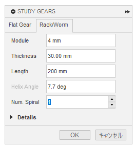
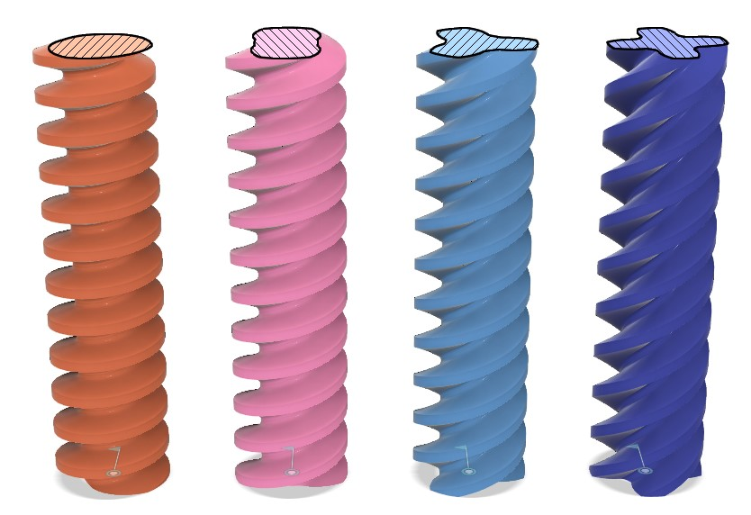
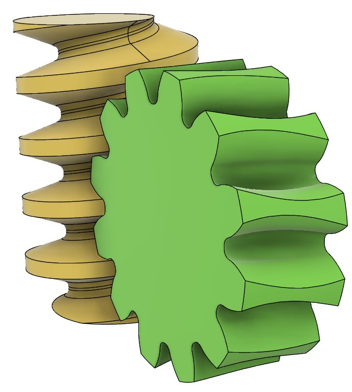
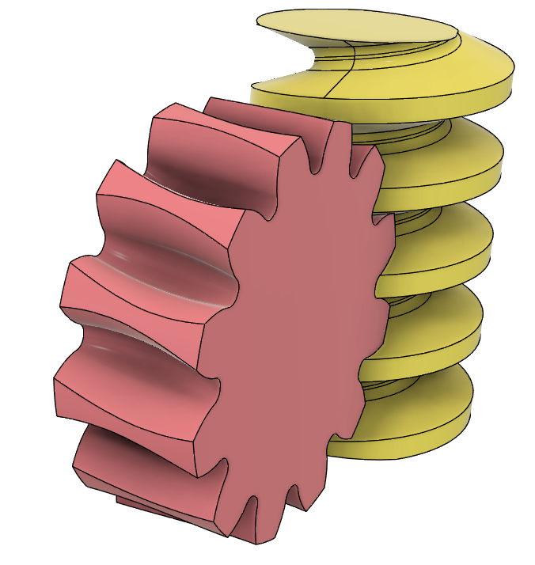
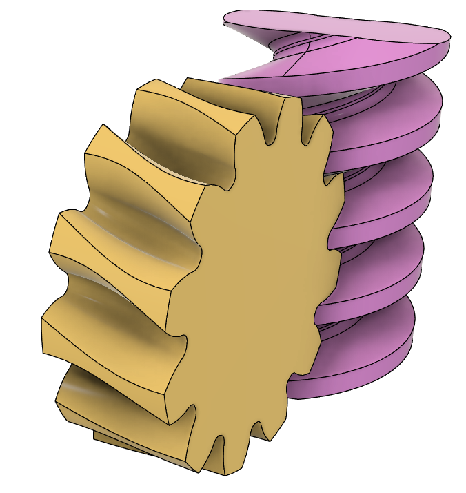
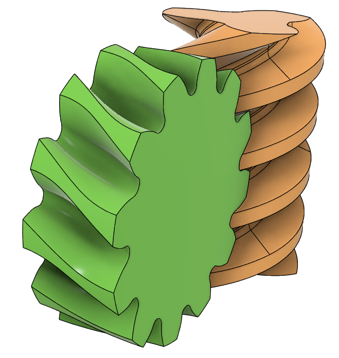
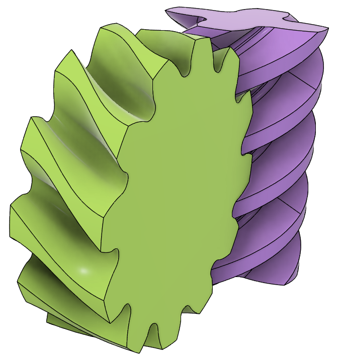

# Create and Combine a Worm and Worm Wheel, and Test Their Meshing

[[Go back to fusion360-study-gears Tutorials]](https://github.com/osamutake/fusion360-study-gears/#tutorials)

## Generating the Worm

The worm is generated by rotating a rack.

In the Rack/Worm tab, setting Num. Spiral (number of threads) to 1 or more will generate a worm instead of a rack.

The number of threads refers to the number of pitches the worm advances in the axial direction when it completes one rotation. It also corresponds to the number of teeth arranged on the circumference when viewing the worm's cross-section.

The figure shows worm shapes generated with the same pitch and reference circle diameter, but with the number of threads set to 1, 2, 3, and 4.

## Printing the Worm

Since the worm teeth extend significantly outward, when printing the worm with a 3D printer, it may be necessary to split it vertically into two halves and print each half separately before assembling them.

## Generating the Worm Wheel

In the Cylinder tab, check the Worm Wheel option, input the worm's reference circle diameter in Worm Diameter, and input the worm's number of threads in Worm Spiral to generate the worm wheel.

The worm wheel is generated at the location to mesh with the worm (or may require a half-pitch rotation adjustment), so it should work directly when combined with the worm.

The tooth profile of the worm wheel is a complex shape that cannot be represented by simple involute curves or similar methods.

This complex tooth profile is calculated by simulating the actual gear cutting process, where interfering parts are removed by combining a disk-shaped material with the worm's tooth profile (slightly extended at the tip as a hob).

Although this script generates the tooth profile with a single click, a lot of effort is happening behind the scenes. 💦

## Checking Tooth Contact

A worm and worm wheel were generated with module 4 and backlash set to -0.02 mm, and the interference areas were visualized.

The worm and worm wheel generated by this script mesh cleanly, and it can be observed that contact is achieved across the entire thickness of the worm wheel.

## Changing the Number of Threads

The number of threads was varied from 1 to 4 to create different models.

As the number of threads increases, the tooth profile of the worm wheel becomes significantly twisted, but it still meshes properly.

(It seems that calculation errors may sometimes cause interference, so it might be better to set a slightly larger backlash...)

----
[[Go back to fusion360-study-gears Tutorials]](https://github.com/osamutake/fusion360-study-gears/#tutorials)
